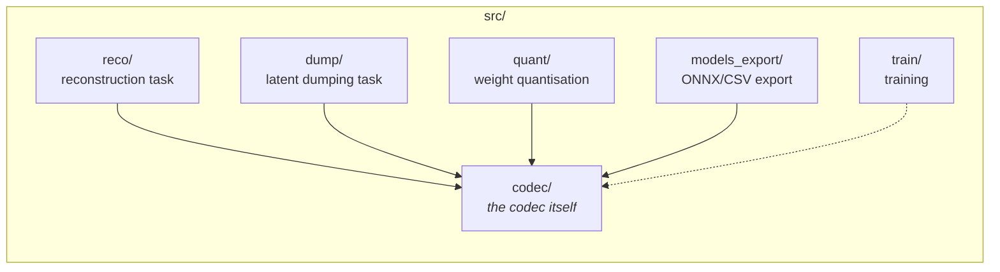

# 01 — Repository Layout

## Top level

```
jpeg-ai-reference-software/
├── cfg/            JSON configuration: pipeline, profiles, operating points, per-tool configs
├── data/           Test and calibration image sets
├── docs/           Documentation: this directory, markdown notes, slides, Excel templates
├── models/         Trained checkpoints (.pth)
├── scripts/        Shell and Python utilities: setup, build, evaluation drivers, model tooling
├── src/            All Python source
├── Dockerfile      Container image based on nvcr.io/nvidia/tensorrt
├── Doxyfile        Doxygen configuration for API documentation
├── Makefile        Entry points for setup, build, test, tool benchmarking, export
├── requirements.txt Pinned Python dependencies (torch 1.10.2, numpy 1.19.1, …)
└── .gitlab-ci.yml  CI: unit tests plus per-merge-request coding-performance runs
```

## `src/` — the Python packages



`src/codec` is the library. `reco`, `dump`, `quant` and `models_export` are *tasks*: thin
front-ends that reuse the same codec but do something different with it. `src/train` stands
apart — it is a separate training implementation with its own model definitions, and it does not
import `src/codec` (the dashed arrow is a shared-weights relationship, not a code dependency).

| Package | Entry points | Purpose |
| --- | --- | --- |
| `src/codec` | (library) | Everything: engine, tools, networks, entropy coding, bitstream, metrics |
| `src/reco` | `src.reco.coders.encoder`, `src.reco.coders.decoder`, `src.reco.scripts.eval` | The reconstruction task — normal image coding. This is what `make test` runs |
| `src/dump` | `src.dump.coders.encoder`, `src.dump.coders.decoder`, `src.dump.scripts.eval` | Same coding path, but additionally writes intermediate latents (`y`, `z`, `psi`, …) to PGX/NPY for conformance and cross-checking |
| `src/quant` | `src.quant.scripts.eval` | Searches integer quantisation parameters for the hyper-scale-decoder layers using a calibration set |
| `src/models_export` | `src.models_export.scripts.eval` | Exports every network to ONNX and every entropy table to CSV |
| `src/train` | (driven by `scripts.acc_train_scripts.acc_train_local`) | Training: `CCS/` is the main codec trainer, `ICCI/` the standalone post-filter trainer |

### `src/codec` internals

```
src/codec/
├── coders/                 CodecCoder / CodecEncoder / CodecDecoder — CLI + lifecycle
├── coding_tools/           All pluggable tools; this is where the codec logic lives
│   ├── coding_engine/      CodingEngine — the root tool, orchestrates everything
│   ├── interfaces/         Base classes: BaseModule → BaseEngine → Coder/Model/Tool engines
│   ├── core_models/        CCS_SGMM — the main neural codec (analysis/synthesis + entropy model)
│   ├── filters/            Post-filters: EFElinear, EFEnonlinear, LEF, ICCI, eICCI
│   ├── colour_processing/  Colour transform, chroma histogram processing
│   ├── quantization/       Quantizer composite: gain unit, residual variance scaling
│   ├── ls_processing/      Latent-space processing: LSBS (latent-space bias shift)
│   ├── skip_ls/            Skip mode in latent space (cube flags)
│   ├── quality_map/        Spatially varying quality (ROI / noise-based QP maps)
│   ├── bitrate_matcher/    Encoder-side rate control: picks beta to hit a target bpp
│   ├── rdlr/               Rate-Distortion Latent Refinement (encoder-side latent optimisation)
│   ├── tiling/             TileManager / TileManagerHyper — tile and region partitioning
│   ├── resolution_changer/ Intra-resolution change (downscale before coding, upscale after)
│   ├── resampler/          Interpolation back-end used by the resolution changer
│   ├── interpolation/      Warping / interpolation primitives (table-based and differentiable)
│   ├── rdi/                Rendering information (metadata substream)
│   ├── udi/                User-defined information (metadata substream)
│   ├── profiler/           Time / CPU memory / GPU memory collectors
│   └── components_wrappers/ Wrapper that adapts a plain nn.Module into the tool framework
├── components/             Raw neural network building blocks
│   ├── autoencoder_data/   Analysis (encoder) and synthesis (decoder) transforms, per operating point
│   ├── autoencoder_hyper/  Hyper-encoder, hyper-decoder, hyper-scale-decoder
│   ├── contexts/           The MCM context model (multi-phase autoregressive prediction)
│   ├── base_layers/        Conv layers, quantised conv layers, CAB, RNAB, TAM blocks
│   ├── activations/        GDN, ResA, ResAU
│   ├── entropy_coding/     Differentiable probability models (GM, SGMM, ASGM, factorized, …)
│   └── vr_quantizers/      Variable-rate quantiser vectors
├── entropy_coding/         The entropy coding subsystem (see doc 07)
│   ├── cpp_exts/           C++ extensions: mans (me-tANS) and direct (bypass bit IO)
│   ├── lib_wrappers/       Python wrappers: mans, lh (likelihood), direct, empty
│   ├── prob_models/        Python-side probability model descriptors
│   ├── ec_module.py        ECModule — the façade used by every tool
│   └── header_module.py    HeaderCoder — fixed-length / bounded header field IO
├── bitstream_structure/    Substream layout, markers, memory objects, file IO
├── datasets/               Image dataset iterators (JPEG AI test set, YUV420, cropping)
├── common/                 Image, Decisions, colorspace, logging, tiling helpers, timing
├── metrics/                PSNR and MS-SSIM, plus image loading, colour conversion, bpp
├── scripts/                CodecEval — the multi-process evaluation harness
└── utils/                  Downloader (resolves model file paths), templating, param loading
```

## `cfg/` — configuration

```
cfg/
├── info.json              Current release version, codec name, default config, pipeline path
├── pipeline.json          THE decoder pipeline description (networks, checkpoints, betas)
├── CTC.json               Common Test Conditions: defaults shared by all operating points
├── tools_off.json         All tools disabled (the anchor)
├── tools_on.json          All tools enabled
├── tools/                 One file per tool, each enabling exactly that tool
├── tool_ena/              "Only one tool on" test configurations
├── tool_dis/              "All tools on except one" test configurations
├── profiles/              simple.json, base.json, high.json + profiles_list.json, levels.json
├── oper_point/            Operating points: bop, hop, sop and enc/dec splits
├── AE/                    Entropy engine selection (ans.json, lh.json, verbose.json)
├── BRM/                   Bitrate matcher modes (default, regen_list, use_list)
├── betas/                 Pre-computed per-image/per-rate beta lists, per operating point
├── eval/                  Evaluation harness configurations (which configs × which profiles)
├── per-image/             Optional per-image parameter overrides
├── per-image-per-bpp/     Optional per-image-and-rate parameter overrides
├── profiler/              Profiler collector selection
└── launch.json            VS Code launch configurations
```

See [03 — Configuration system](03-configuration-system.md) for how these compose.

## `models/` — checkpoints

| Directory | Contents |
| --- | --- |
| `VM_common/` | Weights shared by all operating points: hyper-encoder, hyper-decoder, hyper-scale-decoder, context model. Files `Y_<beta>.pth`, `UV_<beta>.pth` |
| `VM_common_int/` | Integer/quantised variants of the common modules plus entropy transition tables (`transition_table_z*.csv`) |
| `VM_bop/` | BOP analysis and synthesis transforms: `encoder_{Y,UV}_<beta>.pth`, `decoder_{Y,UV}_<beta>.pth` |
| `VM_hop/` | HOP analysis and synthesis transforms |
| `VM_sop/` | SOP synthesis transforms (SOP is decode-only — it pairs with a BOP encoder) |
| `eICCI_bophop_2d020448_20240229/` | eICCI post-filter checkpoints |

Betas present in the released models are `0.002`, `0.012`, `0.075` and `0.5` — the four
"quality models" (`Ntools: 4` in `cfg/pipeline.json`).

The checkpoints ship in the repository, stored with git-lfs. A fresh clone materialises them
with

```bash
git lfs fetch
git lfs checkout
```

after which `models/` holds the real `.pth` files rather than LFS pointer stubs.

## `data/`

| Directory | Contents |
| --- | --- |
| `data/test/` | The JPEG AI 8-bit sRGB test set, named `<id>_TE_<W>x<H>_8bit_sRGB.png` |
| `data/test_10bit/` | 10-bit variants |
| `data/calibration_set/` | Validation subset used by the weight-quantisation search (`<id>_VL_<W>x<H>.png`) |

All of them ship in the repository, stored with git-lfs alongside the checkpoints.

## `docs/`

| Path | Contents |
| --- | --- |
| `docs/architecture/` | This documentation set |
| `docs/md/` | Developer notes: `entropy.md` (how to add an entropy engine or probability model), `quantization.md`, `quality_map.md`, `checkpoints.md` |
| `docs/ppt/VM.pptx` | Slide deck with the software design overview |
| `docs/docx/wg1n100450.docx` | The software manual (WG1 document) |
| `docs/template.xlsm`, `docs/template_img30.xlsm` | Excel templates the result-merging scripts fill in |
| `docs/SNPE_Time_Profiling.xlsm` | Time profiling workbook |

## Training

```
src/train/
├── CCS/                    The main codec trainer
│   ├── acc_train/          Model definitions, data loading, loss, the training loop
│   ├── metrics/            Training-time distortion metrics
│   └── utils.py
├── ICCI/                   The ICCI / eICCI post-filter trainer (standalone, own requirements)
└── README.md               Upstream notes on setting training parameters

scripts/acc_train_scripts/
├── acc_train_local.py      The launcher `scripts/train.sh` and `cfg/launch.json` invoke
├── test.py                 Mid-training evaluation
├── report_bdrate_results.py  BD-rate reporting over a set of runs
├── smart_copy_tree.py      Snapshotting the source tree into a run directory
└── utils.py
```

The schedule is configured by `cfg/train.json`, `cfg/train_stages.json` and
`cfg/training_list/`, with one resume checkpoint per beta under
`models/VM_common/train_stages/`. [13 — Training](13-training.md) documents the launcher, the
stage machinery and every command-line option in full.

One piece referenced by the build is still absent from this release:
`scripts/build_train_libs.sh` ends with `cd src/train/3rdparty/apex && pip install ...`, and
`src/train/3rdparty/` does not ship — NVIDIA Apex has to be installed separately before mixed
precision (`--amp`) will work.

`src/codec/datasets/dataset.py.conflict_with_train` is a leftover: a copy of an older codec
dataset module, kept out of the import path by its extension. It imports a
`src/codec/datasets/image_utils.py` that does not exist, and nothing in the shipped training
code refers to it.
