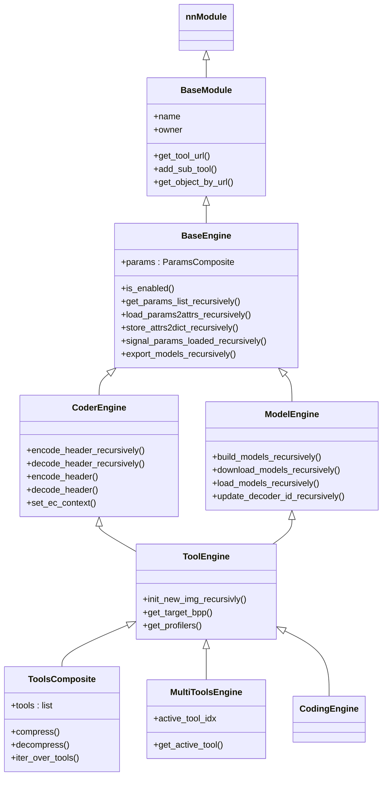
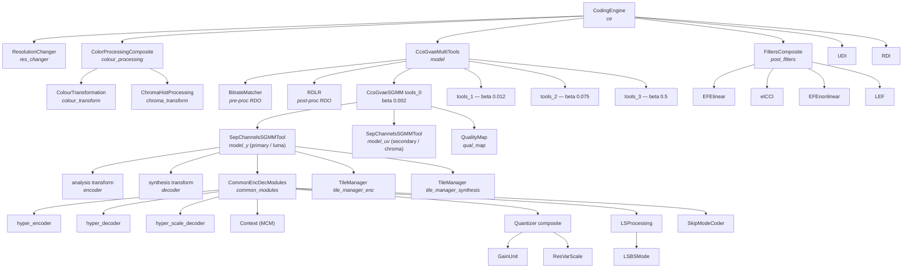
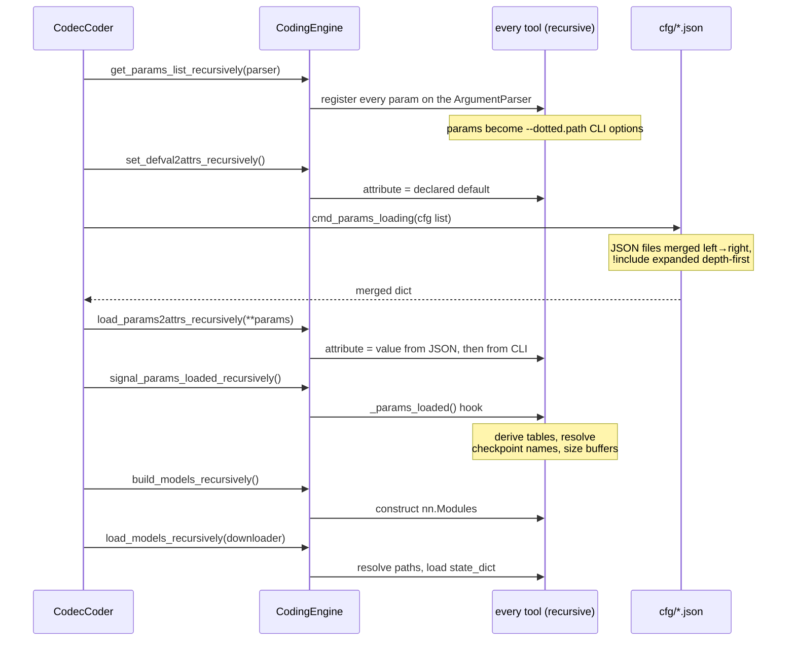

# 02 — Core Architecture

Everything in this codec is a node in a single tree of PyTorch modules. The tree is built from
JSON, every node can read and write its own bitstream header, and data travels between nodes in
one shared dictionary. This document explains those three mechanisms.

## 1. The class hierarchy



Source: `src/codec/coding_tools/interfaces/`.

| Class | File | Responsibility |
| --- | --- | --- |
| `BaseModule` | `interfaces/base/base_module.py` | Extends `nn.Module` with an owner back-pointer, a dotted URL address (`ce.model.CCS_SGMM.tools_0.model_y`), attribute lookup that falls through to sub-tools, and `get_owner_param()` so a child can read a parent's setting |
| `BaseEngine` | `interfaces/base/base_engine.py` | Parameter machinery: declare params → set defaults → load from JSON/CLI → notify `_params_loaded()` → serialise back to a dict. Also the `enabled` flag and profiler access |
| `CoderEngine` | `interfaces/coder/engine.py` | Bitstream header IO. Provides `encode_header_recursively` / `decode_header_recursively`, which walk the tree writing/reading an enable flag plus the node's own header fields |
| `ModelEngine` | `interfaces/model/engine.py` | Checkpoint lifecycle: build the `nn.Module`s, download them, load `state_dict`s, and switch synthesis network when `decoder_id` changes |
| `ToolEngine` | `interfaces/tool/engine.py` | The union of `CoderEngine` and `ModelEngine` — what a real coding tool inherits |
| `ToolsComposite` | `interfaces/composite/composite.py` | An ordered, individually enable-able list of sibling tools. Used for post-filters, colour processing, quantisation, latent-space processing |
| `MultiToolsEngine` | `interfaces/multitools/engine.py` | A set of mutually exclusive variants, one active at a time. Used for the four beta models (`tools_0..tools_3`) |
| `CodingEngine` | `coding_tools/coding_engine/coding_engine.py` | The root: owns the core model, colour processing, post-filters, resolution changer, RDI/UDI, and the picture header |

### Why `CoderEngine` and `ModelEngine` are separate

Some nodes only write headers (RDI, UDI, resolution changer) and some only own weights
(a wrapped `nn.Module`). Keeping the two mixins separate means a tool declares exactly the
capability it needs, and `ToolEngine` composes both for the common case.

## 2. The runtime tree

This is the object graph the `CodingEngine` builds for the default configuration:



Two facts that matter when reading the code:

- **`model_y` and `model_uv` are the same class.** `SepChannelsSGMMTool` is instantiated twice
  per beta model: once for the primary (luma) component with 1 input channel, once for the
  secondary (chroma) component with 2. They have separate checkpoints, separate tile managers
  and separate residual substreams (`SORP` vs `SORS`), but identical code paths.
- **Only one `tools_N` is active at a time.** `CcsGvaeMultiTools` picks it via
  `active_tool_idx`, which the bitrate matcher sets on the encoder and the picture header
  carries to the decoder. Inactive variants are deleted after configuration
  (`MultiToolsEngine.__disable_inactive_tools`), so the decoder only loads the checkpoints it
  needs.

### Node addressing

`BaseModule.get_tool_url()` builds a dotted path by walking `owner` links, and
`get_object_by_url()` resolves one. The same dotted path is the CLI override syntax and the
nesting of the JSON config:

```
ce.model.CCS_SGMM.tools_0.model_y.common_modules.quantizer.rvs.rvs_enabled
```

```
-model.CCS_SGMM.tools_common.model_common.common_modules.quantizer.rvs.rvs_enabled 1
```

(`ArgParserDecorator` registers nested parameters with a **single** leading dash, so overrides
are written `-a.b.c value`, as in `scripts/export_models.sh`'s `-post_filters.tools ""`.)

```json
{ "model": { "CCS_SGMM": { "tools_common": { "model_common": {
  "common_modules": { "quantizer": { "rvs": { "rvs_enabled": 1 } } } } } } } }
```

## 3. The parameter lifecycle

Every engine declares its parameters in a `ParamsBase` subclass — by convention a `params.py`
next to the tool. `ResVarScaleParams`, `AicParams`, `LSBSModeParams` and so on all follow the
same shape: an `add_single_param(name, type=…, default=…, help=…)` per setting.



[12 — Parameter resolution](12-parameter-resolution.md) covers this machinery in full: how a
declaration becomes a command-line option, the exact precedence of the sources, and the five
separate mechanisms by which a value reaches a node it was not written on.

`_params_loaded()` is the single most important hook to know about. It runs *after* the whole
configuration is known, which is why tools use it to build lookup tables (`ResVarScale.buildTables`,
`LSBSMode.buildTables`), resolve which checkpoint file belongs to the active beta, and copy
inherited settings down from the owner via `params.load_params_from_owner(...)`.

`store_attrs2dict_recursively()` is the inverse: it flattens the whole configured tree back into
a nested dict. The evaluation harness writes that dict to `results/<run>/cfg.json` and then feeds
*that* file to the per-image encoder processes, so every image in a run is coded with a
byte-identical, fully-resolved configuration.

## 4. `Decisions` — the data bus

`src/codec/common/decisions.py` defines `Decisions(dict)`. It is the only thing passed between
pipeline stages, and it accumulates as it flows. A `Decisions` for one component of one image
holds, among others:

| Key | Type | Meaning |
| --- | --- | --- |
| `y` | float tensor `[1, C, H/16, W/16]` | Latent, the analysis transform output |
| `z`, `z_hat`, `z_tilde` | int8 / float | Hyper-latent before and after quantisation |
| `psi` | float `[1, 4C, H/64·2, W/64·2]` | Hyper-decoder output — context conditioning |
| `scale_log_origin` | float | Raw hyper-scale-decoder output |
| `skip_scale_log` | float | Scale after non-RVS quantiser stages |
| `scale_log` | float | Final quantised scale used for entropy coding |
| `residual` | float | Dequantised prediction residual (latent minus context prediction) |
| `residual_quant` | int16 | Quantised residual — the symbols actually entropy coded |
| `y_hat` | float | Reconstructed latent = prediction + dequantised residual |
| `cube_flag`, `cube_flags` | bool | Skip-mode decisions per 16×16 latent cube |
| `quantizer` | nested `Decisions` | Sub-decisions of `gain_unit`, `rvs`, `qual_map` |
| `*_tiles` | dict keyed by `Area` | Per-tile copies of the above, for tiled processing |

Convenience methods: `apply_()` (map a function over every tensor recursively), `to_f32_()`,
`detach()`, `permute()`, `preserve_only()`, `add_postfix_to_keys_()`.

Because `Decisions` is what the encoder produces and the decoder reconstructs, it doubles as the
conformance interface: `src/dump` writes selected `Decisions` entries to PGX files so two
implementations can be compared tensor by tensor.

## 5. `Image` — the picture container

`src/codec/common/image.py` wraps three component tensors (Y, U, V) plus metadata rather than a
single NCHW tensor, because chroma may be subsampled.

| Aspect | Detail |
| --- | --- |
| Components | Accessed by name: `get_component('Y')`, `set_component(...)`, `get_components()` |
| Formats | `sRGB`, `444`, `422`, `420`; conversions `to_420_()`, `to_422_()`, `to_444_()`, `to_format_()` |
| Colour spaces | `to_YUV_(type='709')`, `to_RGB_(type='709')` |
| Bit depth | Tracked on the object; `write_file(path, bit_depth=…)` re-quantises on output |
| Geometry | `pad_()`, `pad2depth_()` (pad to a multiple of the network alignment), `scale_size()` |
| Subsampling | `get_chroma_subsampling()` returns `(s_ver, s_hor)` — signalled in the picture header |
| IO | `Image.read_file()` / `write_file()` handle PNG (via OpenCV) and raw YUV; `extract_info()` parses `WxH_Nbit_FMT` out of a filename |

The distinction between `s_ver`/`s_hor` (the *source* subsampling) and `c_ver`/`c_hor` (the
*coded* subsampling) matters: the codec may code 4:2:0 chroma for a 4:4:4 source, and both pairs
go into the picture header.

## 6. Profilers

`src/codec/coding_tools/profiler/` provides `Profilers`, reachable from any engine via
`self.get_profilers()` or the context manager `self.get_profilers_ctx('event name')`. Three
collectors can be enabled through `cfg/profiler/*.json`:

| Collector | File | Measures |
| --- | --- | --- |
| `ModuleDuration` | `module_duration.py` | Wall-clock time per named event |
| `CPUMemoryUsage` | `cpu_memory_usage.py` | Peak RSS, via `psutil` |
| `GPUMemoryUsage` | `gpu_memory_usage.py` | Device memory, via `pynvml` |

Events are nested and named by pipeline stage — `image compression`, `CCS Y analysis`,
`CCS hyper_decoder`, `CCS compress_ar_scale`, `model encode`. Results are written per image by
`CodecCoder.save_profilers_results()` into `<out_dir>/log/{enc,dec}/`.

Complexity in MAC/pixel is measured separately with `ptflops`: `CodecCoder.ptflops_init()`
collects custom hooks from any module exposing `ptflops_custom_hook()`, and `ptflops_term()`
converts the count to kMAC/px and stores it alongside the metrics.
