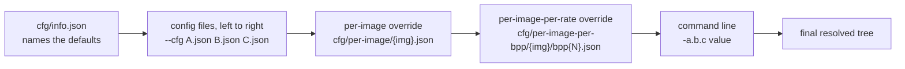
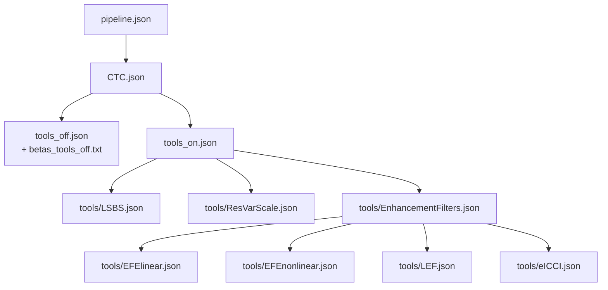
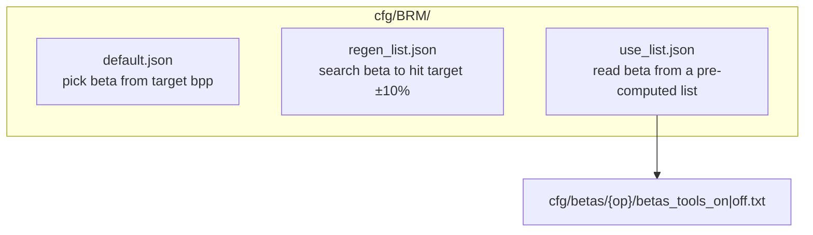

# 03 — Configuration System

The codec has no hard-coded pipeline. Which networks run, which tools are on, which checkpoints
load and which rate points are targeted all come from JSON. This document explains how those
files compose and in what order values win.

## 1. Resolution order



Later always overrides earlier. Within a single file, `!include` is expanded **first** (depth
first, in list order), then the file's own keys are applied on top — so a file always wins over
what it includes.

`ArgParserDecorator.get_cfgs()` (`src/codec/common/argparse_decorator.py`) performs the
`!include` expansion; `cmd_params_loading()` (`src/codec/utils/utils.py`) drives the whole
sequence. Files are parsed with `commentjson`, so `//` and `/* */` comments are legal.

The per-image files are applied only by the evaluation harness (`CodecEval.codec_stream`) and
only when `--only_base_config` / `--no_per_ratepoint_config` do not disable them.

This chapter is a reference for *what is in* the configuration files.
[12 — Parameter resolution](12-parameter-resolution.md) describes the machinery that applies
them — the `!exclude` directive, the deduplication rules, what the command line does and does not
contribute, and how `tools_common` / `model_common` actually work.

## 2. `cfg/info.json` — the release descriptor

```json
{
    "version": "IS",
    "codec_name": "JAI",
    "config": ["tools_on.json", "profiles/high.json"],
    "pipeline": "pipeline.json"
}
```

| Field | Consumed by | Meaning |
| --- | --- | --- |
| `version` | `get_codec_version()` | Printed by every tool; part of the run banner |
| `codec_name` | `get_codec_name()` | Prefix of generated bitstream and reconstruction filenames |
| `config` | `CTC_get_default_fn()` | The encoder's default `--cfg` list when none is given |
| `pipeline` | `get_pipeline_desc_paths()` | **The decoder's only configuration file** |

That last row is the crucial asymmetry:

> The **encoder** reads a stack of configuration files (defaults, tools, profile, per-image).
> The **decoder** reads *only* `cfg/pipeline.json` and recovers everything else from the
> bitstream headers.

Consequently: anything the decoder needs to know must either be in `pipeline.json` or be
signalled in a header. Any encoder-only choice (RDO settings, rate targets, search effort)
belongs in a tool config, never in `pipeline.json`.

## 3. `cfg/pipeline.json` — the decoder pipeline

The largest configuration file (~370 lines). Its structure:

```
!include: [AE/default.json, BRM/default.json]     entropy engine + rate control defaults
target_device: gpu
target_bpps: [12, 25, 50, 75, 100]                rate points, in bpp × 100

model:
  tool: CCS_SGMM                                  which core model class
  CCS_SGMM:
    Ntools: 4                                     four beta models
    tools_common:                                 settings shared by all four
      beta_list: [0.0005 … 3.0]                   the gain-unit beta ladder (18 entries)
      sigma_quant_min/max/level: 0.11 / 100 / 35  scale quantisation grid
      sigma_bound_offset: 0.5
      model_common:                               settings shared by Y and UV
        common_modules:
          ckpt_model_name: VM_common_int
          hyper_encoder_type / hyper_decoder_type / hyper_scale_decoder_type
        decoder: { bop_prim/hop_prim/sop_prim/bop_sec/hop_sec/sop_sec → ckpt_model_name }
        encoder: { bop_prim/hop_prim/bop_sec/hop_sec → ckpt_model_name }
      model_y:
        common_modules: { use_context_module: true }
    tools_0:                                      beta 0.002 — the highest quality model
      base_model_beta: 0.002
      model_common.ls_processing.lsbs.scale0_lsbs / scale1_lsbs
      model_common…quantizer.rvs.threshold_rvs_id1 / rvs_scale_list_id1
      model_y  : ckpt_files per module  (Y_0.002.pth, encoder_Y_0.002.pth, decoder_Y_0.002.pth)
      model_uv : ckpt_files per module  (UV_0.002.pth, …)
    tools_1: beta 0.012      tools_2: beta 0.075      tools_3: beta 0.5

post_filters:
  tools: [EFElinear, eICCI, EFEnonlinear, LEF]    the application order
  eICCI: { ckpt_model_name, nf: 48, nbY: 2, nbUV: 4, y_short_list, uv_short_list, ckpt_files }
  icci:  { ckpt_model_name: ICCI_r2, ckpt_files }

colour_processing:
  tools: [colour_transform, chroma_transform]
```

Note how `tools_common` / `model_common` work: a value set there is inherited by every beta
model and by both components, and a value in `tools_2.model_uv` overrides it for exactly that
combination. This is the `!include`-free equivalent of inheritance and it is implemented by
`ParamsBase.load_params_from_owner()` inside `_params_loaded()`.

The `post_filters.tools` list is both an enable list and an **order** — `ToolsComposite`
executes filters in that sequence and discards any tool not named.

## 4. `cfg/CTC.json` — Common Test Conditions

Included by both `tools_off.json` and `tools_on.json`, so it is the base of every standard run.
It includes `pipeline.json` and adds the encoder-side defaults:

| Setting | Value | Meaning |
| --- | --- | --- |
| `res_changer.enabled` | `0` | Intra-resolution change off by default |
| `model…abs_in_hyperprior` | `1` | Use absolute values feeding the hyperprior |
| `model_y.tile_manager_enc` | 1 048 576 samples/tile, 64 overlap | Luma analysis tiling |
| `model_y.tile_manager_synthesis` | enabled, 1 048 576 / 64 | Luma synthesis tiling |
| `model_uv.tile_manager_enc` | 262 144 / 32 | Chroma analysis tiling |
| `model_uv.tile_manager_synthesis` | enabled, 1 048 576 / 64 | Chroma synthesis tiling |

Tiling is on by default so that arbitrarily large images fit in memory; see
[09 — Coding tools](09-coding-tools-reference.md#tiling-and-regions).

## 5. Anchors: `tools_off.json` and `tools_on.json`



`tools_off.json` is the **anchor** — the configuration every tool measurement is compared
against. It differs from CTC only by pointing the bitrate matcher at
`betas_tools_off.txt`. `tools_on.json` enables the full tool set and uses
`betas_tools_on.txt`.

## 6. `cfg/tools/` — one file per tool

Each file is a minimal patch that turns exactly one tool on. Because they are patches, they
compose: to test LSBS and RDLR together but nothing else, pass

```
--cfg cfg/tools_off.json cfg/tools/LSBS.json cfg/tools/RDLR.json cfg/profiles/base.json
```

| File | Turns on |
| --- | --- |
| `LSBS.json` | Latent-space bias shift |
| `ResVarScale.json` | Residual variance scaling + channel-wise gain (also sets per-component `cnum_list`) |
| `EFElinear.json` | Linear enhancement filter (and sets `preprocess_EFE: 0`) |
| `EFEnonlinear.json` | Non-linear enhancement filter, with on/off switching |
| `LEF.json` | Luma enhancement filter |
| `ICCI.json` / `eICCI.json` | The two CNN post-filters (eICCI is the efficient successor) |
| `EnhancementFilters.json` | Convenience: includes EFElinear + EFEnonlinear + LEF + eICCI |
| `RDLR.json` | Rate-distortion latent refinement, plus the smaller tile sizes it needs |
| `quality_map.json` | Spatially varying quality with an ROI mask |
| `ChromaShift.json` | Chroma histogram processing |
| `IndependentRegions.json` | Region partitioning, each region in its own substream |
| `DependentRegions.json` | Region partitioning with overlap, all regions in one substream |
| `ECThread8.json` | 8 entropy-coding threads for z, residual and quality-map substreams |
| `skip_off.json` | *Disables* latent skip mode (which is on by default) |

`cfg/tool_ena/` holds "anchor + exactly this tool" configurations and `cfg/tool_dis/` holds
"all tools except this one"; `make tool_ena` / `make tool_dis` sweep them. Both directories also
contain `anchor.json` so the sweep produces its own reference point.

## 7. Profiles, levels and operating points

These three concepts are often confused. They are distinct:

| Concept | Where | What it constrains |
| --- | --- | --- |
| **Profile** | `cfg/profiles/{simple,base,high}.json` | Which *synthesis transforms* a conforming decoder must implement. Signalled as `decoder_profile_id`, alongside `stream_profile_id` |
| **Level** | `cfg/profiles/levels.json` | Maximum picture size and which beta models are allowed. Signalled as `level_idc` |
| **Operating point** | `cfg/oper_point/*.json` | Which analysis/synthesis network *this run* actually uses |

### Profiles

| Profile | `decoder_profile_id` | `stream_profile_id` | `synthesis_transform_id` | Operating point included |
| --- | --- | --- | --- | --- |
| `simple` | 0 | 0 | `[0]` | `bopEnc_sopDec` — BOP analysis, SOP synthesis |
| `base` | 1 | 0 | `[1, 0]` | `bop` |
| `high` | 2 | 0 | `[2, 1, 0]` | `hop` |

Every profile also carries `stream_profile_id`, which is `0` for all three — the parameter is
declared with `choices=[0]`, so only one stream profile exists so far. It is signalled separately
from `decoder_profile_id` and validated separately.

The list is ordered: element 0 is the default synthesis transform, and a higher profile must
support every transform of the lower ones. `cfg/profiles/profiles_list.json` maps
`decoder_profile_id` back to a filename, which is how `CodingEngine.check_complience()`
validates a decoded stream.

### Levels

`level_idc` is a two-digit value: `level_idc0 = level_idc // 10` bounds the picture size,
`level_idc1 = level_idc % 10` bounds the model set.

| `level_idc0` | `max_pic_size` (samples) |
| --- | --- |
| 1 | 6 220 800 |
| 2 | 24 883 200 |
| 3 | 99 532 800 |
| 4 | 149 817 600 |
| 5 | 398 131 200 |

| `level_idc1` | Permitted beta models |
| --- | --- |
| 0 | `[2]` (beta 0.075 only) |
| 1 | `[2, 3]` |
| 2 | `[0, 1, 2, 3]` (all) |

### Operating points

| Name | Meaning | Analysis | Synthesis |
| --- | --- | --- | --- |
| `sop` | Small Operating Point | — (no SOP encoder ships) | `sop_prim` / `sop_sec` |
| `bop` | Base Operating Point | `bop_prim` / `bop_sec` | `bop_prim` / `bop_sec` |
| `hop` | High Operating Point | `hop_prim` / `hop_sec` | `hop_prim` / `hop_sec` |

`cfg/oper_point/` splits each into `<op>_Enc.json` (analysis network + beta list path) and
`<op>_Dec.json` (`synthesis_transform_id`) so they can be mixed — that is exactly what
`bopEnc_sopDec.json` does for the simple profile. `common.json` carries settings shared by all
operating points (currently `skip_cube_thr: 3`).

## 8. Rate control configuration



`cfg/BRM/default.json` also carries the model-selection defaults:

| Key | Value | Meaning |
| --- | --- | --- |
| `default_models` | `[0, 1, 2, 2, 3]` | Which beta model to use per rate point (0.12, 0.25, 0.50, 0.75, 1.00 bpp) |
| `default_beta_disp_log` | `[0, 0, -184, 0, 0]` | Log-domain beta displacement per rate point — how far the gain unit shifts from the model's own beta |
| `independent_beta_UV` | `1` | Reuse the luma beta for chroma. The name reads backwards: at `1` the chroma beta is copied from luma, and only at `0` is it searched separately |
| `BDL_range` per model | e.g. `[-1024, 259]` | Legal beta-displacement-log range for that model |

Passing `--set_target_bpp <N>` on the encoder appends `cfg/BRM/regen_list.json` automatically
(see `CodecEncoder.update_kwargs_params`), switching from "use the table" to "search for it".

## 9. Entropy engine selection — `cfg/AE/`

| File | Effect |
| --- | --- |
| `ans.json` | Use `me-tANS`, the real entropy coder (the default, via `default.json`) |
| `lh.json` | Use `lh`, the likelihood-only back-end — estimates rate without producing a bitstream. Used for RDO and training |
| `verbose.json` | Turn on per-substream logging of sizes and MD5 hashes |

## 10. Evaluation configurations — `cfg/eval/`

These are consumed by `scripts/run_eval_script.py`, not by the codec itself. Their schema is
different:

```json
{
    "!include": ["base.json"],
    "post_args": [],
    "configurations": {
        "tools_on-GPU":  { "--cfg": "./cfg/tools_on.json" },
        "tools_off-GPU": { "--cfg": ["./cfg/tools_off.json"] }
    }
}
```

| Key | Meaning |
| --- | --- |
| `profiles` | Which profiles to sweep (from `base.json`: simple, main, high) |
| `pre_args` / `post_args` | Arguments placed before/after the generated ones |
| `configurations` | Named runs; each becomes an output subdirectory |

`base.json` sets `profiles: [simple, main, high]` and `pre_args: ["--coding_type", "enc_dec"]`.
The other files narrow this: `short_test.json` for CI, `bop.json` for a single operating point,
`filters.json` and `tiles.json` for targeted sweeps, `onnx.json` for the export run.
