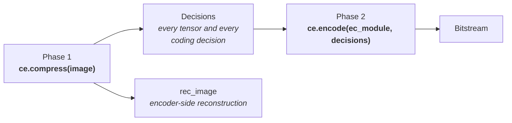
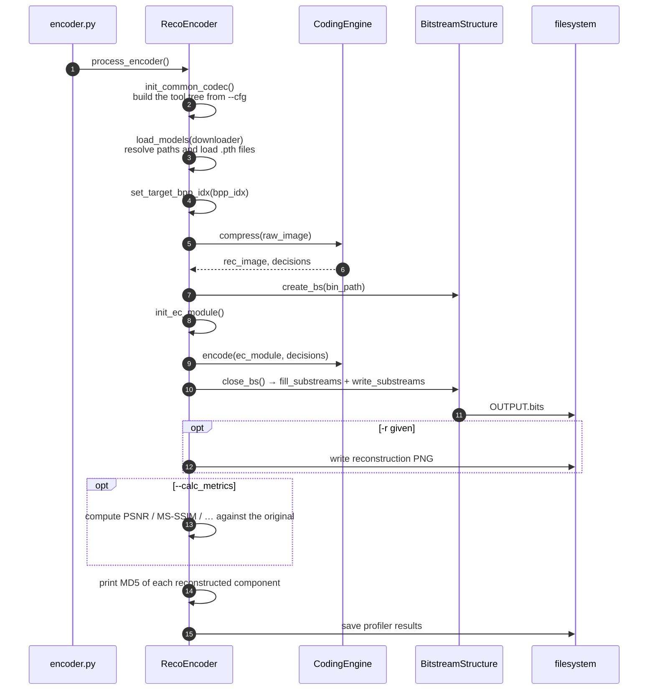
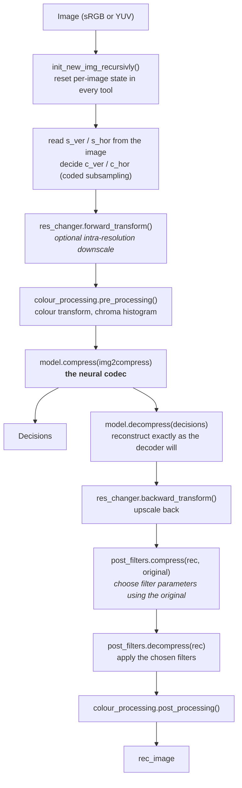
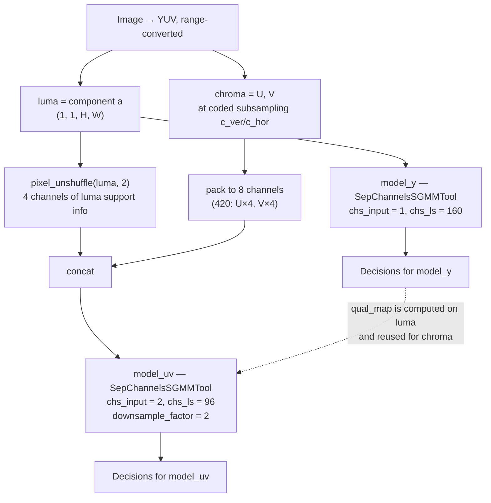
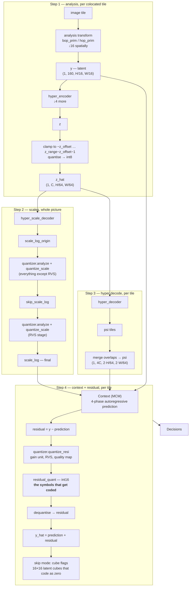
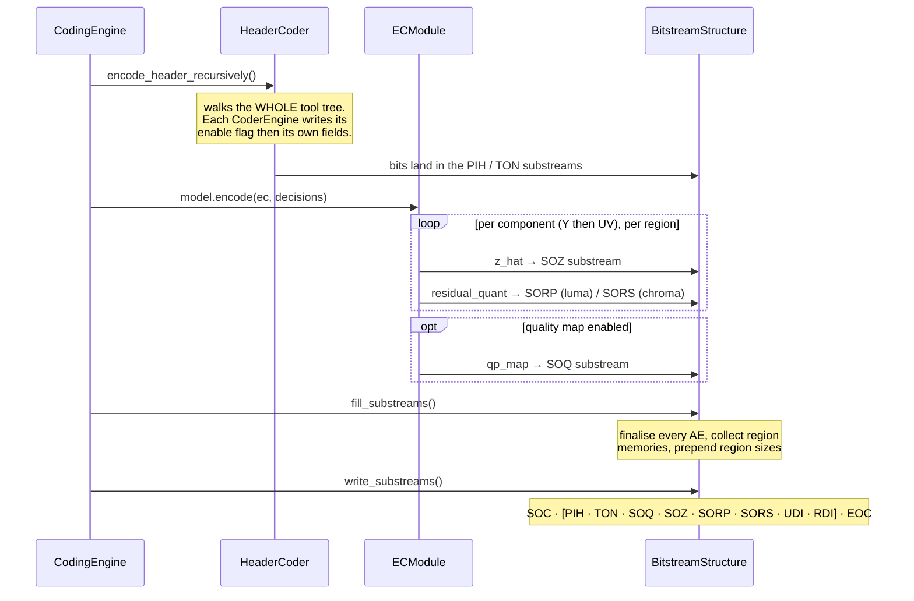

# 04 — Encoding Pipeline

## 1. Command

```bash
python -m src.reco.coders.encoder <IMAGE.png> <OUTPUT.bits> \
       [-r <REC.png>] [--set_target_bpp <BPP×100>] \
       --cfg cfg/tools_on.json cfg/profiles/base.json
```

## 2. Two phases, one engine

The encoder runs in two clearly separated phases, and it is worth understanding why:



Phase 1 does all the *thinking* — networks, rate control, RDO, filter decisions — and produces
both a `Decisions` object and the encoder's own reconstruction. Phase 2 does only *writing*: it
serialises `Decisions` into substreams.

The split exists because the bitstream cannot be opened until the number of residual substreams
is known, and that depends on region/tile decisions made during compression. `RecoEncoder.encode_stream`
therefore calls `self.ce.compress(raw_image)` first and only then `self.create_bs(...)`.

## 3. Top-level flow



The MD5 print is not cosmetic: `src/reco/scripts/compare_md5s.py` compares the encoder's and
decoder's reconstruction hashes to prove encoder/decoder match. This is the primary correctness
check in the evaluation harness and in CI.

## 4. Phase 1 in detail — `CodingEngine.compress()`



Two things to notice:

- The encoder **runs the decoder**. `model.decompress()` is called inside `compress()` so that
  post-filters see the true reconstruction and so the encoder's output matches the decoder's
  bit-exactly.
- Post-filters have a two-call protocol: `compress(rec, original)` *decides* (comparing against
  the original, and writing its decisions into the tool's header state), `decompress(rec)`
  *applies*. The decoder only ever calls `decompress`.

## 5. Inside the core model

`CcsGvaeMultiTools` selects the active beta model, then `CcsGvaeSGMM.compress()` splits the
picture into the two component branches.



This luma-support-info concatenation is the cross-component conditioning that the name
*CCS* (cross-component / conditional) refers to: chroma is coded conditioned on a downsampled
view of luma, and luma is always coded first.

Packing depends on the coded chroma format (`ccs_sgmm_tool.py:compress`):

| Coded format | Chroma packing into 8 channels |
| --- | --- |
| 4:4:4 (`c_ver=1, c_hor=1`) | `pixel_unshuffle(cat(U, V), 2)` |
| 4:2:0 (`c_ver=2, c_hor=2`) | `U.repeat(4)`, `V.repeat(4)` |
| 4:2:2 (`c_ver=1, c_hor=2`) | Even/odd rows of U and V, each repeated ×2 |

## 6. Inside one component branch

This is where the actual compression happens. `SepChannelsSGMMTool.compress()` →
`CommonEncDecModules.compress()`.



### Why the scale is computed twice

`encoder_get_scales()` runs the quantiser analysis in two passes with `excl_list=['rvs']` and
then `incl_list=['rvs']`. Residual variance scaling needs to know the scale *after* the other
quantiser stages have shaped it, so it is deliberately excluded from the first pass and applied
to its result. `skip_scale_log` is the intermediate; skip-mode decisions are made against it,
not against the RVS-scaled version.

### Tiling

Three tile managers with different granularity operate over the same picture:

| Manager | Used for | Configured by |
| --- | --- | --- |
| `tile_manager_enc` | Analysis + hyper-encoder | `model_{y,uv}.tile_manager_enc` |
| `tile_manager_hd` / `tile_manager_hyper` | Hyper-decoder and region layout | `hyper_decoder_overlap_in_latent_samples` |
| `tile_manager_mcm` | Context model and residual coding | `mcm_overlap_in_latent_samples` |
| `tile_manager_synthesis` | Synthesis transform | `model_{y,uv}.tile_manager_synthesis` |

Tiles overlap. Each manager can compute the "core" of an overlapping tile
(`get_core_of_overlapping_latent_tile`), and only the core is written into the full-picture
tensor — the overlap exists purely to give convolutions valid context at tile borders.
`tiling.ColocatedTiles.iter_colocated_grids()` walks image, `y` and `z` tile grids in lockstep so
the three resolutions stay aligned.

## 7. Rate control and RDO

Two special tools hook into the composite around the core model:


### BitrateMatcher (`coding_tools/bitrate_matcher/`)

Registered via `model.add_preproc_tool('bitrate_matcher', …)`. Its job is to choose the quality
operating point that lands closest to the requested bpp. Three modes, selected by `cfg/BRM/`:

| Mode | Behaviour |
| --- | --- |
| `default.json` | Look up `default_models` and `default_beta_disp_log` by rate-point index. No search — fast, deterministic |
| `use_list.json` | Read the per-image, per-rate beta from `cfg/betas/<op>/betas_tools_{on,off}.txt` |
| `regen_list.json` | Actually search: `match_luma()` runs the codec at trial betas and `beta_linear_interpolation()` interpolates towards the target bits. The chroma beta is then copied from luma when `independent_beta_UV` is `1`, or searched with `find_UV_beta_with_hyperopt()` when it is `0`. Distortion is a weighted MS-SSIM (`_calculate_mssim_distortion`) |

The search is what `--set_target_bpp` triggers, and it is the expensive path — it re-runs
compression several times per image. Regular test runs use the pre-computed lists instead.

### RDLR (`coding_tools/rdlr/`)

Registered via `model.add_postproc_tool('rdlr', …)`. Rate-Distortion Latent Refinement iterates
over the already-quantised latent and flips individual values when doing so lowers
`D + λ·R`. It works per tile (`numSamplesPerLumaTile`, `numSamplesPerChromaTile`) and per
iteration count (`numIteYLuma: 8` by default; z-refinement is available but disabled). Slope
estimation lives in `_get_slopes_parameters()`, with `_replace_not_sane_slopes_with_mean()`
guarding against degenerate tiles. RDLR is encoder-only — it changes what is coded, never how
it is parsed.

## 8. Phase 2 — writing the bitstream



Header writing is recursive and order-defined by the tree, which is exactly why the decoder can
reconstruct the same values: it walks the identical tree in the identical order. Adding a header
field to a tool therefore automatically changes both sides — but it also breaks compatibility
with existing bitstreams, so header changes are the highest-risk edits in this codebase.

## 9. Output files

For `python -m src.reco.coders.encoder in.png out.bits -r rec.png --calc_metrics`:

| File | Content |
| --- | --- |
| `out.bits` | The bitstream |
| `rec.png` | The encoder-side reconstruction (bit depth from `--output_bit_depth` or the source) |
| stdout `MD5: (…, …, …)` | Per-component hashes of the reconstruction |
| stdout `=== Metrics ===` | bpp plus the enabled quality metrics |
| `<out>/log/enc/*` | Profiler results, if collectors are enabled |
