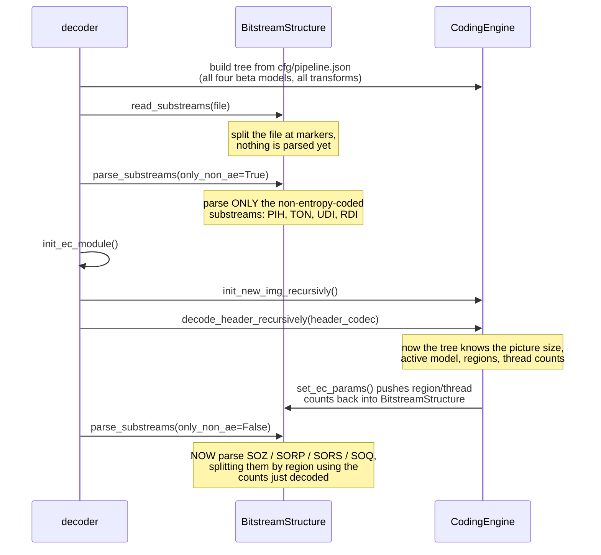
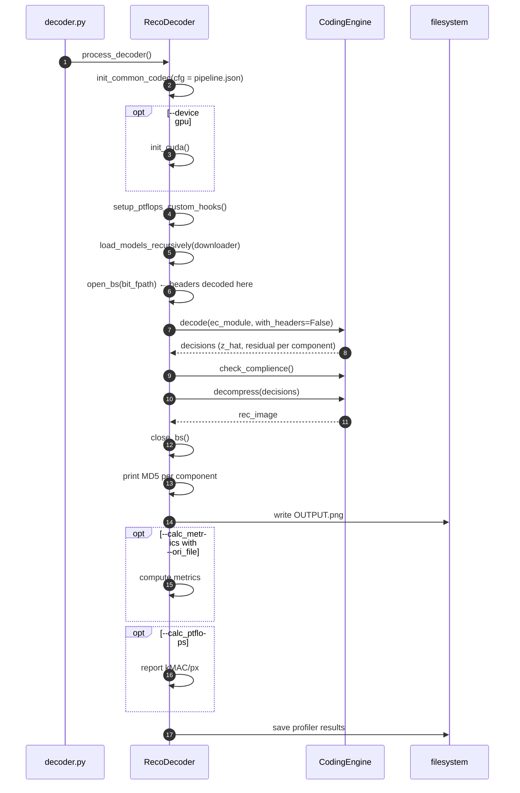
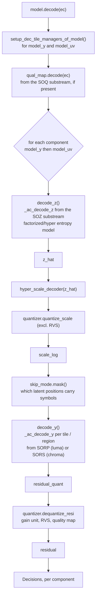
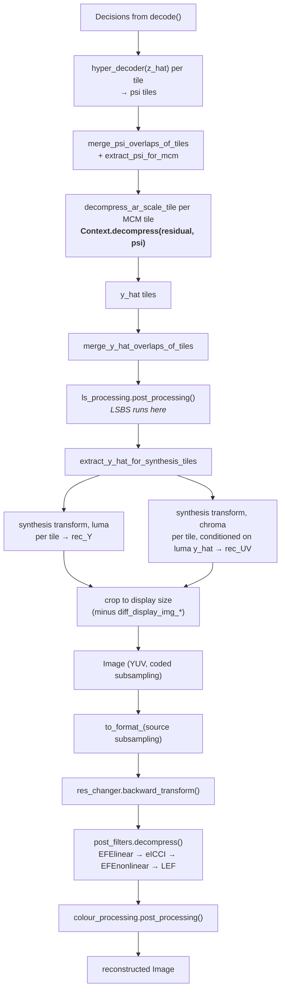
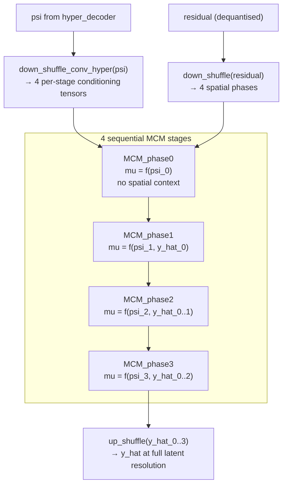

# 05 — Decoding Pipeline

## 1. Command

```bash
python -m src.reco.coders.decoder <INPUT.bits> <OUTPUT.png> [--device gpu|cpu]
```

The decoder takes **no `--cfg`**. `def_base_parser(..., has_cfg=False)` removes the option
entirely, and `CodecCoder.update_kwargs_params()` forces the configuration to
`get_pipeline_desc_paths()` — i.e. `cfg/pipeline.json`. Everything else comes from the
bitstream.

## 2. Bootstrapping problem and how it is solved

The decoder faces a chicken-and-egg problem: it must build the tool tree before it can parse the
headers, but the headers determine how the tree is configured (which beta model, which synthesis
transform, how many regions and threads).

`CodecCoder.open_bs()` resolves it in a specific order:



The header substreams are deliberately *not* entropy coded (`use_ae = False` in
`SubstreamLayouts.FullmarkersDict`) precisely so that this first pass is possible without any
prior knowledge.

## 3. Top-level flow



`check_complience()` is the conformance gate. It verifies, against `cfg/profiles/`:

1. `decoder_profile_id` names a profile that exists;
2. the default synthesis transform is one the profile supports;
3. `level_idc` decomposes into a known `level_idc0` / `level_idc1` pair;
4. `img_height × img_width ≤ max_pic_size` for that level;
5. the active beta model index is permitted at that level.

Any failure is an assertion — a non-conforming stream stops the decoder rather than producing a
picture.

## 4. Entropy decoding — `CodingEngine.decode()`



Note what is **not** here: the hyper-decoder, the context model and the synthesis transform do
not run during `decode()`. Entropy decoding only needs `scale_log` (from the hyper-scale-decoder)
to drive the probability model. Prediction and reconstruction happen in the next phase. This
separation is what allows the residual substreams to be parsed independently of, and in parallel
with, the reconstruction work.

Order matters and is fixed: quality map, then luma, then chroma.

## 5. Reconstruction — `CodingEngine.decompress()`



The chroma synthesis takes `supp_info_uv = decisions['model_y']['tiles_synthesis'][tile]['y_hat']` —
the luma latent for the colocated tile — mirroring the cross-component conditioning done on the
encoder side. **Luma must be fully reconstructed before chroma synthesis can start.**

## 6. The context model (MCM) in decode direction

`src/codec/components/contexts/context.py` implements the Multi-stage Context Model. It is the
autoregressive part of the entropy model and the reason latent decoding is sequential.



Each stage adds its dequantised residual to its predicted mean (`y_hat = resi_dq + mu`) and the
concatenation of all reconstructed stages so far becomes the spatial context for the next. The
four phases are the four positions of a 2×2 spatial pixel-unshuffle, so the model is a
four-pass checkerboard predictor rather than a per-pixel raster scan — this is what makes it
parallelisable within a stage while remaining causal across stages.

`MCM_phase0` is a special case: it has no previous reconstruction and predicts from the
hyperprior alone. `ChannelNet` and `FusionPredNet`
(`components/contexts/channel_net.py`, `fusion_pred_net.py`) are the sub-networks the phases
are built from.

When `use_context_module` is 0 (chroma, by default configuration) the context model is bypassed
and the mean comes straight from an upsampled hyper-decoder output.

## 7. Threading and regions in decode

If `region_partitioning_flag` is set, the picture is split into `numHorRegions × numVerRegions`
regions and each region's residual is decoded independently:

| `region_residual_in_its_own_substream_flag` | Layout | Property |
| --- | --- | --- |
| `1` (Independent Regions) | Each region gets its own `SORP`/`SORS` substream, prefixed with a 1-byte region index | Regions are fully independent — random access, and a region can be dropped |
| `0` (Dependent Regions) | All regions share one substream, prefixed with Exp-Golomb-coded sizes of all but the last | Regions overlap (`hyper_decoder_overlap_in_latent_samples`, `mcm_overlap_in_latent_samples`) which costs less rate but forbids independent extraction |

Independently of regions, an AE substream can be split into `num_threads` byte ranges. Thread
sizes are signalled as signed Exp-Golomb deltas from the mean thread size
(`AEMemObject.__encode_threads_deltas`), which is compact because threads are near-equal in size
by construction. `cfg/tools/ECThread8.json` sets 8 threads for `z`, residual and quality-map
substreams.

## 8. Progressive / partial decoding

The code contains the scaffolding for decoding only part of a stream:

- `num_decode_chs` (`CcsSharedModelsParams`) truncates the latent to the first N channels; the
  context model zeroes the rest (`diff[:, self.num_decode_chs:] = 0`).
- `scripts/bitstream_extractor.py` removes chosen residual substreams or the tools header from
  an existing bitstream, producing a valid but lower-quality stream.
- `scripts/progressive_decoding/` holds standalone encoder/decoder variants and channel-ordering
  utilities for this experiment.
- `CcsGvaeSGMM.forward()` carries commented-out `present_substreams_list_Y/UV` filtering — the
  hooks for skipping absent regions are present but disabled in this release.

## 9. Output

| File | Content |
| --- | --- |
| `OUTPUT.png` | The reconstruction. `--output_bit_depth` forces 8 or 10 bit; otherwise the bit depth signalled in the picture header is used |
| stdout `MD5: (…)` | Per-component hashes — must match the encoder's for a conforming run |
| `<out>/log/dec/*` | Profiler results |
