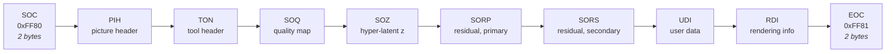
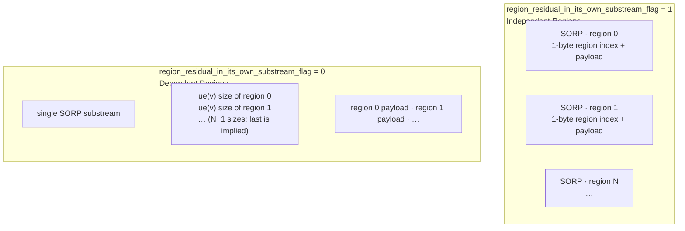

# 06 — Bitstream Format

Source: `src/codec/bitstream_structure/`.

## 1. File layout

A JPEG AI bitstream is a marker-delimited container. Everything is big-endian
(`BitstreamStructure.BYTE_ORDER = 'big'`).



Optional substreams are simply absent. The only ordering rule enforced in code is that **PIH
must be the first substream after SOC** — asserted on both write (`write_substreams`) and read
(`read_substreams`).

### Substream framing

Each substream (`substream.py`) is:

```
┌──────────────┬──────────────────────┬─────────────────────┐
│ marker_id    │ substream_size       │ payload             │
│ 2 bytes      │ unsigned Exp-Golomb  │ substream_size bytes│
│              │ order 0, byte-aligned│                     │
└──────────────┴──────────────────────┴─────────────────────┘
```

SOC and EOC carry only their marker; they have no size field and no payload.

## 2. Marker table

Defined by `SubstreamLayouts` in `layouts_def.py`:

| Marker | Value | Name | Entropy coded | Threads | Mandatory | Has regions |
| --- | --- | --- | --- | --- | --- | --- |
| `SOC` | `0xFF80` | Start of codestream | — | — | yes | — |
| `EOC` | `0xFF81` | End of codestream | — | — | yes | — |
| `PIH` | `0xFF82` | `picture_header` | no | no | **yes** | no |
| `TON` | `0xFF83` | `tool_header` | no | no | no | no |
| `RDI` | `0xFF84` | `rendering_information` | no | no | no | no |
| `SOZ` | `0xFF88` | `z_substream` | **yes** | yes | **yes** | no |
| `SORP` | `0xFF89` | `r_prim_substream` | **yes** | yes | **yes** | **yes** |
| `SORS` | `0xFF8A` | `r_sec_substream` | **yes** | yes | **yes** | **yes** |
| `SOQ` | `0xFF8B` | `quality_map` | **yes** | yes | no | no |
| `UDI` | `0xFF8C` | `udi` | no | no | no | no |

Three properties drive all behaviour:

- **`use_ae`** — an entropy-coded substream gets a real me-tANS coder; a non-AE substream gets
  `ECLibDirect`, a plain bit writer/reader. This is what makes headers parseable before anything
  else.
- **`use_threads`** — the payload may be split into independently decodable byte ranges.
- **`has_regions`** — the payload may be split by spatial region. Only the two residual
  substreams have regions.

### Primary vs secondary mapping

Tools address substreams by a *logical name* and a component index, not by marker. Two mapping
tables translate:

| Logical name | Primary (luma) | Secondary (chroma) |
| --- | --- | --- |
| `pic_header` | PIH | PIH |
| `tool_header` | TON | TON |
| `qmap` | SOQ | SOQ |
| `z` | SOZ | SOZ |
| `r` | **SORP** | **SORS** |
| `udi` | UDI | UDI |
| `rdi` | RDI | RDI |

Only `r` differs. A tool sets `stream_base_comp` (0 for luma, 1 for chroma) and
`stream_header_part` (`'pic_header'`, `'tool_header'`, …), and `ECModule` resolves the pair to a
marker at write/read time.

## 3. Region layout inside a residual substream



Independent regions repeat the marker, one substream per region, each tagged with its index —
so a region can be extracted or dropped without touching the rest. Dependent regions share one
substream with a size table, are cheaper in rate, and are allowed to overlap
(`hyper_decoder_overlap_in_latent_samples`, `mcm_overlap_in_latent_samples`), which improves
quality at region borders. `parse_substreams()` handles both layouts.

## 4. Thread layout inside a substream

`AEMemObject` (`aemem.py`) manages the memory behind one entropy coder instance and, when
`num_threads > 1`, the split points.

```
┌───────────────────────────────────────┬────────────────────────────┐
│ (N−1) signed Exp-Golomb deltas        │ N thread byte ranges       │
│ delta_i = mean_thread_size − size_i   │                            │
└───────────────────────────────────────┴────────────────────────────┘
```

Sizes are coded as deltas from the mean because the encoder splits work near-evenly, so the
deltas are small. `mean_thread_size = floor(total / N)`; the last thread's size is implied by
the total.

## 5. Picture header (PIH) fields

Written by `CodingEngine.encode_header()` and then by every tool in tree order. The
`CodingEngine`'s own fields come first:

| Field | Coding | Meaning |
| --- | --- | --- |
| `decoder_profile_id` | 4 bits | 0 simple, 1 main, 2 high |
| `num_synthesis_transforms_minus1` | 4 bits | Length of the transform list |
| `synthesis_transform_id[i]` | 4 bits each | Which synthesis networks the stream may use; `[0]` is the default |
| `level_idc` | 8 bits | Two decimal digits: picture-size level and model-set level |
| `img_width_minus64` | bounded, max 65 535 | Coded width − 64 |
| `img_height_minus64` | bounded, max 65 535 | Coded height − 64 |
| `diff_display_img_width` | 6 bits | Coded width minus display width (0…63) |
| `diff_display_img_height` | 6 bits | Coded height minus display height (0…63) |
| `bit_depth_idc` | bounded, max 4 | Index into `[8, 10, 12, 14, 16]`. **The decoder asserts 8 or 10** |
| `s_ver_minus1`, `s_hor_minus1` | 1 bit each | Source chroma subsampling |
| `c_ver_minus1`, `c_hor_minus1` | 1 bit each, conditional | Coded chroma subsampling; only present when the corresponding `s_*` is 1 |

Maximum picture dimensions are therefore `(1<<16) − 1 + 64 = 65 599`. The
`diff_display_*` fields exist because the coded picture is padded up to the network alignment
(a multiple of 64 in the worst case); the decoder crops back down.

After these, `encode_header_recursively` continues through the tree. Each `CoderEngine` with
`has_enabled_flag` writes a 1-bit enable flag, and writes its own fields only if enabled.

### Core-model header (also in PIH)

`CcsGvaeSGMM.encode_header()` adds:

| Field | Coding | Meaning |
| --- | --- | --- |
| `multi_threading_z` | 1 bit | Whether z uses multiple threads |
| `log2_num_threads_z_minus1` | 2 bits, conditional | 2, 4, 8 or 16 threads |
| *(quantizer proxy headers, pass 1)* | — | Per-component quantiser flags |
| `region_partitioning_flag` | 1 bit | Regions in use |
| `num_ver_splits_minus1` | 7 bits, conditional | Up to 128 vertical regions |
| `num_hor_splits_minus1` | 7 bits, conditional | Up to 128 horizontal regions |
| `region_residual_in_its_own_substream_flag` | 1 bit, conditional | Independent (1) vs dependent (0) |
| `hyper_decoder_overlap_in_latent_samples` | 2 bits, conditional | ×2 → `HyperDecoderOverlap` |
| `mcm_overlap_in_latent_samples` | 4 bits, conditional | ×4 → `McmOverlap` |
| *(quantizer proxy headers, pass 2)* | — | Per-component quantiser tables |

`HeaderProxy` (`interfaces/coder/header_proxy.py`) is the mechanism behind "pass 1 / pass 2": it
collects the same class of tool across both components and interleaves their headers so that
shared flags are written once.

Per-component fields (`SepChannelsSGMMTool.encode_header`) include `multi_threading_r[ccs_id]`
and the residual thread count.

## 6. Tool header (TON)

Post-filters declare `stream_header_part='tool_header'`, so their decisions land in TON rather
than PIH. Example payloads: EFElinear's filter coefficients and split decisions, EFEnonlinear's
per-block on/off flags, eICCI's per-tile model indices, LEF's sharpening parameters.

TON is optional. `scripts/bitstream_extractor.py --remove_ton` strips it, producing a stream
that decodes without post-filtering.

## 7. `HeaderCoder` — the header field API

`entropy_coding/header_module.py`. Two ways to code a value:

| Call | Result |
| --- | --- |
| `ec.encode(v, bits_count=N, name=…)` | Fixed-length, N bits |
| `ec.encode(v, max_symbol_value=M, name=…)` | Bounded: uses `ceil(log2(M+1))` bits |

`decode()` mirrors both, taking a shape instead of a value. The `name` argument is not
decorative — it is what `ECDump` records, and it is what makes `scripts/bitstream_probe.py`
output readable. Every header field in this codebase is named.

`check_values()` asserts each value fits its declared range before writing, so an out-of-range
header field fails at encode time rather than corrupting the stream.

## 8. Inspection tools

### `scripts/bitstream_probe.py`

```bash
python scripts/bitstream_probe.py stream.bits [--json_output dump.json] [--silent]
```

Opens the bitstream with an `ECDump` attached, parses every header, and prints a structured dump:
substream names, sizes, per-region sizes and every named header field with its decoded value.
`--json_output` writes the same as machine-readable JSON. It never runs a network, so it is fast
and needs no checkpoints.

### `scripts/bitstream_extractor.py`

```bash
python scripts/bitstream_extractor.py in.bits out.bits \
       [--remove_resi_substreams 2 3] [--remove_ton]
```

Reads, drops the named residual substreams and/or the tool header, and rewrites. Used for
progressive-decoding and error-resilience experiments. Removing residual substreams is only
meaningful when the stream was coded with `region_residual_in_its_own_substream_flag = 1`.

### Verbose mode

`--cfg cfg/AE/verbose.json` makes `BitstreamStructure` print, for every substream, its
human-readable name, marker, byte size and MD5 on both write and read — the quickest way to
localise an encoder/decoder mismatch to a single substream.
