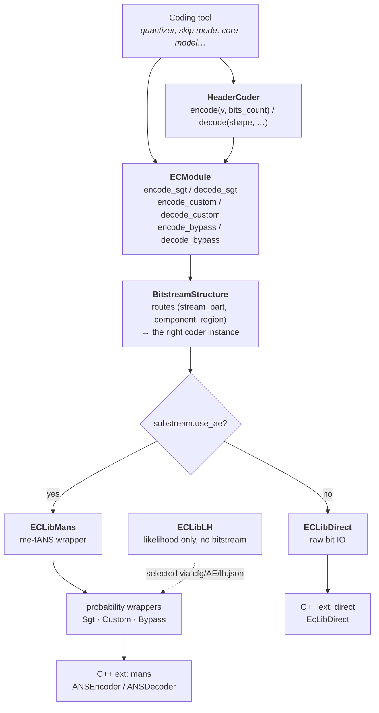
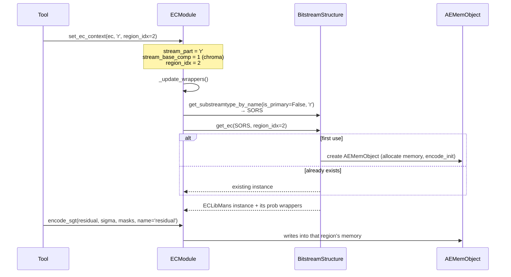

# 07 — Entropy Coding

Source: `src/codec/entropy_coding/` (the coder) and `src/codec/components/entropy_coding/`
(the differentiable probability models used inside the networks).

## 1. Layered design

Four layers, each with one job:

1. **`ECModule`** — the façade every tool talks to. It holds the current *routing context*
   (`stream_part`, `stream_base_comp`, `region_idx`); changing any of them re-resolves which
   coder instance the next call writes into.
2. **`BitstreamStructure`** — owns one `AEMemObject` per (marker, region) pair and creates them
   lazily.
3. **Library wrappers** — `ECLibMans`, `ECLibDirect`, `ECLibLH`, `ECLibEmpty`. Each exposes the
   same `encode_init` / `encode_term` / `decode_init` / `decode_term` lifecycle and a set of
   probability wrappers.
4. **C++ extensions** — the actual arithmetic.

## 2. The three coding primitives

Everything in the bitstream is written with exactly one of these:

| Primitive | `ECModule` method | Probability model | Used for |
| --- | --- | --- | --- |
| **SGT** | `encode_sgt(x, sigma, masks, name)` | Table-based single Gaussian, driven by a per-element σ | The latent residual — the bulk of the bitstream |
| **Custom** | `encode_custom(x, model, max_symbol_value, mean, name)` | Learned factorised (non-parametric) CDF | The hyper-latent `z` |
| **Bypass** | `encode_bypass(x, max_symbol_value, name)` | Uniform | Flags, indices, small side information |

Each has a symmetric decode. `masks` in the SGT call is the skip-mode mask: masked-out positions
carry no symbol at all, which is how skip mode saves rate.

`name` is threaded through to `ECDump`, which is what makes `scripts/bitstream_probe.py` able to
label every field.

## 3. me-tANS — the entropy engine

**me-tANS** = multi-symbol, table-based Asymmetric Numeral Systems. Registered under the name
`me-tANS` in `entropy_coding/composite/factory.py`.

### Why tANS and not arithmetic coding

tANS replaces per-symbol arithmetic with table lookups: the encoder walks a precomputed state
machine, so encoding a symbol is a table index plus a shift. It reaches arithmetic-coding
efficiency at much higher throughput, and — importantly for a reference implementation — the
tables are *specified data*, so two implementations that agree on the tables agree bit-exactly.

### Distribution set

`ECLibMans.__init__` carries a hard-coded `pdf_r` — 32 discrete PDFs
(`NUM_DISTRIBUTIONS_R = 32` in `cpp_exts/mans/constants.h`), one per quantised σ level, ranging
from near-deterministic (`[255]`) to nearly uniform. Alongside it, `bound_table_r` gives each
distribution's symbol bound (1 … 128).

The σ→distribution mapping is a quantisation of the continuous scale:

| Parameter | Default | Config key |
| --- | --- | --- |
| `quant_start` | 0.11 | `sigma_quant_min` |
| `quant_end` | 54.82 (pipeline uses 100) | `sigma_quant_max` |
| `quant_count` | 32 (pipeline uses 35) | `sigma_quant_level` |
| symbol range | `[-128, 128]` | `quant_min_val` / `quant_max_val` |

At `_params_loaded()` time the wrapper converts PDFs to CDFs and builds three tables —
`encode_transitions`, `state_maps`, `decode_transitions` — via
`lib_wrappers/mans/utils.py`. Because the build is deterministic and slow, results are cached in
`lib_wrappers/mans/cache.pt`; `--rebuild_ae_cache 1` (the evaluation default) discards it first.

For the hyper-latent there is a separate, learned table set: `MAX_Z = 63` states, exported as
`transition_table_z*.csv` in `models/VM_common_int/`.

### The C++ side

`src/codec/entropy_coding/cpp_exts/mans/`:

| File | Contents |
| --- | --- |
| `constants.h` | `NUM_DISTRIBUTIONS_R = 32`, `MAX_Z = 63`, bit masks |
| `compressor.h/.cpp` | `BitStreamEncode` (64-bit head, bit position, two ANS states) and `ANSEncoder` |
| `decompressor.h/.cpp` | The mirrored decoder |
| `ans.cpp` | pybind11 bindings |
| `utils.py` | Table construction: `get_cdf_matrix`, `get_encode_transitions`, `get_state_maps`, `get_decode_transitions` |
| `Makefile` | Builds the extension |

`ANSEncoder` holds `nThreads` independent `BitStreamEncode` streams, per-thread output pointers
and sizes — this is where substream threading is actually realised. Note `state1`/`state2` in
`BitStreamEncode`: the encoder interleaves two ANS states to hide dependency latency, and
`closeWithState()` / `closeWithStates()` flush one or both.

ANS encodes in reverse relative to decoding, which is why `BitstreamStructure` carries a
`reverse_encode_order` flag and `CcsGvaeSGMM.encode()` reverses the component order when it is set.

`cpp_exts/direct/` is much simpler: `EcLibDirect` is a bit-addressed reader/writer over a byte
buffer (`read_bits`, `write_bits`, `set_pointer`) used for all non-AE substreams.

Both extensions are built by `scripts/build_ec_lib.sh`, invoked from
`scripts/build_test_libs.sh` (`make build_test_libs`).

## 4. Probability models

Two families exist and they are easy to confuse:

### Coding-side descriptors — `entropy_coding/prob_models/`

Plain Python objects that describe a distribution to the C++ layer. Each implements
`to_ctypes()` to marshal its parameters.

| Class | Parameters | Purpose |
| --- | --- | --- |
| `SgtProbModel` | `sigma`, `symbol_num=512` | Table-based single Gaussian — the residual coder |
| `CustomProbModel` | a `FactorizedProbModel`, optional `mean` | Learned factorised CDF — the `z` coder |
| `BypassProbModel` | `symbol_num` | Uniform |
| `AsgmProbModel` | `mu`, `sigma_l`, `sigma_r` | Asymmetric single Gaussian |
| `AgmmProbModel` | `mu`, `sigma_l`, `sigma_r`, `weight` | Asymmetric Gaussian mixture |
| `GolombProbModel` | `k` | Exp-Golomb |
| `HistProbModel` | frequency array | Explicit histogram |

Only SGT, Custom and Bypass are reachable from `ECModule` in this release; the rest are
infrastructure for experimentation.

### Network-side models — `components/entropy_coding/prob_models/`

Differentiable `nn.Module`s that produce likelihoods for rate estimation during training and RDO.

| Class | Description |
| --- | --- |
| `FactorizedProbModel` | Learned non-parametric CDF per channel; the entropy model for `z` |
| `SymmetricProbModel` / `AsymmetricProbModel` | Base classes |
| `LaplacianProbModel` | Laplacian, symmetric |
| `SSGMProbModel` | Symmetric single Gaussian |
| `SGMMProbModel` | Symmetric Gaussian mixture — the model name in `CCS_SGMM` |
| `ASGMProbModel` | Asymmetric single Gaussian |
| `GMProbModel` | Gaussian mixture, with `LowerBound` (a custom autograd `Function` giving a straight-through gradient below the bound) |

`entropy_estimation/gm_likelihood.py` converts model parameters into likelihoods, and hence into
an estimated bit count.

## 5. `ECLibLH` — the likelihood back-end

Selected with `--cfg cfg/AE/lh.json`. It implements the same interface but produces **no
bitstream**: `encode_term()` returns an estimated size derived from the probability model instead
of writing bytes.

This is what makes the RDO tools affordable. The bitrate matcher must evaluate many candidate
betas and RDLR must evaluate many candidate latent perturbations; running the real ANS coder for
each would dominate runtime. `collect_cpu_bits` and `update_label_attrs(label, bits, freq)` let it
attribute the estimated bits to named fields, so rate can be broken down per tool.

`ECLibEmpty` is the third variant: a null coder used as a placeholder for regions that turn out
to be absent when decoding.

## 6. Routing: how a tool reaches the right substream

`_update_wrappers()` re-binds `self.sgt`, `self.custom` and `self.bypass` on every context
change, which is why a tool must set its context before it codes anything. `CoderEngine.set_ec_context()`
is the helper that does it.

## 7. Extending the entropy coder

`docs/md/entropy.md` documents the (older, C++-library-based) procedure in full. The current
structure needs these steps:

**A new entropy engine**

1. Add a wrapper under `lib_wrappers/<name>/` deriving from `ECLibBase` or `ECLibBaseWithThread`.
2. Provide probability wrappers (`base_prob_wrapper.py`, `bypass_prob_wrapper.py`,
   `sgt_prob_wrapper.py`, `custom_prob_wrapper.py`) mapping models to your back-end.
3. Register it under a new name in the `modules` dict of `ECInstanceFactory`
   (`composite/factory.py`).
4. Add a `cfg/AE/<name>.json` selecting it.

**A new probability model**

1. Add the descriptor under `entropy_coding/prob_models/` with a `to_ctypes()`.
2. Add a wrapper in every `lib_wrappers/*/` you want to support it.
3. Expose `encode_<name>` / `decode_<name>` on `ECModule`.
4. If it needs the network side, add the differentiable counterpart under
   `components/entropy_coding/prob_models/`.

Because probability tables are normative, any change here changes the bitstream. Regenerate the
exported tables (`make export_models`) and re-run the conformance comparison afterwards.
