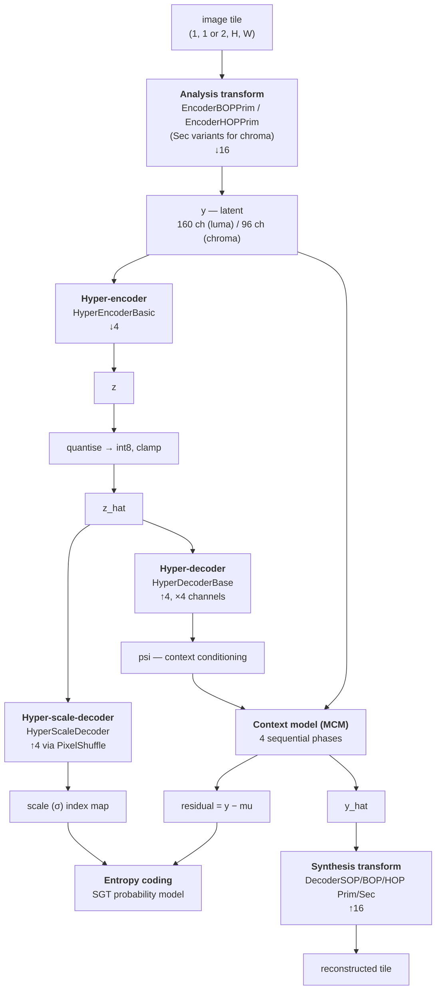
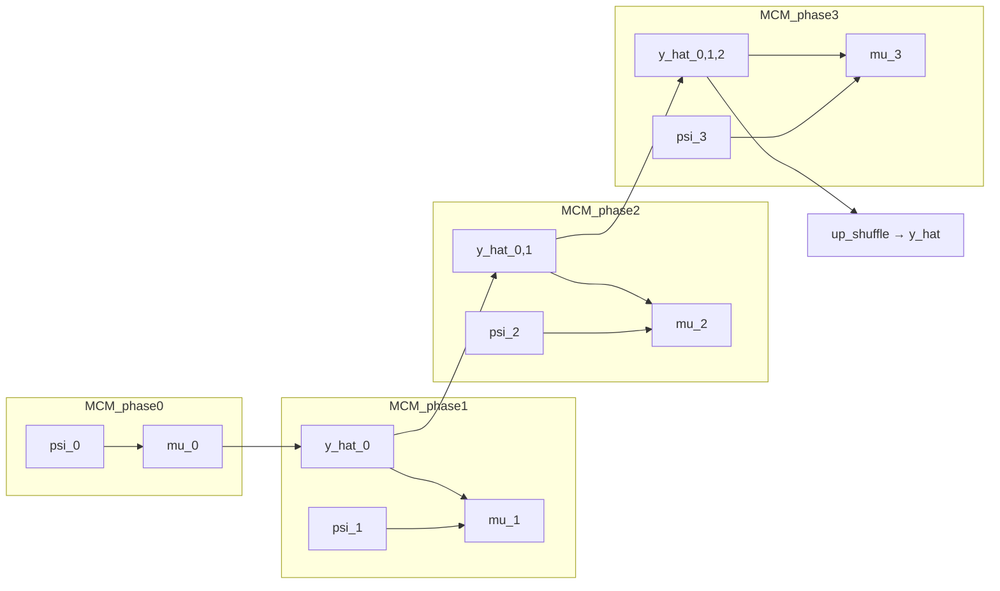

# 08 — Neural Network Components

Source: `src/codec/components/`. These are plain `nn.Module`s with no tool framework attached —
the coding tools instantiate and drive them.

## 1. The network graph



Spatial scale factors: analysis ↓16, hyper-encoder ↓4 more (so `z` is at 1/64 of picture
resolution). Latent channel counts are fixed in `CcsGvaeSGMM.__init__`: **160 for luma, 96 for
chroma**.

## 2. Analysis transforms (encoder side)

`components/autoencoder_data/encoder/`, selected by `EncoderFactory`.

| Class | Operating point | Component |
| --- | --- | --- |
| `EncoderBOPPrim` | BOP | Primary (luma) |
| `EncoderBOPSec` | BOP | Secondary (chroma) |
| `EncoderHOPPrim` | HOP | Primary |
| `EncoderHOPSec` | HOP | Secondary |

There is deliberately **no SOP encoder** — the simple profile uses a BOP analysis transform with
an SOP synthesis transform (`cfg/oper_point/bopEnc_sopDec.json`).

### `EncoderBOPPrim` structure

```
normalize → pad(depth 0)
conv3x3(1→128, stride 2)   → clip 'E1B' → ResAU → pad(depth 1)
conv3x3(128→128, stride 2) → clip 'E2B' → ResAU → pad(depth 2)
conv3x3(128→128, stride 2) → clip 'E3B' → ResAU → pad(depth 3)
conv3x3(128→160, stride 2) → clip 'E4B'
conv1x1(160→160)           → clip 'E5B'
```

Four stride-2 convolutions give the ↓16. `EncoderHOPPrim` is the same backbone plus a
`TAM` transformer block after stage 1 and a `CAB` channel-attention block after stage 2 — that
is the entire difference between the base and high operating points on the encoder side.

### Feature clipping

Every stage passes through `feature_clipping(x, 'E1B', clip_thres, is_clip)`. When
`clipping_mode` is enabled, intermediate activations are clamped to per-layer thresholds stored
in the checkpoint (`clip_thres`, carried through custom `state_dict` / `_load_from_state_dict`
overrides). This bounds the dynamic range so that a fixed-point implementation can reproduce the
float result — it is a conformance feature, not a quality feature.

`padding_layer` / `cropping_layer` (`base_layers/utils.py`) keep the tensor size consistent with
the target `h, w` at each depth, so a tile of any size produces a latent of the size the tile
manager expects.

## 3. Synthesis transforms (decoder side)

`components/autoencoder_data/decoder/`, selected by `DecoderFactory`. Six variants:
`{sop,bop,hop}_{prim,sec}`. The `synthesis_transform_id` in the picture header maps
0 → SOP, 1 → BOP, 2 → HOP.

| | SOP (`DecoderSOPPrim`) | BOP (`DecoderBOPPrim`) | HOP (`DecoderHOPPrim`) |
| --- | --- | --- | --- |
| Hidden channels | 96, 64 (minus 32 each) | 64, 64, 96 | 128, 128 |
| Residual block | `LightResidualBlock` | `LightResidualBlock` | `ResidualBlock` |
| Upsampling | `conv2x2_pxl2` ×2 + PixelShuffle(4) | `conv4x4_t` ×2 + PixelShuffle(4) | `conv3x3_t` ×2 + PixelShuffle(2) + `conv3x3_t` |
| Attention | none | none | `CAB` + `TAM` |
| Activation | `ResAU` | `ResAU` | `ResAU` |
| Output | `denormalize` → `clip_image_sgl` | same | same |

All three end at `out_scale_factor = 16`. The complexity ladder is the point: SOP is the cheapest
decoder a conforming implementation may need to run, HOP the most capable. Because the profile
lists transforms in decreasing order (`high` → `[2, 1, 0]`), a high-profile decoder must be able
to run all three.

## 4. Hyper networks

`components/autoencoder_hyper/`.

### `HyperEncoderBasic`

```
(optional) x = |x|            ← abs_in_hyperprior
conv3x3 s1 → LeakyReLU
conv3x3 s1
pad(depth 4) → conv3x3 s2 → LeakyReLU
conv3x3 s1
pad(depth 5) → conv3x3 s2
```

Two stride-2 convolutions give ↓4. Taking the absolute value first (`abs_in_hyperprior: 1` in
`CTC.json`) reflects that the hyperprior models *scale*, not sign.

### `HyperDecoderBase`

```
conv1x1 → conv4x4_t (↑2) → crop(depth 5) → ReLU6
conv3x3 → ReLU6
conv3x3 (chs → 4·chs)
```

Output has **4× the channels** — the four conditioning tensors the four MCM phases consume. The
comment in the source notes that `conv1` can be fused with the following transposed convolution
in an optimised implementation. `ReLU6` rather than `ReLU` bounds the activation range for
fixed-point implementation.

### `HyperScaleDecoder`

```
conv1x1i → ReLU
conv3x3i (depthwise) → ReLU
conv1x1i (chs → chs·16, pointwise)
PixelShuffle(4)
crop → abs → clamp(0, sigma_idx_max_value)
```

The `i` suffix marks **integer** convolutions (`conv_quant_layers.py::Conv2di`). The scale
decoder is the one network that must be bit-exact across implementations, because its output is
a σ *index* that selects the entropy coding distribution — a one-index disagreement desynchronises
the entropy decoder. Hence the integer path, the `models/VM_common_int/` checkpoints, and the
weight-quantisation search in `src/quant`.

When a float checkpoint is used in an integer pipeline, `emulate_quantization` rounds the output
to `sigma_out_precision` bits so behaviour still matches.

## 5. The context model (MCM)

`components/contexts/`.

| File | Class | Role |
| --- | --- | --- |
| `context.py` | `Context` | The container: down-shuffles inputs, runs the four phases, up-shuffles the result |
| `MCM_phases.py` | `MCM_phase0..3` | One prediction stage each |
| `channel_net.py` | `ChannelNet` | Per-channel refinement sub-network |
| `fusion_pred_net.py` | `FusionPredNet` | Fuses explicit (hyper) and implicit (spatial) prediction |
| `utils.py` | `ContextUtils` | `down_shuffle` / `up_shuffle` — the 2×2 phase split |



`MCM_phase0` derives from `MCM_phase_base` with `double_input_channels=False`: it has no spatial
context. Phases 1–3 concatenate all previously reconstructed phases as spatial context.

Inside `Context.pred()` the loop is, per stage:

```
mu      = stage_model(psi_stage, spatial_context)
diff    = y_stage − mu
resi_dq, resi_q = quantize_func(diff, tool_params)     ← the quantiser composite
y_hat   = resi_dq + mu
spatial_context = cat(all y_hat so far)
```

Note `quantize_func` is called **twice** with the same `diff`. The first call is exploratory: its
result feeds `gen_skip_cubeflag()`, whose cube flags are OR-ed into the skip mask, and the second
call re-quantises with the updated mask. This is how skip decisions become part of quantisation
rather than a separate pass.

`Context` is disabled for chroma by default (`use_context_module` is 1 only under
`tools_common.model_y`); chroma takes its mean from `Upsample_proc(chunk(psi, 4))`.

## 6. Building blocks

### Convolutions — `base_layers/conv_layers.py`

| Helper | Meaning |
| --- | --- |
| `conv1x1`, `conv3x3` | Standard; `conv3x3` defaults to **stride 2** |
| `conv1x1i`, `conv3x3i` | Integer (quantised) variants built on `Conv2di` |
| `conv3x3_t`, `conv4x4_t` | Transposed (upsampling) |
| `conv2x2_pxl2` | 2×2 convolution followed by PixelShuffle(2) — the SOP upsampler |
| `LightResidualBlock`, `ResidualBlock`, `ResidualBlock_BN` | Residual blocks of increasing weight |
| `MaskedConv2d` | Causal masked convolution |

`ConvIntegerBase` / `Conv2di` (`conv_quant_layers.py`) implement fixed-point convolution with
per-layer weight and bias bit depths. `QuantModule` (`quant_layer.py`) is the wrapper the
quantisation search in `src/quant` manipulates.

### Attention — `cab.py`, `tam.py`, `rnab.py`

| Block | Description |
| --- | --- |
| `CAB` | Channel Attention Block. Takes an `alfa` scaling argument, letting attention strength vary with quality |
| `TAM` | Transformer Attention Module: `LayerNorm` + `Attention` + `FeedForward` in `TransformerBlock`, with `PrepareData` handling reshaping. `ds_atten_module=True` runs attention on a downsampled map to bound cost |
| `RNAB`, `SlimmedRNAB` | Residual Non-local Attention Blocks |

Only HOP uses `CAB` and `TAM`. This is the main reason HOP is the "high" operating point.

### Activations — `activations/`

| Class | Description |
| --- | --- |
| `GDN` | Generalised Divisive Normalisation, the classic learned-compression nonlinearity, with a `LowerBound` autograd function for stable parameter clamping |
| `ResA` | Residual activation |
| `ResAU` | The one actually used throughout SOP/BOP/HOP. Takes an optional channel-group argument (`chs//16`) |

### Utilities — `base_layers/utils.py`

| Function | Purpose |
| --- | --- |
| `normalize` / `denormalize` | Map between image range and network range |
| `clip_image`, `clip_image_sgl` | Clamp reconstruction to the valid range |
| `padding_layer` / `cropping_layer` | Keep sizes aligned across the network depth |
| `get_divider_on_depth`, `get_size_on_depth`, `parse_size_diff` | The size arithmetic behind those two |
| `feature_clipping` | Apply per-layer clipping thresholds |
| `make_layer` | Stack N copies of a block |

## 7. Model management and export

`ModelEngine` gives every tool `build_models_recursively()`, `download_models_recursively()`,
`load_models_recursively()` and `update_decoder_id_recursively()`. The last one is what allows a
decoder to switch synthesis transform: it tears down the current network, resolves the checkpoint
for the new `decoder_id`, and reloads.

`Downloader` (`utils/downloader.py`) locates each model directory, runs `dvc fetch` followed by
`dvc checkout -f` on its `.dvc` pointers — DVC is what verifies the content hashes — and then
resolves individual file paths. A model directory with no `.dvc` files, or an unknown model name,
exits immediately; a missing individual file is fatal only when `critical_for_file_absence` is
set (it is, unless `--skip_loading_error` was passed).

Export (`make export_models` → `src.models_export.scripts.eval`) walks the tree calling
`export_models(output_dir, opset_version)` on every node. Each network becomes an ONNX file and
each entropy table a CSV, then `scripts/export_models.sh` reorganises the output into the layout
the standard's reference data expects:

```
results/models/
├── common/model_<0..3>/{primary,secondary}/     common modules + gain_unit_mlog.csv
├── enc_dec/model_<0..3>/{primary,secondary}/
│   ├── analysis_<0|1>.onnx        0 = BOP, 1 = HOP
│   ├── synthesis_<0|1|2>.onnx     0 = SOP, 1 = BOP, 2 = HOP
│   └── z_map_table.csv
├── ICCI/                                        post-filter networks
└── me-tANS/                                     transition_table_z_*.csv
```
