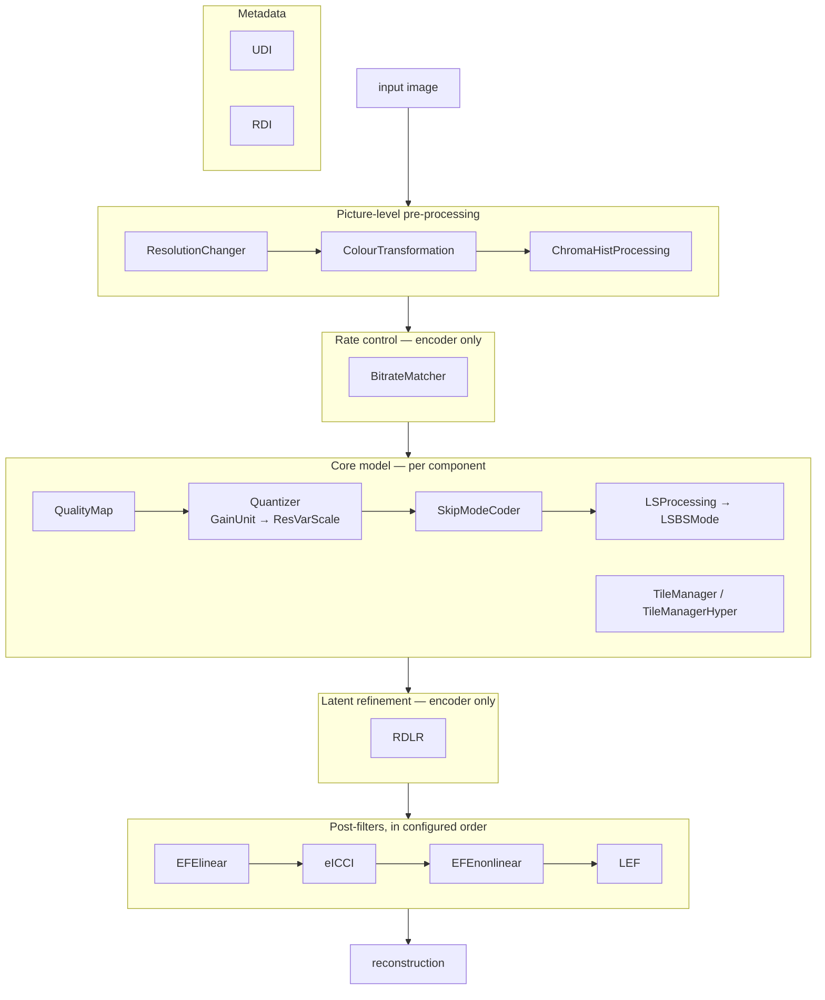

# 09 — Coding Tools Reference

Every tool in this document is a `ToolEngine` subclass living under
`src/codec/coding_tools/`. Each entry gives: what the tool does, where it sits in the pipeline,
its configuration keys, what it signals in the bitstream, and how to enable it.

## Tool map

---

## Quantisation

### Quantizer (composite)

`coding_tools/quantization/quantization.py` · class `Quantizer`

The container for all quantisation stages. It exposes four operations that tools call in
sequence, and dispatches each to every enabled sub-tool in order:

| Operation | Meaning |
| --- | --- |
| `analyze(decisions)` | Derive per-tool state (scales, gain indices) before quantising |
| `quantize_scale(x)` / `dequantize_scale(x)` | Transform the σ map |
| `quantize_resi(x)` / `dequantize_resi(x)` | Transform the residual |

`excl_list` / `incl_list` let a caller run only part of the chain — used by
`encoder_get_scales()` to run everything except RVS, then only RVS.

Key properties: `beta_displacement_log` (the quality offset from the model's own beta),
`unscaled_sigma_precision` / `scaled_sigma_precision`, and `Log2LinConvertion` for converting
between the log-domain and linear-domain representations of σ.

Header: writes per-component enable flags via `QuantizerHeaderBaseFuncs`, coordinated across
components by `HeaderProxy`.

### GainUnit

`coding_tools/quantization/gain_unit/gain_unit.py` · class `GainUnit`

The primary rate/quality knob. A *gain vector* scales the latent before quantisation; picking a
different vector moves along the rate-distortion curve without changing any network weights.

| Config key | Default | Meaning |
| --- | --- | --- |
| `beta_list` | 18 values, 0.0002 … 3.0 (pipeline uses 0.0005 … 3.0) | The gain ladder |
| `beta_range` | `[]` | Restrict which entries this model may use |

`log_k = (ln(54.82) − ln(0.11)) / 31` sets the log-domain step. `_get_min_and_max_beta()` derives
the legal order range from the gain vector's own statistics — if the vector is all zeros the range
collapses to `[0, 0]`.

`beta_displacement_log` is the interpolation position between ladder entries; the bitrate matcher
sets it and `_beta_displacement_log_updated()` propagates the change. Exported as
`gain_unit_mlog.csv` by `make export_models`.

Always enabled — it is the mechanism by which four trained models cover five rate points.

### ResVarScale (RVS)

`coding_tools/quantization/rvs/res_var_scale.py` · class `ResVarScale`

Residual Variance Scaling. Applies a per-channel and per-magnitude scaling to the residual so
that quantisation step size follows the local variance rather than being uniform. Also carries
**CWG** (channel-wise gain), a learned per-channel multiplier signalled in the header.

| Config key | Meaning |
| --- | --- |
| `rvs_enabled` | Enable variance scaling |
| `cwg_enabled` | Enable channel-wise gain flags |
| `threshold_rvs_id1` | Magnitude thresholds selecting a scale bucket (per beta model in `pipeline.json`) |
| `rvs_scale_list_id1` | The scale value per bucket |
| `cnum_list` | Per-component channel counts, e.g. `[5, 24, 35, 64, 64]` luma, `[10, 10, 10, 10, 10]` chroma |

Header fields: `rvs_enable_flag[ccs_id]`, `grfs_enable_flag[ccs_id]`, and when CWG is on, the
per-channel `cwgf` array. `buildTables()` precomputes the scale lookup at `_params_loaded()` time.

Enable with `cfg/tools/ResVarScale.json`. Part of `tools_on`.

---

## Latent-space processing

### SkipModeCoder

`coding_tools/skip_ls/skip_mode.py` · class `SkipModeCoder`

Skips coding of latent elements whose predicted σ implies they would quantise to zero anyway,
and additionally skips whole **16×16 latent cubes** when the entire cube reconstructs acceptably
without any residual.

| Config key | Default | Meaning |
| --- | --- | --- |
| `skip_block_size` | 1 | Granularity of the element-wise mask |
| `thr_skip` | 382 | σ threshold below which an element is skipped |
| `skip_judge_thr` | 3 | Max reconstruction difference tolerated for element skip |
| `skip_cube_thr` | 1 (operating points set 3) | Max difference tolerated for cube skip |

Two masks combine: `generate_skip_mask(scale_hat)` derives the σ-driven mask, and
`gen_skip_cubeflag(y_hat, y_org)` derives cube flags by actually checking whether skipping is
acceptable. `IterObject.check()` verifies a candidate skip before committing to it.

Cube flags are signalled in the header. Skipped positions are excluded from the SGT `masks`
argument, so they consume no bits at all.

**On by default.** Disable with `cfg/tools/skip_off.json`.

### LSProcessing / LSBSMode

`coding_tools/ls_processing/` · classes `LSProcessing`, `LSBSMode`

Latent-Space Bias Shift. Runs as a **post-processing** step on the reconstructed latent
(`post_processing(y_hat)`, called from the reconstruction path after `merge_y_hat_overlaps_of_tiles`):
where the reconstructed scale falls into a configured band, a bias is added to `y_hat` to
compensate the systematic offset that quantisation introduces.

| Config key | Default | Meaning |
| --- | --- | --- |
| `threshold_lsbs` | `[7782, 8192]` | Scale thresholds delimiting the bands |
| `scale0_lsbs` | per beta model, e.g. `[23, 0, 46]` | Bias values for band 0 |
| `scale1_lsbs` | per beta model, e.g. `[28, 0, 56]` | Bias values for band 1 |

`lsbs_scale_precision = 13`, `lsbs_thr_precision = 13`, `scaled_sigma_precision = 17` — LSBS is a
fixed-point tool. `buildTables()` precomputes the mapping.

Enable with `cfg/tools/LSBS.json`. Part of `tools_on`.

### QualityMap

`coding_tools/quality_map/quality_map.py` · class `QualityMap`

Spatially varying quality: a per-16×16-block QP offset modulates the quantisation step, letting
a region of interest be coded more finely than the background.

| `qp_map_type` | Source of the map |
| --- | --- |
| 0 | Automatic, from local variance (4×4 variance, min-pooled, thresholded at 0.8/1.5/2.5/4× the mean) |
| 1 | Explicit rectangles: `roi_lt_pos_x_list`, `roi_lt_pos_y_list`, `roi_wid_list`, `roi_hei_list` |
| 2 | Noise-driven |
| 3 | An external PNG mask: `ROI_map_in_file` (white = region of interest) |

Other keys: `qp_min` / `qp_max` (clipping), `delta_qp`, `adjust_qp`, `block_qp`,
`ignore_qp_map_bits`, `num_threads`, `ROI_map_out_file`.

The map is entropy coded into the **SOQ substream** and header fields go into PIH under the
enable flag name `gain_3D_enable_flag`. `matching_qp_to_scale()` / `matching_qp_to_scale_log()`
convert QP offsets to scale multipliers; `quantize_resi` / `dequantize_resi` apply them.

The map is computed on **luma only** and reused for chroma (`CcsGvaeSGMM.compress` copies it into
the chroma decisions).

Enable with `cfg/tools/quality_map.json --use_qual_map 1`. See also `docs/md/quality_map.md`.

---

## Rate–distortion optimisation (encoder only)

### BitrateMatcher

`coding_tools/bitrate_matcher/bitrate_matcher.py` · class `BitrateMatcher`

Chooses the beta model and beta displacement that land closest to the requested bpp. Registered
as a **pre-processing** RDO tool on the core model composite.

| Config key | Meaning |
| --- | --- |
| `use_default` | Use the fixed tables instead of searching |
| `default_models` | Beta model index per rate point — `[0, 1, 2, 2, 3]` |
| `default_beta_disp_log` | Beta displacement per rate point — `[0, 0, -184, 0, 0]` |
| `default_target_rates` | The rate points themselves |
| `bitrate_config_path` / `bitrate_config_name` | Where to read a pre-computed beta list |
| `independent_beta_UV` | Search the chroma beta separately |
| `tolerance_min` / `tolerance_max` | Acceptable deviation from the target rate |
| `beta_min_mult` / `beta_max_mult` | Search bracket around the initial guess |
| `max_iterations`, `max_iterations_stage1`, `max_iterations_stage2` | Search budget |

Search algorithm (`regen_list.json` mode):

1. `match_luma()` brackets the luma beta and calls `_try_beta()` — a full compress at a candidate
   beta, measuring actual bits.
2. `beta_linear_interpolation()` interpolates between bracket endpoints toward the target.
3. `find_UV_beta_with_hyperopt()` optimises the chroma beta with `hyperopt`, using
   `find_loss()` → `_calculate_mssim_distortion()` (weighted MS-SSIM) as the objective.
4. `skip_matching()` short-circuits when the default already lands in tolerance.

`resize(ori_img)` allows the search to run on a downscaled image for speed.

### RDLR

`coding_tools/rdlr/` · class `RDLR`, with `RDLRCompY` / `RDLRCompUV` / `RDLRCompBase`

Rate-Distortion Latent Refinement. After quantisation, iterate over the latent and adjust values
where doing so reduces `D + λ·R`. Registered as a **post-processing** RDO tool.

| Config key | `cfg/tools/RDLR.json` | Meaning |
| --- | --- | --- |
| `numIteYLuma` / `numIteYChroma` | 8 / 0 | Refinement iterations on the latent |
| `numIteZLuma` / `numIteZChroma` | 0 / 0 | Refinement iterations on the hyper-latent |
| `numSamples` | 4 200 000 | Total sample budget |
| `numSamplesPerLumaTile` / `numSamplesPerChromaTile` | 4 200 000 | Tile size for refinement |
| `numSamplesTileOverlapLuma` / `…Chroma` | — | Tile overlap |
| `LearningRateY` / `LearningRateZ` (+ `…Decay`) | — | Step sizes |
| `LearningRateYAutomaticPerResolution` | — | Scale the step with picture size |
| `lossTypeBDcurveSlope_*` | — | Slope parameters that set λ from a BD-rate model: per-component PSNR slopes, MS-SSIM slope, and `ratioPSNR_MSSSIM` mixing them |

`_get_slopes_parameters()` builds the λ; `_replace_not_sane_slopes_with_mean()` substitutes the
mean when a tile produces a degenerate slope. `get_luma_tile_rate()` measures the rate of a
candidate tile using the likelihood back-end rather than the real coder.

RDLR also forces smaller core-model tiles (`numSamplesPerLumaTileEncoder` etc. in its config),
because refinement holds more state per tile.

Enable with `cfg/tools/RDLR.json`. **Not** part of `tools_on` — it is a separate, expensive tool.

---

## Post-filters

All derive from `FilterBase` and implement the two-call protocol:
`compress(imgs, original)` decides (encoder only), `decompress(imgs)` applies (both sides).
Decisions go into the **TON** substream. Execution order comes from `post_filters.tools` in
`cfg/pipeline.json`: `EFElinear → eICCI → EFEnonlinear → LEF`.

### EFElinear

`coding_tools/filters/EFElinear/EFElinear.py` · class `EFElinear`

Linear Enhancement Filter Estimation. A luma-aided linear upsampling/enhancement filter for
chroma: the encoder chooses filter coefficients per region by testing a candidate list and
sending the winners.

| Config key | Meaning |
| --- | --- |
| `DCTIF_only` | Restrict candidates to the DCT interpolation filter set |

Key methods: `SplitDecide()` picks per-region filter lengths and candidates; `SplitApply()`
applies them; `LumaAidedUpsampler_encoder()` / `_apply()` implement the cross-component
upsampling; `encode_filters()` / `decode_filters()` serialise coefficients.

Everything is integerised (`integerize`, `integerizeTensor`, `deinteger`) and uses generalised
pixel shuffle/unshuffle (`pixelShuffleGeneral`, `pixelUnshuffleGeneral`) to handle non-power-of-two
subsampling ratios.

Enabling it also sets `model.CCS_SGMM.preprocess_EFE: 0`.

### EFEnonlinear

`coding_tools/filters/EFEnonlinear/EFEnonlinear.py` · class `EFEnonlinear`

The non-linear counterpart. Adds a per-block **on/off switch**: `calculateOnOff()` compares
filtered against unfiltered against the original and signals which blocks benefit;
`apply_OnoffSwitch()` applies the decision.

| Config key | Meaning |
| --- | --- |
| `on_off_enabled` | Signal per-block on/off rather than always filtering |

### LEF

`coding_tools/filters/LEF/LEFfilter.py` · class `LEF`

Luma Enhancement Filter — adaptive sharpening driven by the coded scale map, not by the pixels.

How it works: `analyze()` picks the latent channel with the largest average σ
(`argmax` over channel means) as a *reference channel*. That channel's σ map, upsampled to
picture resolution, drives `adptive_sharpness()`, which applies one of three sharpening
magnitudes depending on which of three thresholds the local σ exceeds.

Magnitudes and thresholds are hard-coded per beta model:

| Model | Magnitudes | Thresholds |
| --- | --- | --- |
| 0 (β 0.002) | 1.10, 1.13, 1.16 | 600, 1200, 2000 |
| 1 (β 0.012) | 1.07, 1.09, 1.11 | 800, 1400, 2400 |
| 2 (β 0.075) | 1.03, 1.04, 1.05 | 1000, 1600, 2800 |
| 3 (β 0.5) | 1.01, 1.02, 1.03 | 1200, 2000, 3200 |

Only the reference channel index is signalled: `LEF_chIdx`, 8 bits. Everything else the decoder
already has. That is the whole point of the design — one byte of side information buys an
adaptive sharpener.

| Config key | Meaning |
| --- | --- |
| `op` | Operating-point selector for the magnitude/threshold table |

### ICCI and eICCI

`coding_tools/filters/icci/` and `coding_tools/filters/eICCI/` · classes `ICCIFilter`,
`EfficientICCIFilter`

CNN-based reconstruction enhancement. eICCI is the efficient successor and the one in
`tools_on`; ICCI is kept for comparison.

| Config key | eICCI value | Meaning |
| --- | --- | --- |
| `ckpt_model_name` | `eICCI_bophop_2d020448_20240229` | Checkpoint directory |
| `in_nc` / `out_nc` | 1 / 1 | Channels in/out |
| `nf` | 48 | Feature width |
| `nbY` / `nbUV` | 2 / 4 | Residual blocks for luma / chroma |
| `loss_type` | `mixed` | Selection criterion: `mse`, `msssim` or `mixed` |
| `luma_loss_weights` | `[5.0, 1.0]` | MSE vs MS-SSIM weighting for luma |
| `chroma_loss_weights` | `[1.0, 0.0]` | …for chroma |
| `process_short_list` | 1 | Only evaluate the candidate models in the short list |
| `y_short_list` / `uv_short_list` | per operating point, per rate | Which model indices to try |
| `tile_manager.numSamplesPerTile` | 4 194 304 | Tile size |
| `tile_manager.numSamplesTileOverlap` | 48 | Tile overlap |

The encoder tries each candidate model on each tile, scores it with
`calculate_mse` / `calculate_msssim` / `calculate_mixed`, and signals the winning index per tile.
`auto_enableflag_detected_value()` decides whether filtering helps at all.
`initialize_models_idxes()` and `model_idxes.py` map (operating point, rate, component) to the
short list, which is what keeps the encoder-side search affordable.

The decoder loads only the models actually referenced. ICCI's config differs mainly in
`luma_loss_weights` (`[7.0, 1.0]`) and its checkpoint set (`ICCI_r2`).

---

## Colour processing

### ColourTransformation

`coding_tools/colour_processing/colour_transformation/colour_transformation.py`

| `colour_transform_idx` | Behaviour |
| --- | --- |
| 0 | None — input is already YUV |
| 1 | Standard RGB → YUV (BT.709) |
| 2 | Custom 3×3 integer matrix plus offsets |

| Config key | Meaning |
| --- | --- |
| `colour_transform_matrix` | 9 integers, 0…255, row-major 3×3 |
| `colour_transform_offset` | 3 integers, 0…255 |
| `msssim_weight`, `use`, `size_downscaler` | Used by `rdo_color_transformation.py` when searching a matrix |

The inverse matrix is derived once in `_params_loaded()` (`torch.inverse(M/255)*255`), and the
matrix and offsets are signalled in the header so the decoder inverts exactly the same transform.
When `colour_transform_idx` is unset it defaults to 0 for YUV input and 1 for RGB.

### ChromaHistProcessing

`coding_tools/colour_processing/chroma_hist_processing/chroma_hist_processing.py`

A one-line pre-processing step: scale each chroma component about its own mean,
`c' = coeff·(c − mean) + mean`. Reducing saturation before coding costs fewer bits; the
`coeff` is the only parameter, and there is **no post-processing inverse** — the change is
deliberately baked into the coded picture.

Enable with `cfg/tools/ChromaShift.json`.

---

## Geometry

### ResolutionChanger

`coding_tools/resolution_changer/resolution_changer.py` · class `ResolutionChanger`

Intra-resolution change: downscale before coding, upscale after. At very low rates, coding a
smaller picture well beats coding the full picture badly.

| Config key | `CTC.json` | Meaning |
| --- | --- | --- |
| `enabled` | 0 | Off by default |
| `scale_ver` / `scale_hor` | 2 / 2 | Downscale factors |
| `intraRCfactor` | — | Rate-control adjustment for the resolution change |
| `align_value` | — | Alignment of the scaled size |

`setup(img_shape)` computes the coded shape; `_forward_transform` / `_backward_transform` do the
resampling; `get_processed_img_shape()` / `get_original_img_shape()` are what the rest of the
codec queries. Marked `# TODO: remove this tool` in `CodingEngine.__init__`.

### Resampler and interpolation

`coding_tools/resampler/resampler.py` · class `Resampler`

The interpolation back-end. `_decide_interpolator(isEncoder)` picks a kernel — downscaling and
upscaling use different ones — and `resize_luma` / `resize_chroma` / `resize_img` apply it.

| Config key | Meaning |
| --- | --- |
| `fastResize` | Use the fast path |
| `align_corners_luma` / `align_corners_chroma` | Sampling grid alignment |
| `scale_factor_threshold` | Above which a different kernel is chosen |
| `use_band_correction` | Apply band correction after resampling |

`coding_tools/interpolation/` holds lower-level warping primitives: `table_based/warp_table_based.py`
(fixed-point, conformance-exact), `differentiable/warp_bi.py` and
`warp_differentiable_general.py` (for training), plus `ReconResample.py`.

### Tiling and regions

`coding_tools/tiling/tiling.py` · classes `TileManager`, `TileManagerHyper`
Helpers in `src/codec/common/tiling.py`: `Area`, `TileGrid`, `ColocatedTiles`, `get_data`,
`assign_data`.

Tiling bounds memory; regions bound *dependency*.

| Config key | Meaning |
| --- | --- |
| `numSamplesPerTile` | Target tile size in samples |
| `numSamplesTileOverlap` | Overlap in samples |
| `enabled` | Per-manager |

Core operations:

- `setup_tiles_enc()` / `setup_tiles_dec()` — build the image, latent, psi and z tile grids;
- `_add_overlap()` — grow a tile by the configured overlap;
- `get_core_of_overlapping_*_tile()` — recover the non-overlapping core, in both absolute and
  tile-relative coordinates;
- `_adjust_boundary_tiles()` — absorb undersized edge tiles;
- `ColocatedTiles.iter_colocated_grids()` — iterate image / y / z grids in lockstep.

`TileManagerHyper` adds region partitioning: `calculate_region_coordinates()`,
`regions_generator()`, `psi_regions_generator()`, and header coding of the region layout.

Region configuration (from `cfg/tools/{Independent,Dependent}Regions.json`):

| Key | Independent | Dependent |
| --- | --- | --- |
| `region_partitioning_flag` | 1 | 1 |
| `NumSamplesInRegion` | 1 048 576 | 1 048 576 |
| `region_residual_in_its_own_substream_flag` | **1** | **0** |
| `hyper_decoder_overlap_in_latent_samples` | 2 | 2 |
| `mcm_overlap_in_latent_samples` | 8 | 8 |
| tile overlaps | raised to 128 / 64 | default |

Independent regions can be extracted or dropped from the bitstream; dependent regions cost less
rate but must be decoded together.

---

## Metadata

### UDI — User Defined Information

`coding_tools/udi/udi.py`. Copies an arbitrary file into the **UDI** substream.

| Config key | Meaning |
| --- | --- |
| `filepath` | File to embed |

### RDI — Rendering Information

`coding_tools/rdi/rdi.py`. Carries colour-volume and display metadata in the **RDI** substream,
following the CICP conventions.

| Group | Fields |
| --- | --- |
| Presence flags | `cicp_info_present_flag`, `mdcv_info_present_flag`, `clli_info_present_flag`, `dm_present_flag` |
| CICP | `colour_primaries`, `transfer_characteristics`, `matrix_coefficients`, `image_full_range_flag`, `chroma420_sample_loc_type` |
| Mastering display (MDCV) | `mastering_display_colour_primaries_x/y`, `mastering_display_white_point_chromaticity_x/y`, `mastering_display_maximum_luminance`, `mastering_display_minimum_luminance` |
| Content light level (CLLI) | `maximum_content_light_level`, `maximum_frame_average_light_level` |
| Display mapping | `dm_type`, `dm_size`, `dm_data_byte` |

Both are header-only tools (`CoderEngine`, no models) and neither affects the decoded samples.

---

## Infrastructure tools

### Profilers

`coding_tools/profiler/`. `Profilers` plus three collectors (`ModuleDuration`,
`CPUMemoryUsage`, `GPUMemoryUsage`) and two context managers (`collectors_context.py`,
`profilers_context.py`). Selected via `cfg/profiler/{mod_dur,cpu_mem,gpu_mem}.json`.

### Components wrappers

`coding_tools/components_wrappers/`. `ModelWrapper` and `Wrapper` adapt a plain `nn.Module` from
`src/codec/components/` into the tool framework, giving it parameters, checkpoint management and
export without the module itself knowing about any of it.

---

## Adding a new tool

1. Create `coding_tools/<name>/` with `__init__.py`, `<name>.py` and `params.py`.
2. Derive from the narrowest base that fits: `CoderEngine` (headers only), `ModelEngine`
   (weights only), or `ToolEngine` (both).
3. Declare parameters in a `ParamsBase` subclass; use `_params_loaded()` for anything derived.
4. Implement `encode_header` / `decode_header` as exact mirrors. Name every field.
5. Register the tool: in a factory (`filters/factory.py`, `colour_processing/factory.py`, …) for
   a composite member, or instantiate it in `CodingEngine.__init__` for a top-level tool.
6. Add `cfg/tools/<Name>.json` enabling only it, plus `cfg/tool_ena/<Name>.json` and
   `cfg/tool_dis/<Name>.json` for the sweeps.
7. Implement `export_models()` if the tool owns weights.
8. Verify with `make tool_ena` and confirm encoder/decoder MD5s still match.
