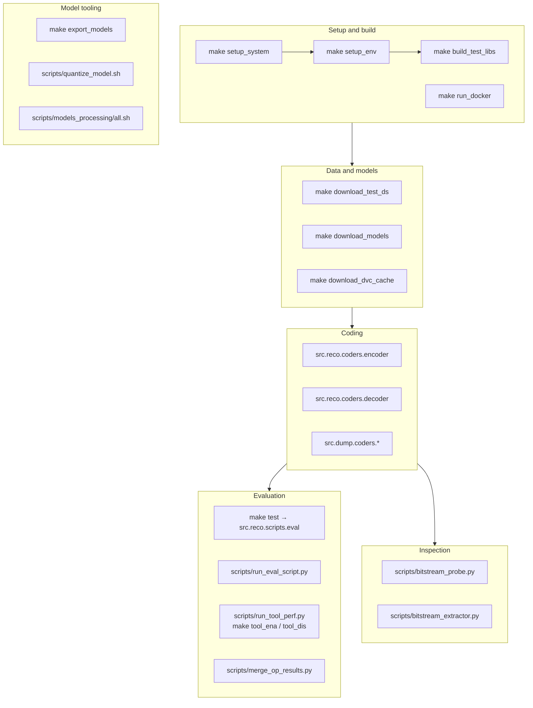

# 10 — Command-Line Tools

## 1. Overview



## 2. Make targets

| Target | Runs | Purpose |
| --- | --- | --- |
| `make setup_system` | `sudo scripts/setup_system.sh` | `apt install doxygen 1.8.13, graphviz 2.40.1, python3-dev, git-lfs` |
| `make setup_env` | `scripts/setup_env.sh` | Create conda env `jpeg_ai_vm` (Python 3.7), `pip install -r requirements.txt`, `pre-commit install`, build C++ libs |
| `make configure` | both of the above | One-shot machine setup |
| `make build_test_libs` | `scripts/build_test_libs.sh` → `build_ec_lib.sh` | Build the `mans` and `direct` entropy-coding extensions |
| `make download_test_ds` | `scripts/download_test_ds.sh` | `dvc pull data/test/*.dvc` |
| `make download_models` | `scripts/download_models.sh` | `dvc pull models/*/*.dvc` |
| `make download_train_ds` | `scripts/download_train_ds.sh` → `download_train_ds.py` | Ask which datasets are needed, then download and unpack them from the ISO or ITU mirror |
| `make download_dvc_cache` | `scripts/sFTP_mirror/download_cache.sh` | Mirror the DVC cache from the upstream sFTP |
| `make test` | `python -m src.reco.scripts.eval --coding_type enc_dec --out_dir results/test` | The standard encode+decode+compare run over the test set |
| `make unittest` | `CUDA_VISIBLE_DEVICES="-1" python -m unittest -v` | Unit tests, CPU only |
| `make base_cfgs` | `run_eval_script.py` × 2 + `merge_op_results.py` | Full tools-on/tools-off sweep, results merged into an Excel workbook |
| `make base_cfgs_img30` | same, on image 30 only | The quick version used in CI |
| `make tool_ena` | `run_tool_perf.py cfg/tool_ena results/tool_ena` | Anchor + one tool at a time |
| `make tool_dis` | `run_tool_perf.py cfg/tool_dis results/tool_dis` | All tools minus one at a time |
| `make tool_perf` | both | The complete tool-contribution matrix |
| `make export_models` | `scripts/export_models.sh` | ONNX + CSV export, reorganised into the standard's layout |
| `make build_docker` / `make run_docker` | `docker build/run` | Image `diveraak/jpeg_ai:latest` |
| `make all` | configure → build → download → test | Everything from scratch |

### Dataset download

```bash
python scripts/download_train_ds.py                    # ask what is needed
python scripts/download_train_ds.py --source {iso,itu} --datasets {train,validation,both} \
       --natural {full,patches,none} --extras all|none|NAME,NAME [--unpack|--no-unpack]
       [--remove-archives] [--data-dir DIR] [--archives-dir DIR] [--yes]
       [--answers FILE] [--save-answers FILE] [--status] [--list-remote] [--dry-run]
       [--base-url URL] [--depth N] [--strip N] [--retries N] [--no-head]
       [--no-verify-checksums] [--no-space-check] [--force-lists]
```

Run bare, it is a questionnaire: mirror, datasets, the form of the natural training content
(full-size images or cropped patches), which extra datasets to add, a confirmation of the
validation set, then whether to unpack and whether to keep the archives — each answer showing
what it adds to the download, and a final summary with the total, the disk needed and the free
space at the destination.

The catalogue is not hard-coded. `crawl()` walks the mirror's published directory index and
`classify()` decides from each archive's name what it holds, using the directory names the
training lists in `cfg/training_list/Q*_training_list.txt` refer to (`scc`, `HF2000`, `PHF200`,
`PHFA500`, `LQ7000`, `MD300`, `EXCEL300`, `CP50`) to recognise the extra datasets. Sizes come
from the index — `IndexParser` rebuilds the rows of an Apache or IIS listing so a size stays
with its own file — and are confirmed with a HEAD request. Anything that cannot be classified
is listed separately rather than downloaded silently; `--list-remote` shows the whole
classification.

Transfers resume with a Range request and are checked against the published `.md5`/`.sha256`
when the mirror has one. Archives are unpacked with `zipfile`/`tarfile`, keeping only images:
full-size natural content flattened into `data/jpegai_training/`, patches into
`data/jpegai_training_random_crop/`, each extra dataset keeping its own directory underneath
it, and the validation set into `data/jpegai_validation_set/`. The training file list is then
regenerated by walking the directory, which covers both the flat patches and the nested extras.

## 3. The codec

### Encoder

```bash
python -m src.reco.coders.encoder <input> <output.bits> [options]
```

| Argument | Default | Meaning |
| --- | --- | --- |
| `input_path` | — | Input image (PNG) |
| `bin_path` | — | Output bitstream |
| `--cfg A.json [B.json …]` | from `cfg/info.json` | Configuration files, merged left to right |
| `-r`, `--rec_path` | none | Also write the encoder-side reconstruction |
| `--bpp_idx N` | 0 | Index into `target_bpps` |
| `--set_target_bpp N` | none | Target bpp × 100. **Switches the bitrate matcher into search mode** by appending `cfg/BRM/regen_list.json` |
| `--output_bit_depth {8,10}` | source | Force reconstruction bit depth |
| `-rb`, `--rec_bitdepth {8,10}` | 8 | Bit depth for the reconstructed file |
| `--calc_metrics` | off | Compute and print quality metrics |
| `--models_dir_name` | `models` | Model directory |
| `--skip_loading_error` | off | Continue when a checkpoint is missing |
| `--profiler_path` | none | Profiler output directory |
| `-a.b.c value` | — | Override any tool parameter by its dotted path |

Standard invocations:

```bash
# anchor — all tools off
--cfg cfg/tools_off.json cfg/profiles/main.json

# all tools on
--cfg cfg/tools_on.json cfg/profiles/main.json

# selected tools only
--cfg cfg/tools_off.json cfg/tools/LSBS.json cfg/tools/RDLR.json cfg/profiles/high.json
```

### Decoder

```bash
python -m src.reco.coders.decoder <input.bits> <output.png> [options]
```

| Argument | Default | Meaning |
| --- | --- | --- |
| `bit_fpath` | — | Input bitstream |
| `rec_path` | — | Output image |
| `--device {cpu,gpu}` | `gpu` | Execution device |
| `--ori_file` | none | Original, for metric computation |
| `--calc_metrics` | off | Compute metrics against `--ori_file` |
| `--calc_ptflops` | off | Report decoder complexity in kMAC/px |
| `--output_bit_depth {8,10}` | from header | Force output bit depth |
| `--use_yuv 0/1` | 0 | Treat input/output as raw YUV |

**There is no `--cfg`.** The decoder always uses `cfg/pipeline.json`.

### Dump coders

```bash
python -m src.dump.coders.encoder <in> <out.bits> --output_format {pgx,npy} \
       --latents_list y z psi --pgx_float_scale_factor <F>
python -m src.dump.coders.decoder <in.bits> <out.png> --output_format pgx --latents_list y z
```

Identical coding path, plus dumps of the named intermediate tensors. `CommonDump.store_tensor_recurrently`
walks the `Decisions` tree writing each requested entry. This is the conformance-testing path:
two implementations dump the same tensors and compare them element by element, which localises a
mismatch far better than comparing final pixels.

## 4. Evaluation

### `src.reco.scripts.eval` — the harness

```bash
python -m src.reco.scripts.eval [options]
```

| Argument | Default | Meaning |
| --- | --- | --- |
| `--cfg …` | from `info.json` | Configuration files |
| `--in_dir` | `data/test` | Input images |
| `--out_dir` | `results/test` | Output root |
| `--coding_type {enc,dec,enc_dec}` | `enc_dec` | Which halves to run |
| `--imgs A.png B.png` | all | Restrict to named images |
| `--only_cpu` | off | Force CPU |
| `--cpu_threads_limit N` | −1 | Thread cap (CPU mode only) |
| `--gpu_ids`, `--gpu_max`, `--gpu_greedy` | — | GPU selection; `--gpu_greedy` uses busy GPUs too |
| `--store_bit 0/1`, `--store_rec 0/1` | 1, 1 | Keep bitstreams / images |
| `--overwrite` | off | Wipe the output directory first |
| `--resume_eval` | off | Only produce missing streams |
| `--force_encdec_match 0/1` | 0 | Compare MD5s even when only one half ran |
| `--calc_encoder_metrics 0/1` | 1 | Metrics on the encoder reconstruction |
| `--calc_decoder_metrics 0/1` | 0 | Metrics on the decoder reconstruction |
| `--rebuild_ae_cache 0/1` | 1 | Regenerate the me-tANS table cache |
| `--only_base_config` | off | Ignore `cfg/per-image/` |
| `--no_per_ratepoint_config 0/1` | 1 | Ignore `cfg/per-image-per-bpp/` |
| `--use_qual_map 0/1` | 0 | Enable the quality map |
| `--use_yuv 0/1` | 0 | Raw YUV input |
| `--models_dir_name`, `--skip_loading_error` | — | As for the codec |

The harness fans out over images × rate points using a `ProcessPoolExecutor`, assigning one GPU
per worker (`set_gpu_id` derives the index from the process name). Output layout:

```
results/<run>/
├── cfg.json          the fully resolved configuration actually used
├── ori/              copies of the originals
├── bit/              bitstreams
├── rec/              encoder-side reconstructions
├── rec_dec/          decoder-side reconstructions
├── log/enc/          per-image encoder logs and profiler output
├── log/dec/          per-image decoder logs
├── log/compare/      MD5 comparison results
├── summary*.txt      collected metrics
└── failed.logs       images that failed, if any
```

### `scripts/run_eval_script.py` — multi-configuration driver

```bash
python scripts/run_eval_script.py <OUTPUT_BASE_DIR> [--cfg cfg/eval/X.json] \
       [--module src.reco.scripts.eval] [--silent] [extra args…]
```

Reads a `cfg/eval/*.json`, expands `profiles` × `configurations` into a set of runs, and executes
them in parallel. Each configuration gets its own subdirectory. This is what `make base_cfgs`
uses.

### `scripts/run_tool_perf.py` — tool sweep

```bash
python scripts/run_tool_perf.py <TOOL_CFG_DIR> <OUTPUT_BASE_DIR> \
       [--base-cfg cfg/eval/base.json] [--module …]
```

Builds one configuration per `.json` in `TOOL_CFG_DIR`, runs them all, then calls
`process_summaries(..., anchor="anchor")` so every tool's result is reported relative to the
anchor.

### Result collection

| Script | Purpose |
| --- | --- |
| `src/reco/scripts/collect_results.py` | Gather per-image metrics into a summary |
| `src/reco/scripts/compare_md5s.py --i1 <enc.log> --i2 <dec.log>` | Assert encoder and decoder reconstructions are identical |
| `src/reco/scripts/decode_dir.py` | Decode every bitstream in a directory |
| `src/reco/scripts/test.py` | Standalone test driver |
| `scripts/merge_summaries.py BASE_DIR [--prefix] [--anchor]` | Merge summaries across configurations, computing deltas vs the anchor |
| `scripts/merge_op_results.py BASE_DIR [--fn-prefix] [--start-row N] [--template X.xlsm] [--anchor op:cfg]` | Merge across operating points into an Excel workbook |
| `scripts/append_summ2xlsm.py <summary> <output.xlsm>` | Append one summary to a workbook |
| `scripts/convert_summary_to_slops.py <summary.txt> [--output_path]` | Convert a summary to BD-curve slope parameters — feeds RDLR's `lossTypeBDcurveSlope_*` |

## 5. Bitstream inspection

```bash
# Parse and print every substream and header field
python scripts/bitstream_probe.py stream.bits [--json_output dump.json] [--silent]

# Remove residual substreams and/or the tool header
python scripts/bitstream_extractor.py in.bits out.bits \
       [--remove_resi_substreams 2 3] [--remove_ton]
```

Neither loads a network, so both are fast and work without checkpoints.

## 6. Model tooling

### Export

```bash
make export_models          # → results/models/
python -m src.models_export.scripts.eval --cfg … --out_dir … [--skip_models_check]
```

### Weight quantisation

```bash
./scripts/quantize_model.sh
python -m src.quant.scripts.eval [...]
```

Searches per-layer integer parameters for the hyper-scale-decoder against the calibration set in
`data/calibration_set/`, targeting minimal bpp increase. Key pieces:
`quantize_hsd()` (the search), `quantize_layer_in_all_models()` (apply a candidate),
`get_average_bpp_for_calibration_set()` (the objective), `bj_delta.py` (Bjøntegaard delta),
`non_quantized_layers_forward_pre_hook` (mixed float/int execution during the search).
See `docs/md/quantization.md`.

### Checkpoint manipulation

| Script | Purpose |
| --- | --- |
| `scripts/split_cp.py` | Split a training checkpoint's `state_dict` into per-module files |
| `scripts/merge_cp.py <out> <cp1> <cp2> …` | Merge checkpoints |
| `scripts/cleanup_cp.py <in> <out>` | Strip optimiser/training state |
| `scripts/copy_cp_elems.py <in1> <in2> <out>` | Copy selected tensors between checkpoints |
| `scripts/rename_modules.py <in> <out>` | Rename `state_dict` keys after a refactor |
| `scripts/process_model.py <model_name> [--push]` | DVC add/push a model directory |
| `scripts/reduce_z_distributions.py [--n_distributions 128] [--cp_dir models/VM_common]` | Cluster the z distributions down to a fixed count |
| `scripts/get_z_distributions_idxs.py [--cp_dir models/VM_common_int]` | Emit the z distribution index tables |

### Release pipeline — `scripts/models_processing/`

`all.sh` runs six steps in order, logging each to `stepN.log`:

| Step | Script | Action |
| --- | --- | --- |
| 0 | `step0.sh` | Remove the current models (`git rm` the `.dvc` pointers) |
| 1 | `step1.sh` | Split models from the trained checkpoints |
| 2 | `step2.sh` | Reduce the number of Z distributions |
| 3 | `step3.sh` | Reorder weights for parallel decoding (`progressive_decoding/reorder.sh`), producing `VM_common_int` |
| 4 | `step4.sh` | Quantise models |
| 5 | `step5.sh` | Pack weights for uploading |

This is the pipeline that turns training output into a release model set.

## 7. Image utilities

| Script | Purpose |
| --- | --- |
| `scripts/convert_bitdepth.py <in> <out>` | Convert a single image's bit depth |
| `scripts/convert_imgs_bitdepth.sh` | Batch version |
| `scripts/crop_image.sh`, `scripts/image_crop.py --lst --data_dir` | Crop images (training set preparation) |
| `scripts/remove_icc_profile.sh` | Strip ICC profiles so PNG decoding is unambiguous |
| `scripts/remove_opt.sh` | Remove optimiser state from checkpoints |
| `scripts/process_license.py` | Insert or refresh the BSD licence header in source files |

## 8. Infrastructure

| Script | Purpose |
| --- | --- |
| `scripts/build_ec_lib.sh` | Build the entropy-coding C++ extensions |
| `scripts/build_train_libs.sh` | Build training libraries (needs the unshipped `src/train`) |
| `scripts/run_profiler.sh` | Run with profiler collectors enabled |
| `scripts/run_reco_all_cfgs.sh <out_dir> <cfg> [args]` | Run every configuration; used by CI |
| `scripts/post_comment_gitlab.py <TOKEN> <PROJECT_ID> <MR_IID> [--files …] [--msg …] [--only_if_files_exist]` | Post CI results as a merge-request comment |
| `scripts/sFTP_mirror/*` | Set up a local sFTP mirror of the DVC model cache: `setup_sftp_server.sh`, `download_cache.sh`, `setup_crontab.sh` (3-hourly `cron.sh`), `setup_cfg.sh` (writes `.dvc/config.local`) |
| `scripts/progressive_decoding/*` | Standalone BOP/HOP/SOP encoder and decoder variants, channel ordering (`channel_list.py`, `reorder.sh`) and channel-wise entropy analysis |
