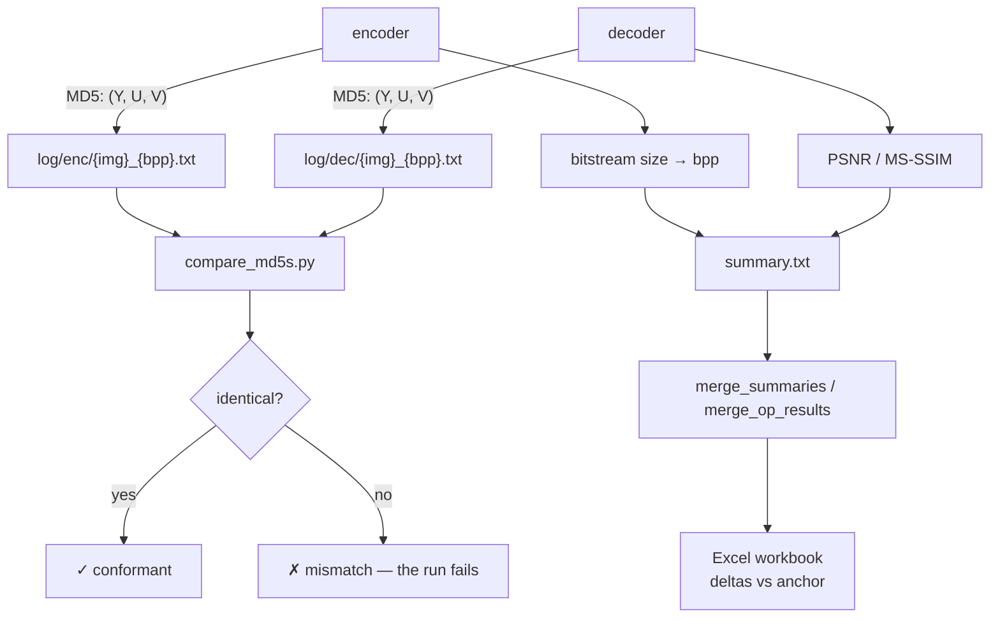
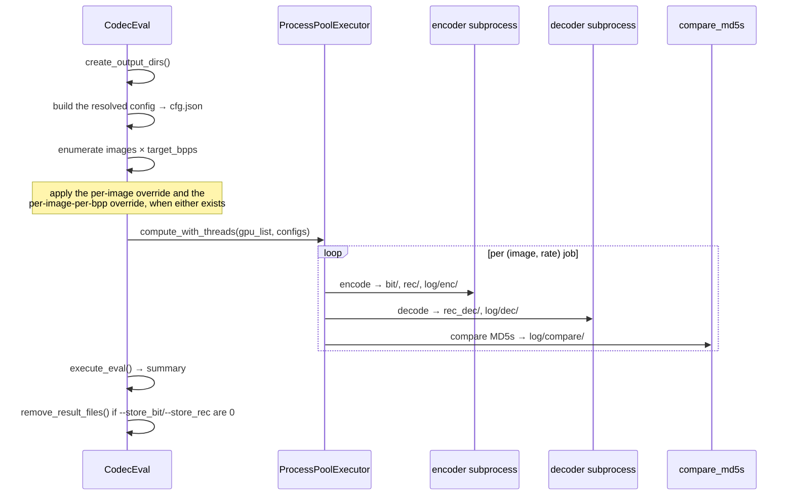
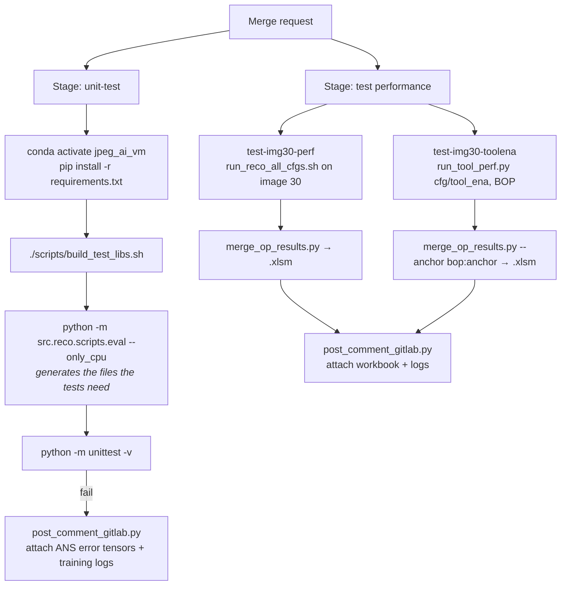

# 11 — Evaluation and Testing

## 1. What "correct" means here

A reference implementation has two obligations, and this repository tests both:

1. **Encoder and decoder must agree bit-exactly.** Verified by comparing MD5 hashes of the
   encoder-side and decoder-side reconstructions.
2. **Coding performance must not regress.** Verified by BD-rate style comparison against the
   tools-off anchor across the whole test set.



## 2. The evaluation harness

`CodecEval` in `src/codec/scripts/eval.py` is the engine; `src/reco/scripts/eval.py` supplies the
reconstruction-task specifics (which encoder, which decoder, which comparator).



Each worker pins itself to one GPU via `CUDA_VISIBLE_DEVICES`, derived from the process name in
`set_gpu_id()`. `CoderProcess` (`src/codec/scripts/coder_process.py`) keeps the model loaded
across jobs within a worker — `is_model_loaded()` / `is_first_time()` / `is_args_stored()` control
whether the tree is rebuilt, which is what makes a full-set run tractable.

### Naming conventions

Generated filenames are structured, and the decoder parses them back:

| Kind | Pattern | Example |
| --- | --- | --- |
| Bitstream | `<codec>_<name>_<bpp:03d>.bits` | `JAI_00030_TE_050.bits` |
| Reconstruction | `<codec>_<name>_<W>x<H>_<bits>bit_<fmt>_<bpp:03d>` | `JAI_00030_TE_560x888_8bit_sRGB_050.png` |
| Test image | `<id>_TE_<W>x<H>_<bits>bit_<fmt>.png` | `00030_TE_560x888_8bit_sRGB.png` |

`get_correct_bit_name()` and `get_correct_rec_name()` in `src/codec/__init__.py` build them;
`CodecDecoder.parse_bitstream_name()` recovers the image name and target bpp from a bitstream
filename.

## 3. Metrics

`src/codec/metrics/` (version 1.1.0). Two metrics are instantiated by default:

| Metric | Class | Notes |
| --- | --- | --- |
| PSNR | `PSNRMetric` | Per component; `--jvet-psnr` switches to the JVET convention |
| MS-SSIM | `MSSSIMTorch` | Via `pytorch-msssim` |

`requirements.txt` pins `pyrtools` and `scikit-image`, dependencies of the wider JPEG AI metric
set, and adds `bjontegaard` for BD-rate — used by
`scripts/acc_train_scripts/report_bdrate_results.py`. `psnr_hvsm` and `hyperopt` are present but
commented out, so the code paths that import them need a manual install.
`MetricsFabric.metrics_list` is the switchboard that decides which metrics are actually
computed.

Supporting machinery:

| Piece | Purpose |
| --- | --- |
| `DataClass` | Loads PNG or raw YUV, normalises range and bit depth, converts colour |
| `color_conv_matrix('709')`, `yuv_to_rgb`, `rgb_to_yuv` | Colour conversion for metric computation |
| `extract_info(fn)` | Parse `WxH_Nbit_FMT` from a filename |
| `read_yuv` / `write_yuv` | Raw YUV IO with subsampling handling |
| `compute_bpp(filename, shape)` | Bitstream bytes → bits per pixel |
| `store_complexity_info()` | Record kMAC/px and encode/decode times |

A summary row carries: `Reconstruct`, `Original`, `Codec`, `BPP`, the metric columns,
`MAC/pxl`, `DecGPU`, `DecCPU`, `EncGPU`, `EncCPU`.

Complexity comes from `ptflops`: `CodecCoder.setup_ptflops_custom_hooks()` collects
`ptflops_custom_hook()` from every module that defines one — necessary because the custom
integer convolutions are invisible to the default counter.

## 4. Unit tests

```bash
make unittest       # CUDA_VISIBLE_DEVICES="-1" python -m unittest -v
```

Tests live next to what they test:

| File | Covers |
| --- | --- |
| `src/codec/entropy_coding/lib_wrappers/mans/test.py` | me-tANS round-trip: encode then decode must return the input |
| `src/codec/entropy_coding/lib_wrappers/direct/test.py` | Direct bit IO |
| `src/codec/components/contexts/tests.py` | Context model / MCM phases |
| `src/codec/coding_tools/quality_map/test.py` | Quality map generation |
| `src/codec/coding_tools/rdi/test.py` | RDI header round-trip |
| `src/codec/coding_tools/udi/test.py` | UDI substream round-trip |

They run CPU-only by design so they stay deterministic. On failure, CI collects
`sgm_err_arr.json` and `factorized_err_arr.json` — the tensors that made the entropy coder
disagree — and attaches them to the merge request.

## 5. Continuous integration

`.gitlab-ci.yml`, two stages, both `only: merge_requests` and `allow_failure: false`.



Both performance jobs run with `CUDA_VISIBLE_DEVICES="-1,-2,-3"` (CPU) on a single image, image
30 (`00030_TE_560x888_8bit_sRGB.png`, 560×888 — the smallest useful test image). The reviewer
gets an Excel workbook attached to the merge request showing the coding-performance delta of the
change. That workbook, not a pass/fail flag, is the actual review artefact.

## 6. Code style

`.pre-commit-config.yaml`, installed by `make setup_env`:

| Hook | Configuration |
| --- | --- |
| `flake8` | `--ignore=W503,W504,E501` |
| `isort` | Default |
| `yapf` | `--style={based_on_style: pep8, column_limit: 99}` |
| `trailing-whitespace`, `end-of-file-fixer`, `mixed-line-ending --fix=lf` | Whitespace hygiene |
| `check-yaml`, `check-merge-conflict` | Sanity |
| `double-quote-string-fixer` | Prefer single quotes |
| `fix-encoding-pragma --remove` | Strip `# -*- coding: utf-8 -*-` |
| `requirements-txt-fixer` | Keep `requirements.txt` sorted |

All hooks exclude `3rdparty|thirdparty`.

## 7. Data and model management

The trained checkpoints and the image sets ship in the repository, stored with git-lfs:

| Path | Contents |
| --- | --- |
| `models/` | Every operating point plus the common modules — 80 `.pth` files |
| `data/test/` | The 50-image JPEG AI test set |
| `data/calibration_set/` | The subset the weight-quantisation search uses |
| `models/VM_common/train_stages/` | Per-beta resume checkpoints for the training schedule |

A fresh clone gets pointer stubs; `git lfs fetch` followed by `git lfs checkout` materialises the
real files. The one dataset that is *not* in the repository is the training set — it is far too
large, and `make download_train_ds` pulls it over sFTP (see
[13 — Training](13-training.md)).

At load time `Downloader` (`src/codec/utils/downloader.py`) only resolves paths:
`get_file_path(model_name, file_name)` returns the path under `models/`, or `None` when the file
is absent and `critical_for_file_absence` is clear — which is what `--skip_loading_error` does.
With the flag unset a missing file ends the run instead.

## 8. Reproducibility

Bit-exactness between encoder and decoder is not automatic on GPU hardware. The codebase enforces
it explicitly:

| Mechanism | Where | Effect |
| --- | --- | --- |
| `@determinism`, `determinism_on_eval` | `common/pytorch_ops.py`, applied to `compress`, `decompress`, `forward` | Force deterministic kernels around the sensitive paths |
| `disable_torch_random()` | `decode_z`, `decode_y` | Remove any RNG dependence |
| `disable_tf32()` | same | Disable TF32 on Ampere+, which would otherwise change results |
| `torch.set_num_threads(1)` | encoder and decoder when `target_device == 'cpu'` | Remove thread-count dependence |
| Integer convolutions | `Conv2di` in the hyper-scale-decoder | Make the σ index exact by construction |
| Feature clipping | `feature_clipping` with per-layer `clip_thres` | Bound activation ranges for fixed-point equivalence |
| Control-point hashes | `TensorOps.get_hash()` logged at named points | Localise a divergence to a specific tensor |

Those control points are worth knowing about when debugging a mismatch. The logs carry hashes at:
`z_hat`, `residual`, `residual_dq_tiles` (per tile), `quantized_residual`, `scale_log_masked_tile`,
`mask_tile`, and `y_hat`/`psi`. Comparing encoder and decoder logs finds the first divergent hash,
which names the stage that broke — far quicker than bisecting a pixel difference.

## 9. Debugging playbook

| Symptom | First things to check |
| --- | --- |
| Encoder/decoder MD5 mismatch | Diff the control-point hashes in `log/enc/` vs `log/dec/`; the first difference names the stage |
| A substream differs | Run with `--cfg cfg/AE/verbose.json` to print per-substream sizes and MD5s |
| Header field looks wrong | `python scripts/bitstream_probe.py stream.bits` prints every named field |
| Entropy coder desync | Check the σ path: is `VM_common_int` being used? Did the me-tANS cache go stale (`--rebuild_ae_cache 1`)? |
| Out of memory | Reduce `numSamplesPerTile` in the tile managers, or enable region partitioning |
| Non-deterministic results | Confirm the `determinism` decorators are on the path you changed, and that TF32 is off |
| Model fails to load | Check that git-lfs materialised the checkpoints — a 132-byte `.pth` is still a pointer stub. Run `git lfs checkout`. The `Downloader` only reports "No information about model" and exits |
| Slow encode | The bitrate matcher in search mode re-runs compression per candidate beta — use `cfg/BRM/use_list.json` or `default.json` |
