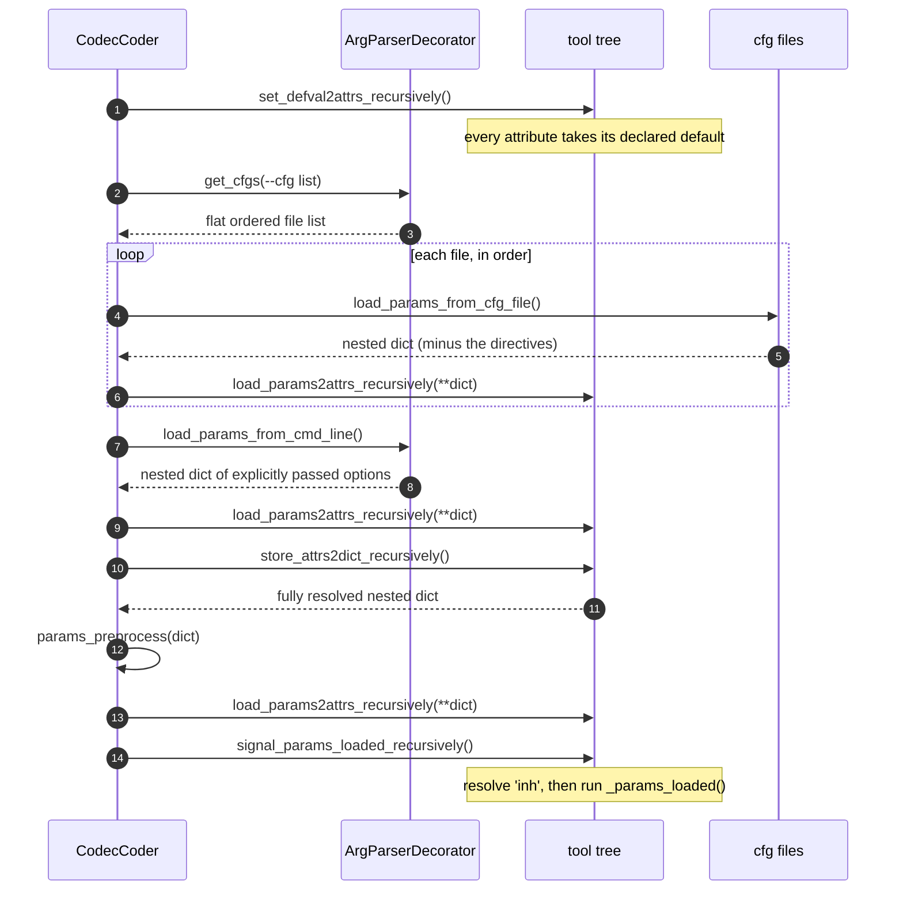
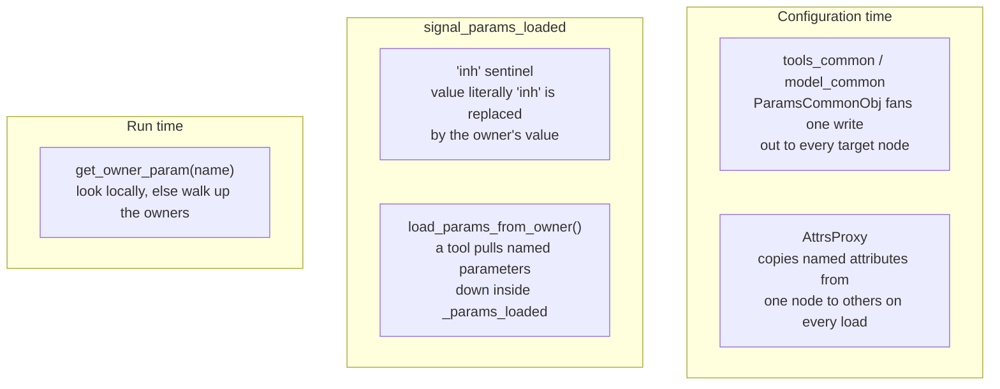

# 12 — Parameter Resolution

[03 — Configuration system](03-configuration-system.md) describes *which* configuration files
exist and what they contain. This chapter describes the machinery that turns those files and the
command line into attribute values on the tool tree: where a parameter is declared, how it
becomes a command-line option, in what order sources are applied, and the five separate
mechanisms by which a value reaches a node it was not written on.

Sources: `src/codec/common/argparse_decorator.py`, `src/codec/utils/utils.py`,
`src/codec/coding_tools/interfaces/params/`, `interfaces/params_common/`, `interfaces/attrs/`,
`interfaces/base/`.

## 1. The shape of the problem

The codec is a deep tree of `BaseEngine` nodes — the four beta models alone contribute an
identical subtree each. Every node owns a handful of named settings, and a setting has to be
reachable three ways:

- from a JSON file, nested to match the tree;
- from the command line, as a flat dotted name;
- from a sibling or parent node, so that shared values are written once.

All three converge on the same thing: **a plain Python attribute on the node**. After resolution
`self.enabled`, `self.beta_list` and `self.num_threads_z` are ordinary attributes; nothing
consults a config object at run time. Everything below exists to get the right value onto the
right attribute before the first image is coded.

## 2. Declaring a parameter

A tool declares its settings in a `ParamsBase` subclass, by convention in a `params.py` beside
it:

```python
class ResVarScaleParams(ParamsBase):
    def __init__(self, *args, **kwargs):
        super(ResVarScaleParams, self).__init__(*args, **kwargs)
        add_arg = self.add_single_param
        add_arg('rvs_enabled', type=int, default=0, choices=[0, 1], help='Enable variance scaling')
        add_arg('cnum_list', type=int, nargs='+', default=[], help='Per-channel counts')
```

`add_single_param` only records `{name, args, kwargs, def}` in a list. The arguments are exactly
those of `argparse.add_argument`, because that is where they end up.

The tool then instantiates the class as an attribute:

```python
class ResVarScale(BaseEngine):
    def __init__(self, **kwargs):
        super().__init__(**kwargs)
        self._params_rvs = ResVarScaleParams()      # registered by the assignment itself
```

`BaseEngine.__setattr__` watches for two types and files them away instead of treating them as
ordinary attributes:

| Assigned type | Goes to | Effect |
| --- | --- | --- |
| `ParamsBase` | `self._params` (a `ParamsComposite`) | Its parameters join this node's set |
| `AttrsProxy` | `self._attrs_proxies` | Its copy rule runs on every load |

So a node can gather parameters from several `ParamsBase` classes — a tool typically has its own
plus `CoderParams` (which contributes `enabled`, but only when the node was constructed with
`has_enabled_flag`) and `LoggerParams` (which contributes `loglevel`). `ParamsComposite` presents
them as one set and can also `remove_param_inst(...)`, which is how `ToolsComposite` drops the
checkpoint parameters it has no use for.

The tree itself is built the same implicit way: `BaseModule.__setattr__` notices that the value
is a `BaseModule`, sets its `name` to the attribute name and its owner to `self`. **The dotted
address of every node is therefore just the chain of attribute names**, and nothing has to
register anything.

## 3. From declarations to command-line options

`CodecCoder.get_params_list()` starts a walk from the root:

```python
def get_params_list_recursively(self, parser: ArgParserDecorator) -> None:
    self.params.def_params_list(parser)
    self.for_top_level_children(
        lambda n, m: m.get_params_list_recursively(parser.add_sub_section_parser(n)))
```

`ArgParserDecorator` (`src/codec/common/argparse_decorator.py`) wraps one real
`argparse.ArgumentParser` and gives each child node a sub-section whose prefix is the child's
attribute name. Registering `rvs_enabled` three levels down produces the option

```
-model.CCS_SGMM.tools_common.model_common.common_modules.quantizer.rvs.rvs_enabled
```

Three consequences worth knowing:

- **A single leading dash.** The decorator writes `-{prefix}.{name}`, so overrides are
  `-a.b.c value`, not `--a.b.c value`. `scripts/export_models.sh` uses exactly this form:
  `-post_filters.tools ""`.
- **The option name is the JSON path.** The same dotted string, split on `.`, is the nesting of
  the configuration file. There is one namespace, expressed two ways.
- **Top-level script options are kept separate.** An argument registered with a leading dash
  (`--cfg`, `--device`, `-r`) is marked as *not* belonging to the tree; `remove_params()` strips
  the tree options back out of the parsed namespace so the script sees only its own arguments.

## 4. Resolving the configuration file list

Before any value is read, `ArgParserDecorator.get_cfgs()` expands `--cfg` into a flat, ordered
list of files. Two directives take part:

| Directive | Meaning |
| --- | --- |
| `"!include": ["a.json", "b.json"]` | Load these first, relative to the including file |
| `"!exclude": ["x.json"]` | Drop `x.json` from the load order entirely |

The expansion is **depth first, post-order**: a file's includes are loaded before the file
itself, so a file always overrides what it includes. Running it on the real configuration gives:

```
--cfg cfg/tools_on.json cfg/profiles/base.json

 1  cfg/AE/ans.json              8  cfg/tools/EFElinear.json      15  cfg/oper_point/bop_Enc.json
 2  cfg/AE/default.json          9  cfg/tools/EFEnonlinear.json   16  cfg/oper_point/bop_Dec.json
 3  cfg/BRM/default.json        10  cfg/tools/LEF.json            17  cfg/oper_point/bop.json
 4  cfg/pipeline.json           11  cfg/tools/eICCI.json          18  cfg/profiles/base.json
 5  cfg/CTC.json                12  cfg/tools/EnhancementFilters.json
 6  cfg/tools/LSBS.json         13  cfg/tools_on.json
 7  cfg/tools/ResVarScale.json  14  cfg/oper_point/common.json
```

Read that as the actual precedence order: `pipeline.json` is the base, `CTC.json` refines it, the
tool files turn tools on, `tools_on.json` overrides what they set, and the profile has the last
word.

### The three rules that are easy to get wrong

**Deduplication is per include list, not global.** Files are collected in a dictionary that moves
a re-inserted key to the end, but each include list is a separate dictionary. A file reached
through two different branches is loaded twice:

| Structure | Resolved order |
| --- | --- |
| `A` includes `[X, B]`, `B` includes `[X]` | `X, X, B, A` |
| `A` includes `[X, X]` | `X, A` |
| `--cfg X.json X.json` | `X` |

Loading a file twice is harmless when its contents are fixed, but it means the *position* of the
second load decides the outcome if anything in between touched the same key.

**Include order changes the result.** `A` includes `[B, X]` where `B` includes `[X]` resolves to
`X, B, X, A` — `X` is applied again after `B`, so `X` wins. Swap the include list and `B` wins.

**`!exclude` is global and late.** It is collected during the walk and applied to the finished
tree, so it removes the file from *every* branch, not just the one it was written in. `A`
including `B` (which includes `X`) while excluding `X` resolves to `B, A`.

Files are parsed with `commentjson` at load time, so `//` and `/* */` comments are legal.

## 5. Applying the values

`cmd_params_loading()` in `src/codec/utils/utils.py` runs the whole sequence:



### How a nested dict lands on the tree

```python
def load_params2attrs_recursively(self, **params) -> None:
    if len(params) == 0:
        return
    self._params.load_params2attrs(**params)
    self._attrs_proxies.process()
    self.for_top_level_children(
        lambda n, m: m.load_params2attrs_recursively(**params.get(n, {})))
```

Each node takes the keys it recognises and hands each child the sub-dict under the child's own
name. Two details follow from this:

- **A subtree the dict never mentions is skipped entirely** (`if len(params) == 0: return`),
  keeping whatever it already had. Configuration files are patches, not full states.
- **Unknown keys are silently ignored.** A key that matches no declared parameter and no child
  name is simply never read. A misspelled parameter name does not raise — it does nothing, which
  is the single most common configuration mistake in this codebase.

### Type coercion

Every load runs the value through the declared `type=`, element-wise for lists:

```python
dtype = param.get('kwargs', dict()).get('type', str)
if isinstance(dv, list):   dv = [dtype(x) for x in dv]
elif dv is None or isinstance(dv, dict):  pass
else:                      dv = dtype(dv)
```

So `"enabled": 1`, `"enabled": "1"` and `-…enabled 1` all end up as the integer `1`, and a value
that cannot be coerced raises here rather than deep inside a tool. `None` and `dict` values pass
through untouched.

### What the command line actually contributes

`load_params_from_cmd_line()` is deliberately narrow — it collects **only the options that were
explicitly typed**:

```python
for arg in ans_known_args.keys():
    if ans_known_args[arg] is None: continue
    if f'-{arg}' in args:                      # the option is on the command line
        ans = update_dict_recursively(ans, param_to_dict(arg, ans_known_args[arg]))
```

Without the `f'-{arg}' in args` test every registered default would be re-applied at the end and
would flatten everything the configuration files set. This is why the command line reliably wins
and why leaving an option out is not the same as passing its default.

A second pass scans the *unrecognised* arguments, so a dotted name that was never registered
still reaches the tree:

| Passed | Collected as |
| --- | --- |
| nothing | `{}` |
| `-model.CCS_SGMM.Ntools 2` (registered) | `{'model': {'CCS_SGMM': {'Ntools': 2}}}` |
| `-post_filters.LEF.enabled 1` (unregistered) | `{'post_filters': {'LEF': {'enabled': '1'}}}` |
| `--post_filters.LEF.enabled 1` (double dash) | `{}` — double-dash unknowns are dropped |
| `-post_filters.tools LEF eICCI` | `{'post_filters': {'tools': ['LEF', 'eICCI']}}` |

Note the third row: a value collected this way is a **string**, because it never passed through
argparse's `type=`. It is coerced later, when `load_params2attrs` applies the declared type — but
only if the parameter is declared. Note also the fourth row: writing `--` instead of `-` on a
tree parameter silently does nothing.

Passing an empty value (`-post_filters.tools ""`) is safe only for a *registered* parameter —
which is why `CompositeParams` lists `''` among the `choices` for `tools`. For an unregistered
name the unknown-argument scanner indexes the empty string and raises `IndexError`.

## 6. The dump, preprocess and re-broadcast step

After the files and the command line have been applied, the resolver flattens the whole tree back
out, hands the result to a callback, and applies it again:

```python
ans = dict()
for b in base_list:
    ans = update_dict_recursively(ans, b.store_attrs2dict_recursively())
ans = params_preprocess(ans)
broadcast_params(base_list, ans)
```

This exists so that a late decision can rewrite a parameter wherever it appears, without knowing
which nodes declare it. Two real uses:

**Forcing the device.** `CodecCoder.setup_device_param()` calls
`set_param_recurrent(params, 'target_device', 'cpu')`, which walks the dict and rewrites every
`target_device` at any depth. One call moves the entire tree to CPU.

**`--set_target_bpp`.** `CodecEncoder.update_kwargs_params()` does three things: it appends
`cfg/BRM/regen_list.json` to the end of the `--cfg` list (so the bitrate matcher switches from
table lookup to search), forces `bpp_idx = 0`, and installs a preprocess callback that overwrites
`target_bpps` with the single requested value in the resolved dump.

The same dump is what the evaluation harness writes to `results/<run>/cfg.json` and then feeds to
every per-image encoder process, so an entire run is coded from one byte-identical, fully
resolved configuration.

## 7. Five ways a value reaches a node it was not written on

This is where most of the confusion lives, because the mechanisms look similar and are not.



### `tools_common` and `model_common`

These are not configuration conventions — they are real nodes. `ParamsCommonObj` is a
`BaseEngine` whose parameter set is **borrowed from its first target**:

```python
class ParamsCommonComposite(ParamsComposite):
    def __init__(self, base, params_list=None):
        super().__init__(base, params_list)
        for p in self.target_objs[0].params.get_params_inst_iter():
            self.append(p)

    def load_params2attrs(self, **params):
        for p in self._params_inst_list:
            p.load_params2attrs(self.base_cls, **params)
            for to in self.target_objs:
                to.load_params2attrs_recursively(**params)   # fan out to every target
```

| Node | Created in | Fans out to |
| --- | --- | --- |
| `model_common` | `CcsGvaeSGMM.__init__` — `ParamsCommonObj(self.models_list)` | `model_y` and `model_uv` |
| `tools_common` | `MultiToolsEngine.insert_sub_tool` | every `tools_0 … tools_N` |

Because it borrows the target's parameters, anything writable on `model_y` is writable on
`model_common`, with no separate declaration. And because `store_attrs2dict` deliberately returns
`{}`, these nodes **never appear in the resolved dump** — `results/<run>/cfg.json` contains the
expanded per-tool values instead of the shorthand, which is what makes that file a faithful record
of what actually ran.

Precedence follows from the file order, not from any special rule: `tools_common` is applied when
its key is read, and a later `tools_2.model_uv.…` write simply overwrites the fanned-out value
for that one node.

### The `'inh'` sentinel

A parameter whose value is still the literal string `'inh'` when `signal_params_loaded` runs is
replaced by the owner's value for the same name:

```python
if cur_dv == 'inh':
    if base.has_owner():
        dv = base.owner.get_owner_param(n)
    elif 'choices' in param['kwargs']:
        dv = param['kwargs']['choices'][0]     # root fallback
```

`LoggerParams` is the canonical user: `loglevel` defaults to `'inh'`, so every node inherits the
log level of its parent, and the root falls back to `choices[0]` — `'debug'`, the first entry of
`Logger.levels`. Setting `-loglevel warn` at the root therefore quiets the whole tree, while
setting it on one node quiets that subtree only.

### `load_params_from_owner()`

An explicit pull, used inside `_params_loaded()` when a tool needs a value the owner computed:

```python
self.params.load_params_from_owner(['code_mode'])
```

It reads the named attributes off the owner and applies them through the normal load path, so the
declared type coercion still runs. It returns `False` if the owner did not have all of them.

### `AttrsProxy`

A copy rule attached to a node, evaluated after every load. It names a list of attributes, a
source and one or more destinations, and calls `source.copy_attrs_value(dest, attr_name_list)`.
Where `ParamsCommonObj` fans a *configuration key* out to several nodes, `AttrsProxy` copies
*already-resolved attributes* between nodes that are not in an owner relationship.

### `get_owner_param()`

The run-time lookup, and the only one of the five that is not part of configuration:

```python
def get_owner_param(self, param_name: str, def_val=None):
    if hasattr(self, param_name):
        return getattr(self, param_name, def_val)
    return self.owner.get_owner_param(param_name, def_val)
```

A child reads a value it does not own by walking up. `CcsGvaeSGMM` uses it for `c_ver` / `c_hor`,
which the `CodingEngine` decides per image and no tool below stores.

There is a matching fall-through for methods: `BaseModule.__getattr__` forwards any missing
attribute whose name starts with `get_` to the owner, which is how a leaf can call
`self.get_target_bpp()` or `self.get_profilers()` without holding a reference to the root.

## 8. `_params_loaded()`

The hook that runs once, after the entire configuration is known and before any model is built.
It is where derived state belongs, because at declaration time none of the inputs are final yet:

| Use | Example |
| --- | --- |
| Build lookup tables | `ResVarScale.buildTables()`, `LSBSMode.buildTables()` |
| Derive one value from others | `CcsGvaeSGMM`: `McmOverlap = mcm_overlap_in_latent_samples * 4` |
| Validate | `ColourTransformation` asserts the matrix and offsets are within 0…255, then inverts the matrix |
| Pull from the owner | `self.params.load_params_from_owner([...])` |
| Resolve checkpoints | pick the `ckpt_files` entry matching the active beta |
| Prune the tree | `MultiToolsEngine` deletes the `tools_N` beyond `Ntools` |

`signal_params_loaded_recursively` also moves the node to its device (`self.to(self.device)`) if
one is set, immediately after the hook.

## 9. Reading the resolved configuration back

`store_attrs2dict_recursively()` is the inverse of the load: it produces a nested dict of every
declared parameter of every node, keyed by the same names the config files use.

```python
ans = self._params.store_attrs2dict()
self.for_top_level_children(lambda n, m: ans.update({n: m.store_attrs2dict_recursively()}))
```

It is used three ways: as the input to `params_preprocess`, as the run record written to
`results/<run>/cfg.json`, and — because that file is then passed back as a `--cfg` argument — as
a *configuration file in its own right*. A resolved dump can be fed straight back in to reproduce
a run exactly.

## 10. Practical recipes

**Find the name of a parameter.** Look for its `add_single_param` call, then read the attribute
chain from the tool up to the root; that chain is the dotted name. `ce.` is not part of it — the
root's own parameters are top-level keys.

**Override one value for one run.**

```bash
python -m src.reco.coders.encoder in.png out.bits \
    --cfg cfg/tools_off.json cfg/profiles/base.json \
    -model.CCS_SGMM.tools_common.model_common.common_modules.quantizer.rvs.rvs_enabled 1
```

**Override it for everything.** Write a small patch file and put it last on `--cfg`; the file
order is the precedence order.

**Override it for one image, or one image at one rate.** Drop a file in `cfg/per-image/.json`
or `cfg/per-image-per-bpp//bpp<N>.json`. The evaluation harness appends them after the base
configuration, unless `--only_base_config` or `--no_per_ratepoint_config` disables them.

**See what a run actually used.** Read `results/<run>/cfg.json`.

### Troubleshooting

| Symptom | Cause |
| --- | --- |
| A setting in a config file has no effect | The key is misspelled or nested under the wrong node — unknown keys are ignored without warning. Check `results/<run>/cfg.json` for the value you expected |
| A command-line override has no effect | Written with `--` instead of `-`, or the dotted path does not match the tree |
| A value is a string where a number was expected | It arrived through the unknown-argument scanner for a parameter that is not declared, so no `type=` coercion ran |
| A value is right in the dump but wrong at run time | Something overwrote it in `_params_loaded()`, or a `get_owner_param()` lookup is finding it on an ancestor |
| A `*_common` key does not appear in the dump | Expected: `ParamsCommonObj` stores nothing and the fanned-out values appear on the real tools |
| Two config files fight and the loser looks arbitrary | Check the expanded order — a file reached through two include branches is applied twice, and the later position wins |
