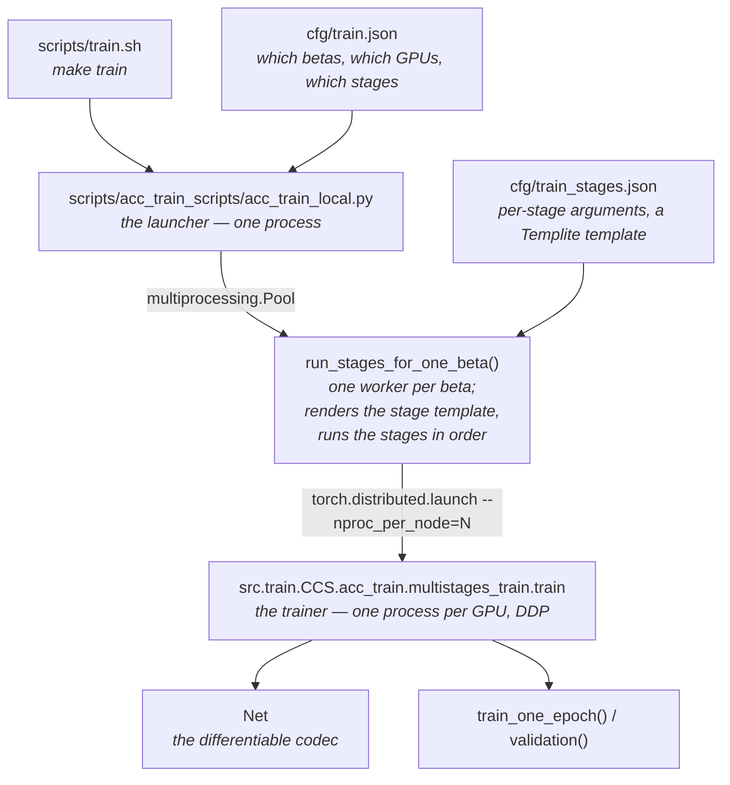
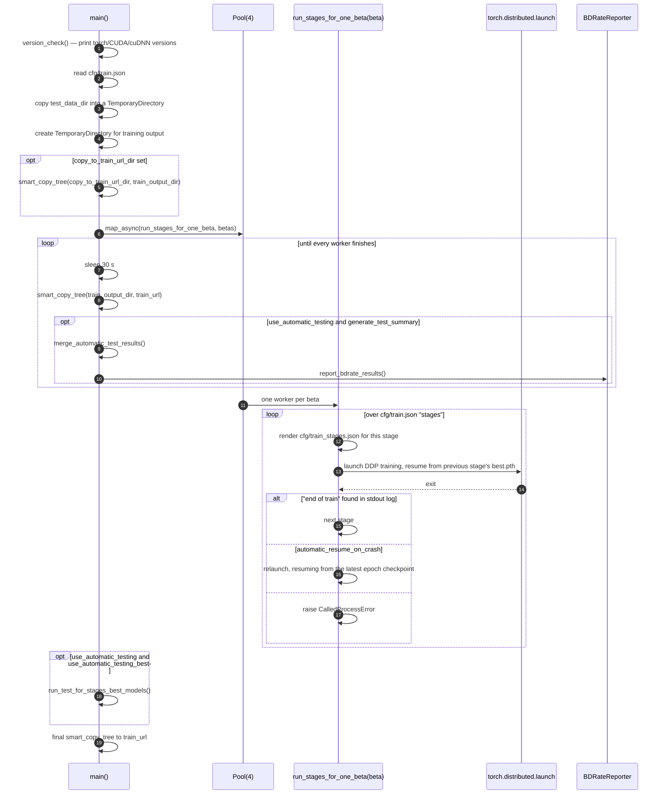
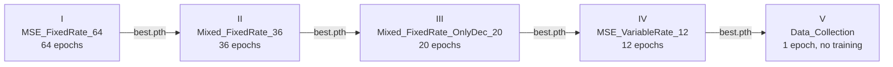
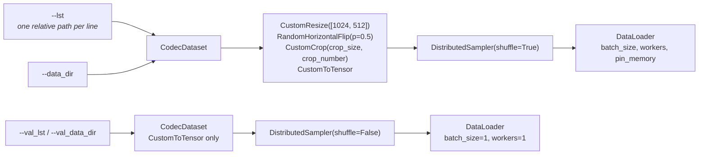
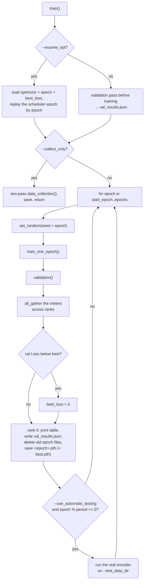

# 13 — Training

The reference software ships two independent trainers:

| Trainer | Location | Trains |
| --- | --- | --- |
| **CCS** | `src/train/CCS/` + `scripts/acc_train_scripts/` | The codec itself — analysis and synthesis transforms, hyper-encoder/decoder/scale-decoder, context model, gain unit |
| **ICCI / eICCI** | `src/train/ICCI/` | The post-filter, as a standalone super-resolution-style network |

They share nothing. CCS is what `make train` runs and what the rest of this chapter is about;
the ICCI trainer is described in section 14.

The CCS trainer is a *separate implementation of the codec*. It imports `src/codec` only for
the network factories (`EncoderFactory`, `DecoderFactory`, `HyperEncoderFactory`,
`HyperDecoderFactory`, `HyperScaleDecoderFactory`), the colour transform and the `Image` class.
The tool tree from [02 — Core architecture](02-core-architecture.md) is not used: training runs
a hand-written differentiable forward pass in `src/train/CCS/acc_train/model/net.py`. What the
two implementations share is the *weights*, and the layout of the checkpoints those weights
live in.

## 1. The three layers



Concretely, for the shipped configuration one `make train` becomes:

* **1** launcher process,
* **4** worker processes (one per beta: 0.002, 0.012, 0.075, 0.5),
* **5** sequential stages inside each worker,
* **2** DDP trainer processes per stage (`beta_2_gpus` gives each beta two GPUs),

so the shipped `cfg/train.json` assumes **8 GPUs**.

## 2. Quick start

```bash
make download_train_ds      # ~5300 cropped natural images + 7000 SCC patches + validation set
make train                  # == scripts/train.sh
```

`scripts/train.sh` is a thin wrapper:

```bash
python3 -m scripts.acc_train_scripts.acc_train_local \
       --data_dir      ${DATA_ROOT}/jpegai_training_random_crop/ \
       --lst           ${DATA_ROOT}/jpegai_training_random_crop/jpegai_training_set512_random_crop_16.txt \
       --val_data_dir  ${DATA_ROOT}/jpegai_validation_set/ \
       --val_lst       ${DATA_ROOT}/jpegai_validation_set/jpegai_validation_set_10.txt \
       --train_url     ${work_dir}/train_results/
```

Everything else in the script is commented out — it is a menu of the variations described in
section 3.4.

## 3. Layer 1 — the launcher

`scripts/acc_train_scripts/acc_train_local.py`, 455 lines, entry point `main()`.



### 3.1 Why a temporary directory

Training writes one checkpoint per epoch per beta. `main()` runs the whole thing inside a
`tempfile.TemporaryDirectory()` and copies the result out to `--train_url` every 30 seconds
with `smart_copy_tree()`. The trainer itself deletes everything in its output directory except
`best.pth` and `val_results.json` before saving each new epoch — so the run needs disk for two
checkpoints per beta at a time, and the accumulated history ends up under `--train_url`.

`--copy_to_train_url_dir` runs in the other direction: it seeds the temporary directory
*before* training starts. Combined with `--resume_from_stage`, this is how you continue from
the released checkpoints (see section 3.4).

### 3.2 What the launcher forwards to every stage

`run_stages_for_one_beta()` builds a `common_parameters` list that is prepended to every
stage's own arguments. Exactly these launcher options reach the trainer this way:

`--data_dir --lst --val_data_dir --val_lst --batch_size --seed --test_data_dir --N --N_UV
--hyper_decoder_type --hyper_scale_decoder_type --mse_weight --beta --use_automatic_testing
--automatic_testing_epoch_period --enable_gvae --amp --sigma_quant_level --sigma_quant_max
--sigma_quant_min --cube_flag_thre --loss_weights --l1 --opt_type --skip_thre --rec_dir
--cfg_path --vae_encoder_type_list --vae_decoder_type_list`,
plus `--frozen_part` when non-empty and `--overfit` when set.

Three consequences worth knowing:

* **Options not in that list never reach the trainer from the command line.** `--crop_size`,
  `--workers`, `--epochs`, `--lr`, `--wd`, `--color`, `--bh`, `--N_G`, `--entropy`,
  `--print_freq`, `--save_epoch`, `--best_n`, `--patience`, `--factor`, `--lr_steps`,
  `--lr_type`, `--scale_bound`, `--start_epoch`, `--crop_number`, `--sym_flag`,
  `--sigma_bound_offset`, `--N_Y`, `--max_pic_area_in_validation`, `--cal_entropy_on_val`,
  `--zero_redundancy_optimizer`, `--cuda_empty_cash_each_batch`, `--use_scc_dataset` and
  `--workers` are parsed by the launcher and then silently dropped. To change them you edit
  `cfg/train_stages.json`, where they *are* appended per stage — `--epochs`, `--lr`,
  `--anneal_final_lr`, `--base_warmup_epoch`, `--loss_type`, `--msssim_weight`,
  `--loss_factors`, `--beta_list`, `--frozen_part`, `--enable_gvae`, `--cal_entropy_on_val`
  and `--collect_only` all arrive that way. (`--base_warmup_epoch`, `--lr` and
  `--anneal_final_lr` are the exception: the template reads the launcher's values through
  `args.…` and substitutes them when they are not `None`.)
* **`--frozen_part` on the launcher command line kills the run silently.** The forwarding
  line is

  ```python
  if len(args.frozen_part) > 0:
      common_parameters += "--frozen_part" + args.frozen_part
  ```

  `args.frozen_part` is a list (`nargs="+"`), so `str + list` raises
  `TypeError: can only concatenate str (not "list") to str` inside
  `run_stages_for_one_beta()` — before a single training process is launched. That function
  runs in a `multiprocessing.Pool` worker, and `main()` never calls `results.get()`: it polls
  `results.ready()`, then `close()` and `join()`. `map_async` stores the exception and
  nothing ever retrieves it, so the launcher exits 0 with an empty output directory and no
  error message. Set freezing per stage in `cfg/train_stages.json` instead, where every stage
  already does.
* **`--cube_flag_thre` is overridden for the top rate:** the launcher passes
  `args.cube_flag_thre if beta < 0.5 else 0.0`.

### 3.3 Crash handling

The launcher does not trust the child's exit code. It scans the last five lines of the child's
stdout log for the literal string `end of train`, printed by
`multistages_train/train.py` after `train()` returns. Anything else counts as a crash:

* with `--automatic_resume_on_crash 1` (the default) it lists the stage output directory,
  finds the highest-numbered `<epoch>.pth`, and relaunches with
  `--resume <that file> --resume_opt 1` — so the optimizer state, the epoch counter and the
  best-loss watermark all survive;
* with `--automatic_resume_on_crash 0` it raises `subprocess.CalledProcessError`.

Each stage gets a fresh free TCP port (`find_free_port()`) for the DDP rendezvous, so
concurrent betas do not collide.

### 3.4 The commented-out recipes in `train.sh`

| Recipe | Arguments |
| --- | --- |
| Disable automatic testing | `--use_automatic_testing 0` |
| Resume from the released checkpoints | `--copy_to_train_url_dir models/VM_common/train_stages` and `--resume_from_stage MSE_VariableRate_12` |
| Train BOP only | `--vae_encoder_type_list bop --vae_decoder_type_list bop --loss_weights 1 --cfg_path tools_off.json oper_point/bop.json` |
| Train HOP only | same with `hop` and `oper_point/hop.json` |
| BOP encoder, SOP decoder | `--vae_encoder_type_list bop --vae_decoder_type_list sop --loss_weights 1 --cfg_path tools_off.json oper_point/bopEnc_sopDec.json` |
| Arbitrary pair | `--cfg_path tools_off.json oper_point/common.json oper_point/<ENC>_Enc.json oper_point/<DEC>_Dec.json` |

Three of them are commented **out** but reference options that do not exist in
`get_args.py`: `--freeze_entropy_part`, `--train_only_analysis_part` and
`--train_only_synthesis_part`. They are leftovers from an earlier argument set; the working
equivalents are `--frozen_part entropy`, `--frozen_part synthesis` and
`--frozen_part analysis` respectively, set per stage. Because `get_args()` calls
`parse_known_args()`, passing them would *not* raise — they would be silently ignored.

The `--cfg_path` values matter only for the automatic-testing runs: they are the inference
configuration handed to `src.reco.scripts.eval`. They have no effect on the training forward
pass. The default is `['tools_off.json', 'profiles/base.json']`.

## 4. Layer 2 — `cfg/train.json`

Five per-beta lookup tables plus the stage list. Every key is the *nominal* beta of the model
being trained; the shipped four match the four released quality models.

### `beta_2_gpus`

```json
{ "0.002": "0,1", "0.012": "2,3", "0.075": "4,5", "0.5": "6,7" }
```

Doubles as the list of betas to train — `main()` takes `beta_2_gpus.keys()` as the work items.
The value is the `CUDA_VISIBLE_DEVICES` string for that worker; its length is
`--nproc_per_node`. To train a single beta on one GPU, reduce this dict to one entry
(`scripts/acc_train_scripts/test.py` does exactly that for the unit test).

### `beta_2_betaList`

```json
{ "0.002": "0.002", "0.012": "0.03", "0.075": "0.2", "0.5": "1.0" }
```

The *upper* end of the variable-rate range each model must cover. It becomes
`--beta_list` in stages III, IV and V. `get_beta_list()` splits it on commas, so this may be
a list; the shipped configuration gives a single value per model, and stage II uses the
nominal beta alone.

Independently of `--beta_list`, `Net` hard-codes a fixed **model beta grid**:

```
0.0005 0.001 0.002 0.004 0.007 0.01 0.012 0.015 0.03
0.05   0.075 0.1   0.2   0.5   0.75 1.0   2.0   3.0
```

`_nrate_n_ft(beta)` maps a sampled beta onto this grid: `n` is the index of the largest grid
point not above `beta`, and `f` is the fractional position between grid points `n` and `n+1`.
The pair `(n, f)` indexes and interpolates the gain-unit vectors `vr_vec_Y` / `vr_vec_UV` —
this is what makes one checkpoint cover a continuous rate range.

### `beta_2_msssim_weight`

```json
{ "0.002": "0.5", "0.012": "0.5", "0.075": "0.4", "0.5": "0.3" }
```

`a_ssim` in the mixed loss. Lower rates lean more on MS-SSIM, the top rate least.

### `beta_2_loss_factors`

```json
{ "0.002": "0.6667_0.1667_0.1667",
  "0.012": "0.6667_0.1667_0.1667",
  "0.075": "0.7143_0.1429_0.2857",
  "0.5":   "0.6667_0.1667_0.3333" }
```

`factorY_factorCb_factorCr`, parsed by splitting on `_`. Applied only by the `mix` loss.

### `beta_2_training_list`

```json
{ "0.002": "cfg/training_list/Q1_training_list.txt", … "0.5": "cfg/training_list/Q4_training_list.txt" }
```

Used **only when `--lst` is empty**. `scripts/train.sh` passes `--lst`, so these files are
bypassed by the default run. They are per-quality curated subsets — 132 308 / 132 308 /
139 596 / 145 945 lines, each a path relative to `--data_dir`:

```
jpegai_training_7000scc/04853_TR_4928x3264_28.png
```

### `stages`

```json
["MSE_FixedRate_64", "Mixed_FixedRate_36", "Mixed_FixedRate_OnlyDec_20",
 "MSE_VariableRate_12", "Data_Collection"]
```

Executed in order. Each stage resumes from the previous stage's `best.pth`; the first stage
resumes from `--resume_from_stage` if given, otherwise from scratch. Names are keys into
`cfg/train_stages.json` — the numeric suffix is convention, the epoch count comes from the
stage's own `--epochs`.

## 5. Layer 2b — `cfg/train_stages.json` and the templating

The file is rendered by `Templite` (`src/codec/utils/templite.py`, the same engine described in
[03 — Configuration system](03-configuration-system.md)) and then parsed with `commentjson`.
Delimiters are `${ … }$`. The bindings `run_stages_for_one_beta()` supplies are:

| Variable | Value |
| --- | --- |
| `args` | The launcher's full `argparse.Namespace` |
| `beta` | The worker's beta, as a float |
| `beta_list_stageII` | `str(beta)` |
| `beta_list_stageIII_IV` | `beta_2_betaList[beta]` |
| `msssim_weight` | `beta_2_msssim_weight[beta]` |
| `loss_factors` | `beta_2_loss_factors[beta]` |

Two template idioms appear:

```jinja
${ if args.lr is None: }$ 1e-03 ${ :else: }$ ${ write(args.lr) }$ ${ :end-if }$
${ if beta == 0.002: }$ "synthesis", ${ :end-if }$
```

The first gives every stage a default that a launcher `--lr` can override globally. The second
branches the stage definition on the beta — the lowest-rate model is treated differently in
stages III, IV and V.

Rendering happens **once per stage per beta**, so the same file yields four different argument
lists.

### The result is a list of command-line arguments

```json
"MSE_FixedRate_64": [
    "--epochs", 64,
    "--loss_type", "mse",
    "--base_warmup_epoch", 1.0,
    "--lr", 1e-03,
    "--anneal_final_lr", 1e-04,
    "--frozen_part", "gain_unit",
    "--beta_list", 0.002
]
```

Numbers may be JSON numbers; the launcher stringifies every element before `Popen`.

## 6. The five stages



Total: 132 training epochs per beta, plus a two-pass statistics sweep.

| | I `MSE_FixedRate_64` | II `Mixed_FixedRate_36` | III `Mixed_FixedRate_OnlyDec_20` | IV `MSE_VariableRate_12` | V `Data_Collection` |
| --- | --- | --- | --- | --- | --- |
| `--epochs` | 64 | 36 | 20 | 12 | 1 |
| `--loss_type` | `mse` | `mix` | `mix` | `mix` | `mix` |
| `--beta_list` | the nominal beta | the nominal beta | `beta_2_betaList` | `beta_2_betaList` | `beta_2_betaList` |
| `--lr` | `1e-3` | `1e-4` | `1e-4` | `1e-4` (fixed) | `1e-4` (fixed) |
| `--anneal_final_lr` | `1e-4` | `1e-5` | `1e-5` | `1e-5` (fixed) | `1e-5` (fixed) |
| `--base_warmup_epoch` | 1.0 | 0.1 | 0.1 | 0.1 | 0.1 |
| `--msssim_weight` | — | `beta_2_msssim_weight` | same | same | same |
| `--loss_factors` | — | `beta_2_loss_factors` | same | same | same |
| `--frozen_part` | `gain_unit` | `gain_unit` | `gain_unit` **only for beta 0.002** | `analysis entropy` (+ `synthesis` for beta 0.002) | `gain_unit` |
| `--enable_gvae` | — | — | `0` for beta 0.002, else `1` | `0` for beta 0.002, else `1` | — |
| `--cal_entropy_on_val` | — | — | — | `1` | — |
| `--collect_only` | — | — | — | — | `1` |

Reading the schedule as a story:

1. **I — get a working codec at one rate.** Pure MSE, the highest learning rate, a full epoch
   of warm-up. The gain unit is frozen because there is only one rate to serve.
2. **II — add perceptual quality.** Switch to the mixed MSE/MS-SSIM loss, drop the learning
   rate by 10×, still one rate.
3. **III — open the rate range, decoder-side.** `--beta_list` becomes the wide range, and the
   gain unit is *unfrozen* for every model except the lowest, so it learns to span rates.
   `--enable_gvae 1` switches the quantisation path (see section 8.3).
4. **IV — fine-tune the synthesis side only.** `--frozen_part analysis entropy` leaves only
   the synthesis transform and the gain unit trainable — for beta 0.002 the synthesis
   transform is frozen too, so the stage only trains the gain unit.
   `--cal_entropy_on_val 1` turns on the channel-wise entropy accumulation used for
   progressive-decoding channel ordering.
5. **V — collect activation statistics.** `--collect_only 1` short-circuits `train()`: no
   optimisation happens, the loop runs twice over the training set to gather per-channel
   min/max and then a 1000-bin histogram for the five analysis-transform stages
   (`E1B…E5B` / `E1H…E5H`) and the five hyper-encoder stages (`HE1…HE5`), trims the extreme
   100 samples from each tail, and stores the result as `clip_thres` on the modules before
   saving the checkpoint. These are the clipping bounds the integer/quantised inference path
   needs — see [11 — Evaluation and testing](11-evaluation-and-testing.md) and
   `docs/md/quantization.md`.

Stage IV also passes `--add_random_noise_for_quantization_y 1`, which **no code reads**.
`get_args()` uses `parse_known_args()`, so it is accepted and discarded.

## 7. Layer 3 — the trainer

`src/train/CCS/acc_train/multistages_train/train.py` is six lines of substance:

```python
args = get_args()
multi_process_env_init(args)
train_loader, val_loader = get_data_loader(args)
net = ddp_model_init(Net, args)
optimizer = init_optimizer(args, net)
scheduler = set_lr_scheduler(optimizer, 8, train_loader, args)
criterion = set_criterion(reg_loss_weight=args.l1)
train(train_loader, val_loader, net, criterion, optimizer, scheduler, args)
```

`print('start of train')` and `print('end of train')` bracket it — the second is the launcher's
success signal.

### 7.1 Process group

`multi_process_env_init()` initialises `nccl` (or `gloo` without CUDA) with a **7200-second**
timeout, sets `args.local_rank` from the rank, pins the CUDA device, and seeds
`random`, `numpy`, `torch`, `PYTHONHASHSEED` and both CUDA generators from `--seed`.
`cudnn.deterministic = False` and `cudnn.benchmark = False` — deterministic mode is *not*
requested, so runs are not bit-exact reproducible.

The seed is re-derived every epoch as `set_random(args.seed + epoch)`.

### 7.2 Data



* `CodecDataset` reads the list file, keeps the first whitespace-separated field of each line,
  opens with PIL and `.convert('RGB')`.
* `CustomResize([1024, 512])` scales the **short** side down to the first threshold it exceeds
  — short side > 1024 → 1024; else short side > 512 → 512; else 512. It never upscales
  (`custom_resize` returns the image unchanged if it already matches).
* `CustomCrop(size, num)` takes `--crop_number` random `--crop_size` × `--crop_size` crops and
  returns them as a list; the `Lambda` stacks them, so the effective batch is
  `batch_size × crop_number` images.
* `CustomToTensor` produces a float tensor in **[0, 255]**, not [0, 1] — the codec works in
  sample units throughout.
* Validation asserts `len(val_dataset) % world_size == 0`. A validation list whose length is
  not a multiple of the GPU count aborts the run.
* `--overfit` replaces the whole training transform with `CustomToTensor` — full images, no
  crop, no flip. Combined with `--rec_dir` it writes a reconstruction per validation step, so
  you can watch a single image converge.

### 7.3 Pre-processing inside the model

`Net._preprocess()` runs per batch:

1. **Boundary handling.** With `--bh 1` (default) it crops a *random* `2·U(1,32)` samples off
   the bottom and right — an even number, so the 4:2:0 shuffle stays aligned. This is what
   teaches the network to cope with arbitrary picture sizes.
2. **Colour.** `ColorSpace.rgb_to_yuv(x / 255) * 255` — the same BT.709 transform the codec
   uses.
3. **Chroma layout.** With `--color 420` (default) luma is `x[:, :1]`, the chroma *target* is
   the full-resolution `x[:, 1:]`, and the secondary branch input is `pixel_unshuffle(x, 2)` —
   the whole picture space-to-depth by 2, so the chroma branch sees luma context.
   `--color 444` takes an untaken path that references an undefined `img` and would raise.
4. **Validation only:** odd height/width are replicate-padded to even, and pictures larger than
   `--max_pic_area_in_validation` (default 2.4 · 10⁹ samples) are skipped to avoid OOM.

## 8. The model

`Net.__init__` builds, from the factories in `src/codec/components`:

| Attribute | Built from | Option |
| --- | --- | --- |
| `encoder_Y` / `encoder_UV` | `EncoderFactory`, names `<op>_prim` / `<op>_sec` | `--vae_encoder_type_list` |
| `decoder_Y` / `decoder_UV` | `DecoderFactory`, same naming | `--vae_decoder_type_list` |
| `hyper_encoder_Y` / `_UV` | `HyperEncoderFactory` | `--hyper_encoder_type` (default `basic`) |
| `hyper_decoder_Y` / `_UV` | `HyperDecoderFactory` | `--hyper_decoder_type` (default `basic`) |
| `hyper_scale_decoder_Y` / `_UV` | `HyperScaleDecoderFactory` | `--hyper_scale_decoder_type` (default `hsd`) |
| `context_Y` | the MCM context model | — |
| `entropy` | `SGMM` or `LaplacianProbModel` | `--entropy`, `--sigma_quant_*`, `--scale_bound` |
| `vr_vec_Y` / `vr_vec_UV` | `VrqVec(chs=N+N_Y, qp_num=len(model_beta_list))` | `--N`, `--N_Y`, `--N_UV` |

`MultiCoders` wraps each list, so one `Net` can hold several operating points at once. The
default lists — encoders `["bop", "hop"]`, decoders `["bop", "hop", "sop"]` — mean the shipped
run trains **six** encoder/decoder combinations simultaneously
(`total_loss_comp = len(enc) × len(dec)`).

### 8.1 `--loss_weights`

```
"dec0_enc0,dec0_enc1;dec1_enc0,dec1_enc1;dec2_enc0,dec2_enc1"
```

Default `8,1;1,8;8,1` — with the default lists that reads:

| Decoder | with BOP encoder | with HOP encoder |
| --- | --- | --- |
| `bop` | 8 | 1 |
| `hop` | 1 | 8 |
| `sop` | 8 | 1 |

so the matched pairs dominate, cross pairs are trained at 1/8 weight, and the SOP decoder is
trained mainly against the BOP encoder — which is why the release ships a SOP synthesis
transform with no SOP analysis transform.

`_distortion_loss()` reshapes the decoder output to `(total_loss_comp, N, C, H, W)`, evaluates
the loss for each combination, and normalises: each term is divided by the column sum
`loss_weights_summ[i % enc_count]` and the total by `enc_count`. Weights therefore express
*relative* importance within an encoder column, not an absolute scale.

Training a single pair means `--vae_encoder_type_list bop --vae_decoder_type_list bop
--loss_weights 1`.

### 8.2 The loss

```
loss = rd_loss + reg_loss
rd_loss = y_rate + z_rate + (mse_weight · beta) · D
```

`y_rate` and `z_rate` are `−log₂(likelihood)` summed over the latent and hyper-latent and
divided by `batch · H · W`, i.e. bits per **input** pixel.

The distortion term `D` depends on `--loss_type`:

* **`mse`** — `D = w_y·MSE_Y + w_u·MSE_Cb + w_v·MSE_Cr` where the component weights are
  `(0.8, 0.1, 0.1)` when `beta < 0.5` and `(0.33, 0.33, 0.33)` otherwise. (The source comment
  on that branch says "if is the highest beta", which reads backwards — the equal weighting is
  what the top rate gets.)
* **`msssim`** — the same weighting over `1 − MS-SSIM`, scaled by `beta · 1000` instead of
  `mse_weight · beta`.
* **`mix`** — the one the schedule actually uses from stage II on. With
  `a = --msssim_weight` and `(fY, fCb, fCr) = --loss_factors`:

  | Model | Luma term | Chroma terms |
  | --- | --- | --- |
  | beta < 0.01 and beta < 0.07 | `(1−a)·MSE_Y·fY + a·1000·MSSSIM_Y` | `(1−a)·MSE_C·fC` |
  | beta < 0.2 and above | `(1−a)·MSE_Y·fY + a·1000·MSSSIM_Y·fY` | `MSE_C·fC` |

  Note the asymmetry: at the two lower rates the chroma terms are damped by `(1−a)`, at the two
  higher rates they are not. The branch tests `args.beta` — the *nominal* beta of the model —
  not the beta sampled for this step.

MSE is always computed, even under `msssim`, because the validation table reports PSNR.

`reg_loss` is `--l1` (default `5e-9`) times the sum of L1 norms of every parameter whose name
contains `rnab`, `cab`/`CAB` or `TAM` in either transform — i.e. the attention and residual
blocks only, not the plain convolutions.

### 8.3 Quantisation, GVAE and skip

The residual path is `res = y − mean`, gain-scaled by `vr_vec`, then quantised. Three
straight-through variants appear:

| Helper | Forward | Gradient |
| --- | --- | --- |
| `addResiNoise()` | `round(x + U(−0.5, 0.5))` | identity |
| `_round_with_detach()` | `round(x)` | identity |
| `addZNoise()` | returns both a rounded value and a noisy one | identity |

The hyper-latent always uses `addZNoise()`. The residual uses `addResiNoise()` for the
likelihood computation, and:

* **`--enable_gvae 0`** — the reconstruction is built from `y_hat` produced by the context
  model, and the luma residual keeps its noisy value.
* **`--enable_gvae 1`** — the luma residual is hard-rounded (`(round(res) − res).detach() + res`)
  and the reconstruction is built from `dequantize(res) + mean` for both components. This is
  the "generalised VAE" path enabled from stage III on for every model except beta 0.002.

**`--frozen_part entropy`** also changes the forward pass, not only the optimizer: it switches
the luma likelihood input from the noisy residual to the hard-rounded one and uses the precise
`y_hat`.

**`--skip_thre`** (default `0.0`, i.e. off) enables latent skipping during training:
positions whose predicted scale is `≤ skip_thre` are candidates, `_gen_skip_cubeflag()` groups
them into 8×8×all-channels cubes and keeps a cube only if the maximum change it would cause is
below `--cube_flag_thre`, and surviving positions get residual 0 and likelihood 1.0 (zero rate).
The launcher forces `--cube_flag_thre 0.0` at beta 0.5. Note the chroma branch is skipped in
both the `enable_gvae` and plain paths, but luma skipping is only reachable through
`_decode_to_loss()` — the validation path.

### 8.4 Parameter groups and `--frozen_part`

`Net.parameters()` returns four lists:

| Group | Modules |
| --- | --- |
| `analysis` | `encoder_Y`, `encoder_UV` |
| `synthesis` | `decoder_Y`, `decoder_UV` |
| `entropy` | both hyper-encoders, both hyper-decoders, both hyper-scale-decoders, both hyper entropy models, `context_Y` |
| `gain_unit` | `vr_vec_Y`, `vr_vec_UV` |

`init_optimizer()` adds a group to the Adam parameter list only if its name is **not** in
`--frozen_part`. Freezing is therefore "not passed to the optimizer" — the modules still run,
and `analysis` additionally gets `torch.set_grad_enabled(False)` around the encoder forward in
`train_forward_to_loss()`, which is what makes freezing the analysis transform actually save
memory and time.

`--zero_redundancy_optimizer` is asserted to be `False`; `--opt_type` accepts only `adam`.
`--wd` (default 0) is Adam's `weight_decay`.

## 9. Learning-rate schedule

`set_lr_scheduler(optimizer, base_batch_size=8, train_loader, args)` first **rescales the
learning rate for the real batch size**:

```
real_batch = batch_size × world_size
real_lr    = real_lr_scale · args.lr    where real_lr_scale = real_batch / 8
```

With the defaults (`--batch_size 8`, 2 GPUs) that doubles the configured LR to `2e-3` in
stage I. Then one of four schedules, chosen by `--lr_type`:

| `--lr_type` | Wrapped scheduler | Stepped |
| --- | --- | --- |
| `warmup_anneal.step` (default) | `CosineAnnealingLR(T_max = epochs·len(loader) − warmup, eta_min = --anneal_final_lr)` | every batch |
| `warmup_step.step` | `MultiStepLR(milestones = --lr_steps · len(loader) − warmup, gamma = 0.5)` | every batch |
| `step.epoch` | `MultiStepLR(milestones = --lr_steps, gamma = 0.5)` | every epoch |
| `reduce_on_plateau.epoch` | `ReduceLROnPlateau(patience = --patience, factor = --factor)` | every epoch, fed the best loss |

The first two are wrapped in `WarmupLR`, which linearly ramps each group from `--lr / 10` to
the rescaled LR over

```
warmup_steps = int(--base_warmup_epoch × len(loader) × real_batch / 8)
```

steps and then hands over. `--adam_lr_type` exists with the same choices and default but is
never read — `--lr_type` is the live option.

`--lr_steps` (default `"20,30,40"`) is only consulted by the two `step` schedules, which the
shipped schedule does not use.

## 10. The training loop



Inside `train_one_epoch()`, per batch:

1. Step the scheduler if `--lr_type` ends in `step`.
2. **Sample a beta uniformly at random from `--beta_list`.** This is what makes the model
   variable-rate: within one epoch different batches optimise different points of the R-D
   curve.
3. Forward under `autocast(enabled=--amp)`.
4. `all_gather` the loss across ranks and check for NaN. If any rank saw NaN, re-run the batch
   with AMP off. If more than **2 %** of the epoch's batches hit NaN, disable AMP for the rest
   of the epoch.
5. Backward through `GradScaler`, `unscale_`, **clip gradients to norm 10** per module, step.
6. Check the scaler for inf/NaN gradients across all ranks; if found, redo the batch in fp32.
7. Keep the loss scale at **≥ 2048** (`if scaler.get_scale() < 2048: scaler.update(2048.0)`).
8. Every `--print_freq` batches (rank 0) print `Time lr rd_loss reg_loss scale`.

Validation walks the validation loader with `beta = beta_list[istep % len(beta_list)]` — cyclic,
not random, so the metric is comparable across epochs. It reports:

`Rate`, `Hyper_rate`, `Y_PSNR`, `U_PSNR`, `V_PSNR`, `MSE`, `MSSSIM`, `Loss`

as a `PrettyTable`, cumulative across epochs, printed and written to `val_results.json` after
every epoch. TensorBoard receives the same values under `<key>/train` and `<key>/validation`
in `<train_url>/tensorboard/<stage>/<beta>/`.

Two hard stops worth knowing: `if count_trained_epochs == 100 and not args.overfit: exit()`
caps any single stage at 100 epochs regardless of `--epochs`, and the rank-0 cleanup deletes
every file in the stage output directory except `best.pth` and `val_results.json` before each
save — so only the newest epoch checkpoint and the best one survive locally.

## 11. Automatic testing during training

With `--use_automatic_testing 1`, rank 0 runs a **real inference test** every
`--automatic_testing_epoch_period` epochs (default 4) and always on the last epoch of a stage:

1. `copy_model_for_test()` copies `best.pth` to `<tmp>/VM_tmp/<beta>.pth`, and with
   `create_missing_models=True` also copies it to the other three beta filenames — the
   inference code expects all four to exist.
2. `split_cp()` (`scripts/split_cp.py`) splits the monolithic training checkpoint into the
   release layout: keys starting with `encoder`/`decoder` that contain `.coders.<op>_` go to
   `VM_<op>/`, everything else to `VM_common/`, with the `_Y` / `_UV` suffix stripped into the
   filename.
3. `run_test()` invokes the ordinary evaluation harness:

```bash
python -m src.reco.scripts.eval --coding_type enc \
    --in_dir <test_data_dir> --out_dir <tmp> \
    -target_bpps <12|25|50|75> --gpu_greedy --skip_loading_error \
    --models_dir_name <tmp> \
    -model.CCS_SGMM.tools_common.model_common.common_modules.ckpt_model_name VM_common \
    --cfg <args.cfg_path…> ./cfg/test_after_train.json \
    -model.CCS_SGMM.tools_common.model_common.hyper_scale_decoder_type <…> \
    -model.CCS_SGMM.tools_common.model_common.hyper_decoder_type <…>
```

   The beta → target-bpp map is fixed: `0.002 → 12`, `0.012 → 25`, `0.075 → 50`, `0.5 → 75`.
   `cfg/test_after_train.json` enables the bitrate matcher with
   `default_models: [0,1,2,3,3]` and `default_beta_disp_log: [0,0,0,0,180]` so the top model
   serves two rate points.
   `CUDA_VISIBLE_DEVICES` is narrowed to the worker's first card, and `ori/`, `rec/` and
   `bit/` are deleted before the results are copied out — only the metric summaries are kept.

Results land in `<train_url>/<stage>/<beta>/<epoch>_test/<beta>/`.

With `--generate_test_summary 1`, the launcher additionally merges the four betas'
`summary.txt` files into `<train_url>/<stage>/results/epoch<N>/` and runs `BDRateReporter`,
which reads `scripts/acc_train_scripts/anchor_VVC.txt` as the anchor and writes BD-rate curves
into TensorBoard. This requires the `bjontegaard` package (in `requirements.txt`) and pandas.

With `--use_automatic_testing_best 1`, the launcher runs one more pass after **all** betas
finish, testing every stage's `best.pth` across all four rate points at once.

## 12. Complete option reference

Every option `get_args()` defines. "Launcher" means the launcher forwards it to the trainer;
"stages" means `cfg/train_stages.json` sets it; "dead" means nothing reads it.

### Data and I/O

| Option | Type / default | Effect |
| --- | --- | --- |
| `--data_dir` | str, `''` | Root the training list's paths are relative to. Launcher |
| `--lst` | str, `''` | Training list file. Empty → `cfg/train.json`'s `beta_2_training_list[beta]`. Launcher |
| `--val_data_dir` | str, `''` | Validation root. Launcher |
| `--val_lst` | str, `''` | Validation list. Its length must be divisible by the GPU count. Launcher |
| `--test_data_dir` | str, `{cwd}/data/test` | Images for the automatic inference test. Copied into a temporary directory by the launcher. Launcher |
| `--train_url` | str, `''` | Final output directory. The launcher rewrites it per stage to `{tmp}/{stage}/{beta}` |
| `--rec_dir` | str, `''` | Write one validation reconstruction per epoch here. Forced to `''` unless `--overfit`. Launcher |
| `--workers` | int, 10 | `DataLoader` worker processes for the training loader. Not forwarded |
| `--crop_size` | int, 320 | Random-crop side. Not forwarded — set it in the stage file |
| `--crop_number` | int, 1 | Crops per source image; multiplies the effective batch. Not forwarded |
| `--batch_size` | int, 8 | Per-process batch. Also the numerator of the LR rescale. Launcher |
| `--color` | `420` / `444`, `420` | Chroma layout. The `444` branch is broken (undefined `img`). Not forwarded |
| `--use_scc_dataset` | bool, `False` | **Dead** — no code reads it |
| `--tar_file`, `--val_tar_file`, `--data_url`, `--cloud_tar` | str/bool, empty/`False` | **Dead** — remnants of a cloud training harness |
| `--gpu_id` | str, `'0'` | **Dead** — GPU assignment comes from `beta_2_gpus` via `CUDA_VISIBLE_DEVICES` |

### Schedule

| Option | Type / default | Effect |
| --- | --- | --- |
| `--epochs` | int, 64 | Epochs in this stage. Stages. Capped at 100 by the loop |
| `--start_epoch` | int, 0 | First epoch index; overwritten by `--resume_opt` |
| `--lr` | float, `None` | Base learning rate, before the batch-size rescale. Stages (with the launcher value as override) |
| `--lr_type` | 4 choices, `warmup_anneal.step` | Which scheduler. Not forwarded |
| `--adam_lr_type` | same choices, same default | **Dead** — shadowed by `--lr_type` |
| `--base_warmup_epoch` | float, `None` | Warm-up length in epochs, scaled by `real_batch / 8`. Stages |
| `--anneal_final_lr` | float, `None` | `eta_min` of the cosine schedule. Stages |
| `--lr_steps` | str, `"20,30,40"` | Milestones for the two `step` schedules only |
| `--patience` | int, 5 | `ReduceLROnPlateau` patience |
| `--factor` | float, 0.5 | `ReduceLROnPlateau` factor |
| `--opt_type` | `adam` only | Optimizer. Launcher |
| `--wd` | float, 0 | Adam weight decay |
| `--zero_redundancy_optimizer` | bool, `False` | Asserted `False`; `ZeroRedundancyOptimizer` is not wired up |
| `--amp` | bool, `True` | Mixed precision, with the NaN fallback of section 10. Launcher |
| `--seed` | int, 10 | Seeds everything; re-seeded as `seed + epoch` each epoch. Launcher |
| `--print_freq` | int, 100 | Batches between progress lines |
| `--save_epoch` | int, 1 | **Dead** — every epoch is saved regardless |
| `--best_n` | int, 4 | **Dead** — only `best.pth` is kept |
| `--cuda_empty_cash_each_batch` | int, 0 | **Dead** |
| `--local_rank` | — | Not a CLI option; set from the process group rank |

### Loss

| Option | Type / default | Effect |
| --- | --- | --- |
| `--loss_type` | `mse` / `msssim` / `mix`, `mse` | Which distortion formula. Stages |
| `--mse_weight` | float, 1.0 | Global multiplier on the distortion term (`mse_weight · beta · D`). Launcher |
| `--msssim_weight` | float, 0.5 | `a_ssim` in the mixed loss. Stages, from `beta_2_msssim_weight` |
| `--loss_factors` | str, `"0.5_0.5_0.5"` | `factorY_factorCb_factorCr` for the mixed loss. Stages, from `beta_2_loss_factors` |
| `--loss_weights` | str, `"8,1;1,8;8,1"` | Per decoder×encoder combination weights (section 8.1). Launcher |
| `--l1` | float, `5e-9` | Weight of the L1 regularisation over attention/residual blocks. Launcher |
| `--beta` | float, 0.002 | The model's nominal beta. Selects the branch in the mixed loss, names the output directory, and picks the automatic-test bpp. Launcher |
| `--beta_list` | str, `''` | Comma-separated betas sampled during training. Stages |

### What is trained

| Option | Type / default | Effect |
| --- | --- | --- |
| `--frozen_part` | list of `entropy` / `synthesis` / `gain_unit` / `analysis`, `[]` | Excludes groups from the optimizer; `analysis` also disables its gradients; `entropy` changes the luma likelihood path. Stages. Passing it to the *launcher* crashes the worker silently — see section 3.2 |
| `--enable_gvae` | int, 0 | Hard-rounded luma residual and dequantise-from-residual reconstruction. Stages. Launcher |
| `--vae_encoder_type_list` | list, `["bop", "hop"]` | Which analysis transforms to instantiate. Launcher |
| `--vae_decoder_type_list` | list, `["bop", "hop", "sop"]` | Which synthesis transforms. Launcher |
| `--hyper_encoder_type` | `HyperEncoderFactory` keys, `basic` | Not forwarded (only `hyper_decoder_type` and `hyper_scale_decoder_type` are) |
| `--hyper_decoder_type` | `HyperDecoderFactory` keys, `basic` | Launcher; also passed to the automatic test |
| `--hyper_scale_decoder_type` | `HyperScaleDecoderFactory` keys, `hsd` | Launcher; also passed to the automatic test |

### Network shape and entropy model

| Option | Type / default | Effect |
| --- | --- | --- |
| `--N` | int, 160 | Luma latent channels. Launcher |
| `--N_UV` | int, 96 | Chroma latent channels. Launcher |
| `--N_Y` | int, 0 | Extra luma channels added to the gain-unit vector width (`chs = N + N_Y`) |
| `--N_G` | int, 3 | SGMM component count — **dead**, the model is built with a fixed SGMM |
| `--sym_flag` | bool, `True` | Documented as SGMM vs GMM — **dead** |
| `--entropy` | `gaussian` / `laplacian`, `gaussian` | `gaussian` builds the quantised SGMM; `laplacian` a `LaplacianProbModel` |
| `--scale_bound` | float, `1e-9` | Lower clamp on the Laplacian scale (unused by the Gaussian path) |
| `--sigma_quant_level` | int, 35 | Scale quantisation levels. Launcher |
| `--sigma_quant_max` | float, 100 | Largest quantised scale. Launcher |
| `--sigma_quant_min` | float, 0.11 | Smallest quantised scale. Launcher |
| `--sigma_bound_offset` | float, 0.5 | Offset applied at the quantisation boundary |
| `--bh` | int, 1 | Random 2–64 sample crop off bottom and right, to train boundary handling |

### Skip and thresholds

| Option | Type / default | Effect |
| --- | --- | --- |
| `--skip_thre` | float, 0.0 | Scale below which a latent position is a skip candidate; `0.0` disables skipping. Launcher |
| `--cube_flag_thre` | float, 1.0 | Maximum permitted change inside an 8×8 cube for the skip to be taken. Recommended 1.0 for BOP, 0.0 for HOP; the launcher forces 0.0 at beta 0.5. Launcher |

### Modes and resumption

| Option | Type / default | Effect |
| --- | --- | --- |
| `--resume` | str, `''` | Checkpoint to load. Set automatically per stage by the launcher |
| `--resume_opt` | bool, `False` | Also restore optimizer state, epoch and best loss, and replay the scheduler. Set by the crash-resume path |
| `--resume_from_stage` | str, `None` | Start the first stage from `{train_url}/{stage}/{beta}/best.pth` |
| `--copy_to_train_url_dir` | str, `''` | Seed the working directory from here before training (pairs with `--resume_from_stage`) |
| `--automatic_resume_on_crash` | bool, `True` | Relaunch a stage from its latest epoch instead of failing |
| `--collect_only` | bool, `False` | Skip training; run the two-pass activation-statistics collection and save. Stages |
| `--cal_entropy_on_val` | bool, `False` | Accumulate per-channel entropy of the residual during validation, for progressive-decoding channel order. Stages |
| `--overfit` | flag, off | Full images, no augmentation, no 100-epoch cap, reconstructions written to `--rec_dir`. Launcher |
| `--train_cfg_json` | str, `cfg/train.json` | Launcher-only |
| `--train_stages_json` | str, `cfg/train_stages.json` | Launcher-only |
| `--cfg_path` | list, `['tools_off.json', 'profiles/base.json']` | Inference configuration for the automatic test only — no effect on training. Launcher |
| `--use_automatic_testing` | bool, `False` | Run the encoder on `--test_data_dir` periodically. `scripts/train.sh` leaves it at the default, so the shipped run does **not** test. Launcher |
| `--use_automatic_testing_best` | bool, `False` | After all betas finish, test every stage's best model |
| `--generate_test_summary` | bool, `False` | Merge per-beta summaries and compute BD-rate |
| `--automatic_testing_epoch_period` | int, 4 | Epochs between automatic tests. Launcher |
| `--max_pic_area_in_validation` | int, 2.4·10⁹ | Skip larger validation pictures to avoid OOM |

## 13. Preparing the data

### `make download_train_ds`

`scripts/download_train_ds.sh` prompts for the JPEG AI sFTP password (the WG1 document that
carries it is linked in the script), pulls from `amalia.img.lx.it.pt` as user `jpeg-ai`:

* `train_and_valid_natural/cropped/*.zip` — four archives covering images 00000–5263,
* `train_and_valid_scc700/scc7000_patchs2.tar` — the screen-content patches,
* the validation set archive,

unzips them flat into `data/jpegai_training_random_crop/` and
`data/jpegai_validation_set/`, and generates
`jpegai_training_set512_random_crop_16.txt` by listing the directory and removing `.txt`
entries.

### `src/codec/datasets/image_crop.py`

How the cropped set is produced from the full-resolution JPEG AI training images.
`src/codec/datasets/crop_image.sh` shows both invocations:

| Option | Default | Meaning |
| --- | --- | --- |
| `--lst` | `''` | Input list of source images |
| `--data_dir` | `''` | Source root |
| `--save_data_dir` | `''` | Destination for the crops |
| `--output_lst` | `''` | List file naming the produced crops |
| `--output_info` | `''` | Per-crop provenance record |
| `--crop_size` | 1024 | Crop side |
| `--crop_format` | `random` / `sliding`, `random` | Random crops, or an exhaustive sliding tiling |
| `--seed` | 123 | Randomness for `random` |

The shipped lists reference crops from `jpegai_training_random_crop/` and
`jpegai_training_7000scc/`.

## 14. The ICCI/eICCI post-filter trainer

`src/train/ICCI/` is a fork of the **mmsr** super-resolution framework (Apache 2.0), adapted to
train the post-filter as an image-to-image network. It is entirely separate: its own conda
environment (`eicci`, Python 3.6.7), its own requirements file
(`src/train/ICCI/eicci_requirements.txt`), YAML configuration instead of argparse, and no
connection to the CCS trainer or `cfg/`.

The workflow from `src/train/ICCI/Readme.md`:

1. **Record.** `run_recorder.sh` runs the codec over the training set with the recorder enabled,
   producing reconstructed and original YUV for BOP and HOP at five rate points
   (012, 025, 050, 075, 100).
2. **Build the dataset.** `codes/data_scripts/extract_subimages_eicci_{bop,hop}.py` cuts
   patches; `create_lmdb_eicci_{bop,hop}.py` packs them into LMDB. Paths are constants at the
   top of each script. `yuv2img_simple.py` / `yuv2img_simple_nn.py` handle the YUV↔image
   conversion.
3. **Train.** `python codes/train.py -opt <config>.yml`, one run per
   (operating point × loss × rate point) — 20 filters in total. 300 000 iterations each,
   state saved every 2000 iterations, model every 1000; the **last** model is taken, not the
   best. Under 4 GB VRAM per run, so several run in parallel. The full set takes 3–4 days on
   two TitanX-class GPUs.
4. **Collect.** `experiments/eicci_<op>_<loss>_<qp>/models/latest_G.pth`.

The YAML options are read by `codes/options/options.py` and consumed by
`codes/models/SR_model.py`: `network_G.which_model_G` selects the architecture (`ThreeStage`,
`ThreeStageYUV`, `ThreeStageYUV444`, `ThreeStageYUV_DWT`, `YOnlyModel`, `ThreeStageYUVLite`,
`ThreeStageYUVLiteDWTv1`, …), `train.pixel_criterion` / `pixel_weight` the loss,
`train.lr_G` / `beta1` / `beta2` / `weight_decay_G` the Adam settings, and
`train.lr_scheme` one of `MultiStepLR` or `CosineAnnealingLR_Restart` with restart support.

**Three pieces are missing from this release**, so the ICCI trainer cannot be run as shipped:

* `codes/data/` — `train.py` starts with `from data.data_sampler import DistIterSampler` and
  `from data import create_dataloader, create_dataset`; the package is absent.
* `codes/options/train/*.yml` — the Readme says "All needed yml files are provided"; the
  `options/train/` directory does not exist.
* `codes/train_eicci.sh` — the launcher the Readme's 20 example commands use.

The `dataset/`, `experiments/` and `tb_logger/` trees are present but empty.

## 15. Output layout

```
train_results/
├── log/<stage>/beta<beta>_std{out,err}.log     launcher-captured child output
├── tensorboard/<stage>/<beta>/                 scalars, plus the BD-rate curves
├── <stage>/<beta>/
│   ├── best.pth                                lowest validation loss in the stage
│   ├── <epoch>.pth                             the most recent epoch only
│   ├── val_results.json                        the cumulative validation table
│   └── <epoch>_test/<beta>/                    automatic-test results, if enabled
└── <stage>/results/epoch<N>/                   merged four-beta summary + BD-rate
```

A stage checkpoint is monolithic: every module of `Net` in one state dict, luma and chroma
distinguished by a `_Y` / `_UV` suffix on the top-level key, operating points by a
`.coders.<op>_prim` / `.coders.<op>_sec` path segment.

To turn it into a model set the inference code can load, run `scripts/split_cp.py` — the same
function the automatic test uses. It writes `VM_<op>/encoder_<name>.pth`,
`VM_<op>/decoder_<name>.pth` and `VM_common/<module>_<name>.pth`, carrying the `epoch` field
into each part. Then point the codec at them:

```bash
python -m src.reco.scripts.eval \
    --models_dir_name <dir> \
    -model.CCS_SGMM.ckpt_model_name <MODEL_NAME> \
    -model.CCS_SGMM.ckpt_files <CHECKPOINT>.pth …
```

`docs/md/checkpoints.md` covers this, plus updating and publishing checkpoints.

## 16. Reproducing a run — practical notes

* **8 GPUs, or edit `beta_2_gpus`.** The shipped configuration assumes four betas × two cards.
* **NVIDIA Apex is not vendored.** `scripts/build_train_libs.sh` ends with
  `cd src/train/3rdparty/apex && pip install …`, and `src/train/3rdparty/` does not ship.
  Install Apex separately, or run with `--amp 0` — the loop's AMP path is guarded throughout.
* **The default run does not test.** `--use_automatic_testing` defaults to `False` and
  `scripts/train.sh` does not set it. Add `--use_automatic_testing 1 --generate_test_summary 1`
  to get the BD-rate tracking described in section 11.
* **Validation set size must divide the GPU count**, or the `assert` in `get_data_loader()`
  fires before the first epoch.
* **Runs are not bit-exact.** `cudnn.deterministic` is explicitly `False`, and the per-batch
  beta is drawn from `np.random` after a per-epoch reseed.
* **A stage silently stops at 100 epochs** (`exit()`), regardless of `--epochs`. The shipped
  stages are all shorter, so this only bites custom schedules.
* **Never pass `--frozen_part` to the launcher.** It raises a `TypeError` that the process
  pool swallows: the run ends with exit code 0 and an empty output directory. Use the stage
  file (section 3.2).
* **`scripts/acc_train_scripts/test.py`** is a runnable end-to-end smoke test: it generates two
  random PNGs, rewrites both configuration files to one beta and one epoch per stage,
  DVC-pulls `models/VM_common/train_stages/MSE_VariableRate_12/*/best.pth`, and asserts that
  every stage produced `val_results.json` and that no metric came back `None`. It is the
  fastest way to check a training environment.
