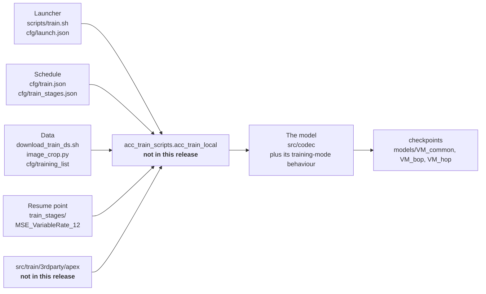
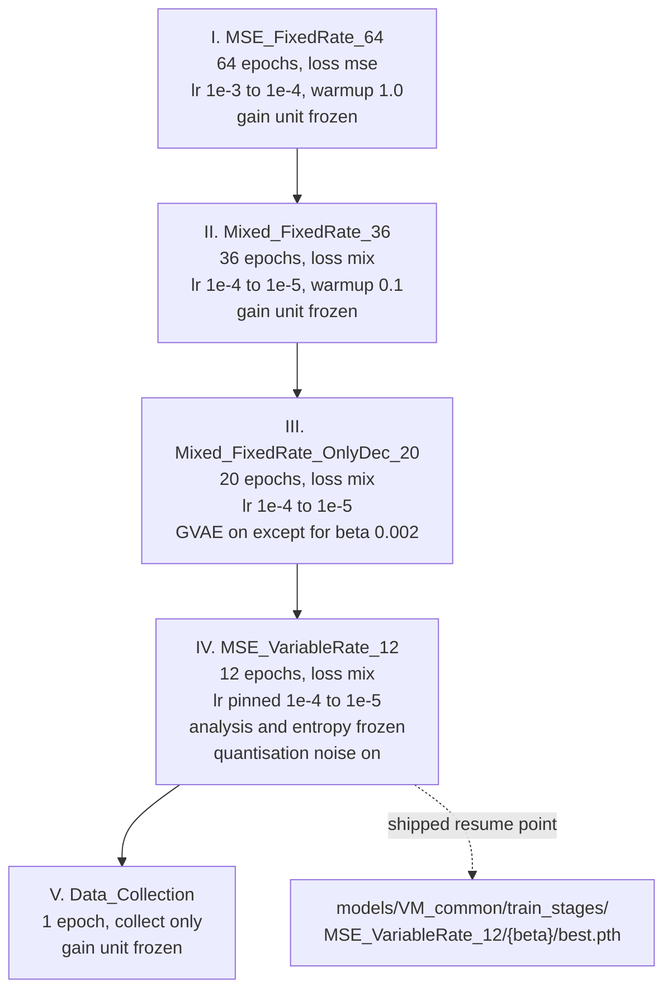
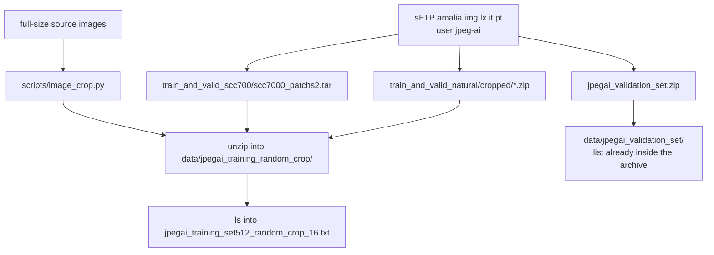
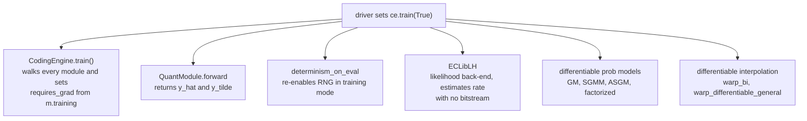

# 13 — Training

The four beta models this codec ships were produced by a five-stage training schedule. The
schedule, its per-stage hyper-parameters, the per-beta parameter tables, the training file lists
and one resume checkpoint per beta are all in the repository. **The program that reads them is
not.** This chapter documents everything that is here, states precisely what is missing, and
separates what can be read from the code from what can only be read off the configuration.

## 1. What ships and what does not



Everything here is in the repository except the two boxes marked *not in this release*.

Three different missing paths are referenced, and it is worth keeping them apart:

| Reference | Points at | Present |
| --- | --- | --- |
| `scripts/train.sh` line 42 | `scripts.acc_train_scripts.acc_train_local` | no |
| `cfg/launch.json` "Run local training script" | `scripts.acc_train_scripts.acc_train_local` | no |
| `scripts/build_train_libs.sh` line 50 | `src/train/3rdparty/apex` | no |
| `Dockerfile` line 44 | `/root/vm/src/train/3rdparty/apex` | no |
| `README.md` line 80 | `src/train/README.md` | no |
| `src/codec/datasets/dataset.py.conflict_with_train` | `.image_utils` | no |

So the launcher and the VS Code configuration both call a driver under `scripts/`, while the
build script, the Dockerfile and the README all refer to a `src/train` package. Neither exists
here.

**None of the training options are recognised by the shipped code.** Searching the source for
`frozen_part`, `enable_gvae`, `base_warmup_epoch`, `anneal_final_lr`, `loss_factors`,
`collect_only`, `cal_entropy_on_val`, `train_url`, `resume_from_stage`, `vae_encoder_type_list`
and the rest returns nothing. The few names that do appear — `beta_list`, `loss_type`,
`msssim_weight`, `loss_weights` — belong to unrelated inference-side tools: the gain unit's beta
ladder, the ICCI and eICCI post-filter model selection, and the RDO colour transform.

Everything in sections 2 to 6 below is therefore a faithful description of *the configuration*.
Where a parameter's effect is not determined by a shipped file, this chapter says so rather than
guessing.

## 2. The launcher

`scripts/train.sh` sets `PYTHONPATH` to the repository root, changes into it, and runs the driver
as a module. Only five arguments are active; the rest of the file is a catalogue of commented
recipes, which is the most useful part of it.

### Active arguments

| Argument | Value in the script | Meaning |
| --- | --- | --- |
| `--data_dir` | `data/jpegai_training_random_crop/` | Directory of training crops |
| `--lst` | `data/jpegai_training_random_crop/jpegai_training_set512_random_crop_16.txt` | List of training files, relative to `--data_dir` |
| `--val_data_dir` | `data/jpegai_validation_set/` | Validation images |
| `--val_lst` | `data/jpegai_validation_set/jpegai_validation_set_10.txt` | Validation file list |
| `--train_url` | `train_results/` | Output root for checkpoints and logs |

### Arguments the launcher documents but leaves commented

| Argument | Value shown | Purpose as written in the script |
| --- | --- | --- |
| `--use_automatic_testing` | `0` | Disable the test run that otherwise follows training |
| `--copy_to_train_url_dir` | `models/VM_common/train_stages` | Seed the output tree from pre-trained stage checkpoints |
| `--resume_from_stage` | `MSE_VariableRate_12` | Start from that stage instead of stage I |
| `--freeze_entropy_part` | `1` | Freeze the entropy part |
| `--train_only_analysis_part` | `1` | Train the analysis transform only |
| `--train_only_synthesis_part` | `1` | Train the synthesis transform only |
| `--vae_encoder_type_list` | `bop`, `hop`, `<ENC>` | Which analysis transforms to train |
| `--vae_decoder_type_list` | `bop`, `sop`, `hop`, `<DEC>` | Which synthesis transforms to train |
| `--loss_weights` | `1,1` | Weights, paired with the two type lists above |
| `--cfg_path` | `tools_off.json oper_point/<...>.json` | Codec configuration for the run, in the usual `--cfg` style |

The four operating-point recipes are worth reading as a group, because they show that the
encoder and decoder sides are selected independently — the same asymmetry the profiles use:

| Recipe | Encoder list | Decoder list | `--cfg_path` |
| --- | --- | --- | --- |
| BOP only | `bop` | `bop` | `tools_off.json oper_point/bop.json` |
| HOP only | `hop` | `hop` | `tools_off.json oper_point/hop.json` |
| BOP encoder, SOP decoder | `bop` | `sop` | `tools_off.json oper_point/bopEnc_sopDec.json` |
| General | `<ENC>` | `<DEC>` | `tools_off.json oper_point/common.json oper_point/<ENC>_Enc.json oper_point/<DEC>_Dec.json` |

That last row is the general form: `common.json` for what all operating points share, then one
encoder-side and one decoder-side file. See
[03 — Configuration system](03-configuration-system.md) for those files.

### Four more options, only in `cfg/launch.json`

The VS Code configuration named "Run local training script" invokes the same module with a
different argument set, and it is the only place these four appear:

| Argument | Value | Meaning |
| --- | --- | --- |
| `--opt_type` | `lamb` | Optimiser — LAMB |
| `--mse_weight` | `1.0` | Weight of the MSE term |
| `--seed` | `2` | Random seed |
| `--test_data_dir` | `data/test` | Test set for the automatic post-training test |

## 3. The five-stage schedule

`cfg/train.json` names the stages and carries the per-beta tables. `cfg/train_stages.json` gives
the argument list for each stage. The two are joined by the beta being trained.



Stage IV is the one whose output ships: `models/VM_common/train_stages/MSE_VariableRate_12/`
holds one `best.pth` per beta (0.002, 0.012, 0.075, 0.5), each 68 993 567 bytes, tracked by DVC.
That is exactly the resume point the launcher's commented `--resume_from_stage MSE_VariableRate_12`
selects, so stages I to III can be skipped.

### Per-beta tables — `cfg/train.json`

Every entry is keyed by the base model beta. The four betas are the four `tools_N` models
described in [02 — Core architecture](02-core-architecture.md).

| Key | 0.002 | 0.012 | 0.075 | 0.5 |
| --- | --- | --- | --- | --- |
| `beta_2_gpus` | `0,1` | `2,3` | `4,5` | `6,7` |
| `beta_2_msssim_weight` | `0.5` | `0.5` | `0.4` | `0.3` |
| `beta_2_betaList` | `0.002` | `0.03` | `0.2` | `1.0` |
| `beta_2_training_list` | `Q1_training_list.txt` | `Q2_...` | `Q3_...` | `Q4_...` |
| `beta_2_loss_factors` | `0.6667_0.1667_0.1667` | `0.6667_0.1667_0.1667` | `0.7143_0.1429_0.2857` | `0.6667_0.1667_0.3333` |

Reading across the table:

- **`beta_2_gpus`** assigns two GPUs per beta, so the reference schedule trains all four models
  concurrently on an eight-GPU host.
- **`beta_2_msssim_weight`** falls as the rate falls: the MS-SSIM term carries half the mixed loss
  at the highest quality and 0.3 at the lowest.
- **`beta_2_betaList`** is *not* the model's own beta except for 0.002 — it rises to 0.03, 0.2 and
  1.0. It is the beta the fixed-rate stage trains at, distinct from the beta that names the model.
- **`beta_2_training_list`** gives each beta its own file list. They are not the same length:
  132 308, 132 308, 139 596 and 145 945 lines. The lists name files under
  `jpegai_training_7000scc/` and similar subdirectories, one relative path per line.
- **`beta_2_loss_factors`** is three underscore-separated numbers. They are not normalised — the
  first two sum with the third to 1.0, 1.0, 1.1429 and 1.1667 — and the third grows as the rate
  falls. Which component each factor weights is not determined by any shipped file.

### `stages`

```json
"stages": ["MSE_FixedRate_64", "Mixed_FixedRate_36", "Mixed_FixedRate_OnlyDec_20",
           "MSE_VariableRate_12", "Data_Collection"]
```

The order here is the execution order, and each name is a key in `cfg/train_stages.json`.

## 4. Per-stage argument lists — `cfg/train_stages.json`

Each stage is a JSON array of command-line tokens, rendered through a template engine before it
is handed to the driver. The tables below list every argument, in file order.

### I — `MSE_FixedRate_64`

| Argument | Value |
| --- | --- |
| `--epochs` | `64` |
| `--loss_type` | `mse` |
| `--base_warmup_epoch` | `1.0`, or `args.base_warmup_epoch` if given |
| `--lr` | `1e-03`, or `args.lr` if given |
| `--anneal_final_lr` | `1e-04`, or `args.anneal_final_lr` if given |
| `--frozen_part` | `gain_unit` |
| `--beta_list` | the beta being trained |

The only pure-MSE stage, the longest one, and the only one with a full-epoch warm-up and a
learning rate of 1e-3.

### II — `Mixed_FixedRate_36`

| Argument | Value |
| --- | --- |
| `--beta_list` | `beta_list_stageII` |
| `--epochs` | `36` |
| `--loss_type` | `mix` |
| `--msssim_weight` | per-beta, from `beta_2_msssim_weight` |
| `--loss_factors` | per-beta, from `beta_2_loss_factors` |
| `--base_warmup_epoch` | `0.1`, or `args.base_warmup_epoch` |
| `--lr` | `1e-04`, or `args.lr` |
| `--anneal_final_lr` | `1e-05`, or `args.anneal_final_lr` |
| `--frozen_part` | `gain_unit` |

### III — `Mixed_FixedRate_OnlyDec_20`

| Argument | Value |
| --- | --- |
| `--beta_list` | `beta_list_stageIII_IV` |
| `--epochs` | `20` |
| `--loss_type` | `mix` |
| `--msssim_weight` | per-beta |
| `--loss_factors` | per-beta |
| `--base_warmup_epoch` | `0.1`, or `args.base_warmup_epoch` |
| `--lr` | `1e-04`, or `args.lr` |
| `--frozen_part` | `gain_unit` — **only when beta is 0.002** |
| `--anneal_final_lr` | `1e-05`, or `args.anneal_final_lr` |
| `--enable_gvae` | `0` when beta is 0.002, otherwise `1` |

Note that the stage name says only-decoder but the argument list never freezes the analysis part.
If that restriction exists it comes from the driver, not from this file.

### IV — `MSE_VariableRate_12`

| Argument | Value |
| --- | --- |
| `--beta_list` | `beta_list_stageIII_IV` |
| `--epochs` | `12` |
| `--loss_type` | `mix` |
| `--msssim_weight` | per-beta |
| `--loss_factors` | per-beta |
| `--base_warmup_epoch` | `0.1`, or `args.base_warmup_epoch` |
| `--lr` | `1e-4` — **fixed, not overridable** |
| `--cal_entropy_on_val` | `1` |
| `--anneal_final_lr` | `1e-5` — **fixed, not overridable** |
| `--frozen_part` | `analysis entropy`, plus `synthesis` when beta is 0.002 |
| `--add_random_noise_for_quantization_y` | `1` |
| `--enable_gvae` | `0` when beta is 0.002, otherwise `1` |

Two things stand out. The stage that produces the shipped checkpoints is the one that pins its
learning rate — passing `--lr` on the command line has no effect here, unlike in stages I to III.
And for beta 0.002 the frozen set covers analysis, entropy *and* synthesis while GVAE is off,
which leaves markedly less trainable than for the other three betas.

### V — `Data_Collection`

| Argument | Value |
| --- | --- |
| `--beta_list` | `beta_list_stageIII_IV` |
| `--epochs` | `1` |
| `--loss_type` | `mix` |
| `--msssim_weight` | per-beta |
| `--loss_factors` | per-beta |
| `--base_warmup_epoch` | `0.1`, or `args.base_warmup_epoch` |
| `--lr` | `1e-4` — fixed |
| `--anneal_final_lr` | `1e-5` — fixed |
| `--frozen_part` | `gain_unit` |
| `--collect_only` | `1` |

One epoch with `--collect_only 1`: a pass over the data that gathers something rather than
training. What it gathers is decided by the driver and cannot be read from any shipped file.

## 5. The templating layer

`cfg/train_stages.json` is not plain JSON — it is a template for
`Templite` (`src/codec/utils/templite.py`), a small engine with `${` and `}$` delimiters:

| Form | Meaning |
| --- | --- |
| `${ expr }$` | A bare name, index or literal is written out — the `autowrite` rule |
| `${ write(x) }$` | Explicit write, needed for anything the autowrite pattern rejects |
| `${ if cond: }$ … ${ :else: }$ … ${ :end-if }$` | Conditional block; any leading `:` closes one level |
| `${ include(file) }$` | Render another template into this one |

The engine compiles the template to Python and executes it against a namespace, so the
conditionals are real Python — `${ if beta == 0.002: }$` is a numeric comparison, not a string
match.

`Templite` is shipped, but **nothing in the shipped code imports it**; it exists for the driver.

### Which template variables the shipped configuration binds

| Variable | Bound by | Value |
| --- | --- | --- |
| `beta` | the driver, per model | 0.002, 0.012, 0.075 or 0.5 |
| `msssim_weight` | `cfg/train.json` → `beta_2_msssim_weight` | 0.5 / 0.5 / 0.4 / 0.3 |
| `loss_factors` | `cfg/train.json` → `beta_2_loss_factors` | the three-number strings above |
| `beta_list_stageII` | most likely `beta_2_betaList` | 0.002 / 0.03 / 0.2 / 1.0 |
| `beta_list_stageIII_IV` | **nothing in this release** | — |
| `args.lr`, `args.anneal_final_lr`, `args.base_warmup_epoch` | the driver's parsed command line | `None` unless passed |

`beta_list_stageIII_IV` is used by three stages and is defined nowhere in the repository. Given
that stages III to V are the variable-rate part of the schedule, it is presumably a list of betas
rather than the single value stage II uses — but that is an inference from the stage names, not
something any shipped file states.

## 6. Option reference

Every option observable across `scripts/train.sh`, `cfg/launch.json` and `cfg/train_stages.json`,
with where it appears and the values seen.

### Data and output

| Option | Seen in | Values |
| --- | --- | --- |
| `--data_dir` | launcher, launch.json | training crop directory |
| `--lst` | launcher, launch.json | training file list |
| `--val_data_dir` | launcher, launch.json | validation directory |
| `--val_lst` | launcher, launch.json | validation file list |
| `--test_data_dir` | launch.json | `data/test` |
| `--train_url` | launcher, launch.json | output root |
| `--copy_to_train_url_dir` | launcher, commented | `models/VM_common/train_stages` |

### Schedule and optimisation

| Option | Seen in | Values |
| --- | --- | --- |
| `--epochs` | every stage | 64, 36, 20, 12, 1 |
| `--lr` | every stage | 1e-3 in stage I, 1e-4 thereafter |
| `--anneal_final_lr` | every stage | 1e-4 in stage I, 1e-5 thereafter |
| `--base_warmup_epoch` | every stage | 1.0 in stage I, 0.1 thereafter |
| `--opt_type` | launch.json | `lamb` |
| `--seed` | launch.json | `2` |
| `--resume_from_stage` | launcher, commented | `MSE_VariableRate_12` |

Stages I to III take their three learning-rate values from the command line when it supplies
them; stages IV and V accept an override only for `--base_warmup_epoch`.

### Loss

| Option | Seen in | Values |
| --- | --- | --- |
| `--loss_type` | every stage | `mse` in stage I, `mix` in II to V |
| `--msssim_weight` | stages II to V | per beta: 0.5, 0.5, 0.4, 0.3 |
| `--loss_factors` | stages II to V | per beta, three underscore-separated numbers |
| `--mse_weight` | launch.json | `1.0` |
| `--loss_weights` | launcher, commented | `1,1`, paired with the two type lists |

Note that stage IV is named `MSE_VariableRate_12` but sets `--loss_type mix`, and stage III is
named `Mixed_FixedRate_OnlyDec_20` while sitting in the variable-rate half of the schedule. The
stage names are not a reliable guide to the arguments; the arguments are.

### What is trained and what is frozen

| Option | Seen in | Values |
| --- | --- | --- |
| `--frozen_part` | stages I, II, III (beta 0.002 only), IV, V | `gain_unit`; in stage IV `analysis entropy` plus `synthesis` for beta 0.002 |
| `--enable_gvae` | stages III, IV | `0` for beta 0.002, `1` otherwise |
| `--freeze_entropy_part` | launcher, commented | `1` |
| `--train_only_analysis_part` | launcher, commented | `1` |
| `--train_only_synthesis_part` | launcher, commented | `1` |

The four part names that appear — `gain_unit`, `analysis`, `entropy`, `synthesis` — line up with
the tool tree: the gain unit under the quantiser, the analysis and synthesis transforms, and the
entropy model. GVAE matches the core model's class names, `CcsGvaeSGMM` and `CcsGvaeMultiTools`,
so `--enable_gvae` plausibly switches the gain-based variable-rate mechanism; the shipped code
does not confirm it.

### Model selection

| Option | Seen in | Values |
| --- | --- | --- |
| `--beta_list` | every stage | stage I the model's beta; II `beta_list_stageII`; III to V `beta_list_stageIII_IV` |
| `--vae_encoder_type_list` | launcher, commented | `bop`, `hop` |
| `--vae_decoder_type_list` | launcher, commented | `bop`, `sop`, `hop` |
| `--cfg_path` | launcher, commented | the usual codec `--cfg` file list |

### Behaviour switches

| Option | Seen in | Values |
| --- | --- | --- |
| `--add_random_noise_for_quantization_y` | stage IV | `1` |
| `--cal_entropy_on_val` | stage IV | `1` |
| `--collect_only` | stage V | `1` |
| `--use_automatic_testing` | launcher, commented | `0` to disable |

## 7. Preparing the training data



### `scripts/download_train_ds.sh`

Prompts for a password — the script prints the WG1 document URL where members find it — then
pulls two archives over sFTP from `amalia.img.lx.it.pt` as user `jpeg-ai`: four natural-image zip
files covering ranges `00000-01299`, `01300-02599`, `02600-03899` and `03900-5263`, plus the
screen-content tar `scc7000_patchs2.tar`. It unzips them flat into
`data/jpegai_training_random_crop/`, generates the file list with `ls -1` filtered of `.txt`
entries, and unzips the validation set separately. The validation list is not regenerated,
because it comes inside the archive — the script says so in a comment.

The script needs `sshpass`, which is not among the packages `scripts/setup_system.sh` installs.

### `scripts/image_crop.py`

Cuts full-size images into fixed-size crops. `scripts/crop_image.sh` is a worked example with the
random and sliding modes.

| Option | Default | Meaning |
| --- | --- | --- |
| `--lst` | `''` | Input list; the first whitespace-separated field of each line is the file name |
| `--data_dir` | `''` | Where those files live |
| `--save_data_dir` | `''` | Output directory, created if absent |
| `--output_lst` | `''` | File list of the crops, opened in append mode |
| `--output_info` | `''` | Per-crop geometry record, append mode |
| `--input_crop_lst` | `''` | Coordinate list, for `fromfile` only |
| `--crop_size` | `1024` | Square crop side |
| `--seed` | `123` | Seed for `random` |
| `--crop_format` | `random` | `random`, `sliding` or `fromfile` |

The three modes:

- **`sliding`** — a grid of `ceil(W/crop) x ceil(H/crop)` positions, with the last row and column
  flush against the far edge so the whole image is covered, duplicates dropped.
- **`random`** — twice as many crops as the sliding grid would produce, at uniformly random
  positions, seeded by `--seed`.
- **`fromfile`** — coordinates read from `--input_crop_lst`. Names are matched through the regex
  `(?P<name>\d+_TR_\d+x\d+)_\d+`, so a line naming a crop maps back to its source image; each
  line contributes one position taken from its third and first numeric fields.

An image smaller than or equal to `--crop_size` in either dimension is copied through uncropped
and recorded with a full-image geometry line. Output names are the source name with `_<n>`
inserted before the extension, and each `--output_info` line is
`name  x_start  x_end  y_start  y_end`; the file ends with a total count.

A note for anyone reading the source: it destructures `cv2.imread(...).shape` as `w, h, _`, which
names rows `w` and columns `h` — the opposite of the usual convention. The indexing that follows
uses the same convention consistently and the crop is square, so the naming has no effect on the
output.

`src/codec/datasets/image_crop.py` is an older copy of the same tool: no `fromfile` mode and no
`--input_crop_lst`. Prefer the one under `scripts/`.

### The training lists

`cfg/training_list/Q1..Q4_training_list.txt` are one relative path per line, under subdirectories
such as `jpegai_training_7000scc/`. They pair with the betas through
`beta_2_training_list`, so each quality model sees a different — and differently sized — subset:

| List | Beta | Lines |
| --- | --- | --- |
| `Q1_training_list.txt` | 0.002 | 132 308 |
| `Q2_training_list.txt` | 0.012 | 132 308 |
| `Q3_training_list.txt` | 0.075 | 139 596 |
| `Q4_training_list.txt` | 0.5 | 145 945 |

## 8. Environment

`scripts/build_train_libs.sh` does two things: it builds the entropy-coding extensions by
delegating to `scripts/build_ec_lib.sh` — the same ones `make build_test_libs` builds — and then
installs NVIDIA **apex** from `src/train/3rdparty/apex` with the C++ and CUDA extensions enabled.
The `Dockerfile` performs the same apex install. Since `src/train` is absent, neither step can
run as written; the entropy-coding half is available through `make build_test_libs`.

Apex matters beyond the build script: several layers in the shipped model switch behaviour under
automatic mixed precision.

```python
try:
    from torch.cuda.amp import autocast
    HAS_AMP = True
except ImportError:
    HAS_AMP = False
...
if HAS_AMP and self.training:
    ...
```

That guard appears in `ResA`, `ResAU`, `RNAB` and `CAB` — the activations and attention blocks —
and it fires only when the module is in training mode, so inference is unaffected either way.

## 9. What the shipped codec provides for training

Even without the driver, the model is built to be trained, and these parts are readable from the
code.



**Gradient enabling.** `CodingEngine.train(state)` does more than `nn.Module.train`: it walks
every named module and sets each parameter's `requires_grad` to that module's `training` flag, so
freezing a subtree is a matter of putting it in eval mode.

```python
def train(self, state=True):
    super().train(state)
    for n, m in self.named_modules():
        for pn, pp in m._parameters.items():
            if pp is not None:
                pp.requires_grad = m.training
```

**Quantisation.** `QuantModule.forward` (`components/base_layers/quant_layer.py`) is the standard
pair used in learned compression:

```python
if self.training:
    y_no_grad = y.detach()
    y_hat = y_no_grad.round() - y_no_grad + y                      # straight-through rounding
    y_no_grad_tilde = y_no_grad + torch.empty_like(y).uniform_(-0.5, 0.5)
    y_tilde = y_no_grad_tilde.round() - y_no_grad_tilde + y        # noise-relaxed
    return y_hat, y_tilde
else:
    y_hat = y.detach().round() - y.detach() + y
    return y_hat, y_hat
```

In training it returns both a straight-through rounded value and a uniform-noise relaxation; in
inference both outputs are the same tensor. This is the mechanism stage IV's
`--add_random_noise_for_quantization_y` selects between.

**Determinism.** `determinism_on_eval` (`common/pytorch_ops.py`) disables the RNG and TF32 only
when the module is in eval mode, and calls `enable_torch_random()` when it is training — so the
bit-exactness machinery described in [11 — Evaluation and testing](11-evaluation-and-testing.md)
deliberately steps aside during training.

**Rate estimation.** `ECLibLH`, selected with `--cfg cfg/AE/lh.json`, implements the entropy-coder
interface but returns an estimated size from the probability model instead of writing bytes. The
differentiable probability models under `components/entropy_coding/prob_models/` supply the
likelihoods. `GMProbModel.forward` takes an explicit `training` argument that defaults to
`self.training`. See [07 — Entropy coding](07-entropy-coding.md).

**Datasets.** `src/codec/datasets/dataset.py` provides `ImageDataset`, `CustomToTensor`,
`CustomCrop` and `CustomResize` — a torch `Dataset` over a directory and file list, which is what
`--data_dir` and `--lst` address. Alongside it,
`src/codec/datasets/dataset.py.conflict_with_train` is a leftover from a merge: the training-side
variant, with `CodecDataset`, `CodecYUVDataset`, `FixedCustomCrop` and a two-argument
`CustomResize`. It imports `.image_utils`, which is not in this release, so it is unimportable as
it stands. It is not a `.py` file and nothing loads it.

## 10. From training output to a release model set

`scripts/models_processing/all.sh` turns trained checkpoints into a shipped model set in six
steps, covered in [10 — Command-line tools](10-command-line-tools.md). Two of them read training
output directly:

- **Step 2** runs `scripts/reduce_z_distributions.py`, which loads every `.pth` in
  `models/VM_common`, reads the tensor `hyper_entropy.freqs_int` out of each, builds a pairwise
  KL matrix over the distributions and clusters them with K-medoids (PAM, `random_state=0`) down
  to `--n_distributions`, default 128. So the hyper-latent entropy tables are *learned parameters
  carried in the checkpoint*, not separately collected statistics.
- **Step 3** reorders weights for parallel decoding and produces `models/VM_common_int`.

## 11. Testing after training

`cfg/test_after_train.json` is the configuration for the run that `--use_automatic_testing`
controls. It is small and it differs from the ordinary test conditions in two ways:

```json
{
    "target_bpps": [12, 25, 50, 75],
    "model": { "bitrate_matcher": {
        "independent_beta_UV": 1, "enabled": 1,
        "default_models": [0, 1, 2, 3, 3],
        "default_beta_disp_log": [0, 0, 0, 0, 180] } }
}
```

Four rate points instead of the usual five, and a different model assignment: where
`cfg/BRM/default.json` uses `[0, 1, 2, 2, 3]` with displacements `[0, 0, -184, 0, 0]`, this uses
`[0, 1, 2, 3, 3]` with `[0, 0, 0, 0, 180]` — one model per rate point up to the fourth, and the
displacement applied at the top rather than in the middle. That is the mapping you would expect
while checking four freshly trained models one-to-one against four rates.

## 12. Gaps worth knowing before you try to reproduce a run

| Gap | Consequence |
| --- | --- |
| `scripts/acc_train_scripts/acc_train_local.py` absent | Nothing can execute the schedule; every option above is unimplemented here |
| `src/train` absent | `scripts/build_train_libs.sh` and the `Dockerfile`'s apex step both fail; `README.md`'s training link is dead |
| `beta_list_stageIII_IV` unbound | `cfg/train_stages.json` cannot be rendered for stages III to V from shipped files alone |
| `src/codec/datasets/image_utils.py` absent | The training-side dataset variant is unimportable |
| `sshpass` not installed by `setup_system.sh` | `download_train_ds.sh` fails until it is installed separately |
| Dataset access is credentialed | The password lives in a WG1 document; the sFTP host is not public |
| Only stage IV checkpoints ship | Stages I to III cannot be reproduced from a shipped starting point, only resumed past |
