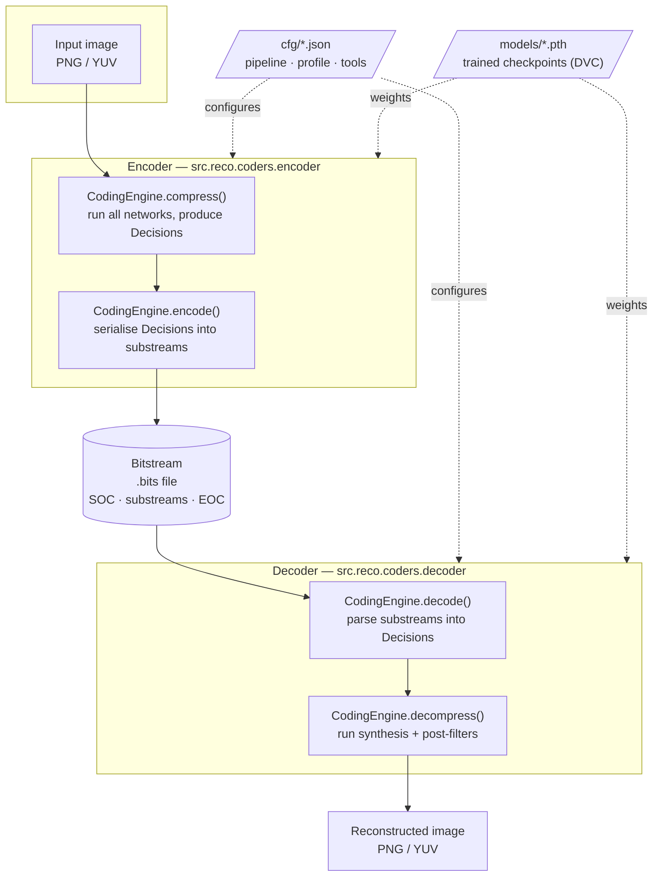

# JPEG AI Reference Software — Architecture Documentation

This directory contains a detailed technical description of the JPEG AI reference software
(also called the *Verification Model*, VM): what lives in the repository, how the components
are wired together, how data flows through the encoder and the decoder, and what every coding
tool does.

The software implements **Rec. ITU-T T.840.1 | ISO/IEC 6048-1**, a learning-based image coding
system. Unlike a classical codec, the transform is a set of trained convolutional neural
networks; the "classic" codec machinery (headers, substreams, entropy coding, rate control,
post-filters) is built around those networks.

## How to read this documentation

| Document | What it covers |
| --- | --- |
| [01 — Repository layout](01-repository-layout.md) | Every top-level directory and what it holds |
| [02 — Core architecture](02-core-architecture.md) | The engine/tool class hierarchy, the module tree, `Decisions`, `Image` |
| [03 — Configuration system](03-configuration-system.md) | JSON configs, `!include`, profiles, operating points, per-image overrides |
| [04 — Encoding pipeline](04-encoding-pipeline.md) | End-to-end encoder data flow with diagrams |
| [05 — Decoding pipeline](05-decoding-pipeline.md) | End-to-end decoder data flow with diagrams |
| [06 — Bitstream format](06-bitstream-format.md) | Markers, substreams, headers, regions, threads |
| [07 — Entropy coding](07-entropy-coding.md) | The EC subsystem, me-tANS, probability models, C++ extensions |
| [08 — Neural network components](08-neural-network-components.md) | Analysis/synthesis transforms, hyperprior, context model, layers |
| [09 — Coding tools reference](09-coding-tools-reference.md) | Per-tool documentation: purpose, config keys, signalling |
| [10 — Command-line tools](10-command-line-tools.md) | Every executable entry point and shell/Python utility |
| [11 — Evaluation and testing](11-evaluation-and-testing.md) | The evaluation harness, metrics, CI, DVC, model management |
| [12 — Parameter resolution](12-parameter-resolution.md) | How the command line and the config files reach the tool tree |

## Reading this as HTML

```bash
make docs           # Doxygen site: these pages next to the API reference -> docs/html/index.html
make docs_single    # one self-contained page                             -> docs/architecture.html
```

Both are generated from the Markdown in this directory, which stays the single point of truth.
[docs/doxygen/README.md](../doxygen/README.md) explains the build and the two Mermaid pitfalls to
avoid when editing these files.

## The system in one picture



The encoder and the decoder are two thin wrappers around **the same** `CodingEngine` object
tree. The engine is built from a JSON configuration; the decoder rebuilds an identical tree
from `cfg/pipeline.json` plus the parameters carried in the bitstream headers. This symmetry is
the single most important architectural property of the software: any tool you add must be
constructible on both sides from the same description.

## Key concepts glossary

| Term | Meaning |
| --- | --- |
| **VM** | Verification Model — this reference software |
| **CE** | `CodingEngine`, the root of the tool tree |
| **Decisions** | A nested `dict` carrying all intermediate tensors and coding decisions between stages |
| **Latent / `y`** | Output of the analysis transform (the compressed representation) |
| **Hyper-latent / `z`** | Output of the hyper-analysis transform; drives the entropy model |
| **`psi`** | Hyper-decoder output: the conditioning parameters for the context model |
| **`scale_log`** | Log-domain scale (σ) predicted for each latent element, drives quantisation and entropy coding |
| **beta (β)** | Rate-distortion Lagrangian; selects which trained model and quantisation offset are used |
| **Primary / Secondary** | The luma (Y) branch and the chroma (UV) branch of the codec |
| **SOP / BOP / HOP** | Small / Base / High Operating Point — three synthesis network complexities |
| **Tool** | A pluggable, individually enable-able coding module (`ToolEngine` subclass) |
| **Substream** | A marker-delimited section of the bitstream (header, z, residual, …) |
| **me-tANS** | Multi-symbol table-based Asymmetric Numeral Systems — the entropy engine |
